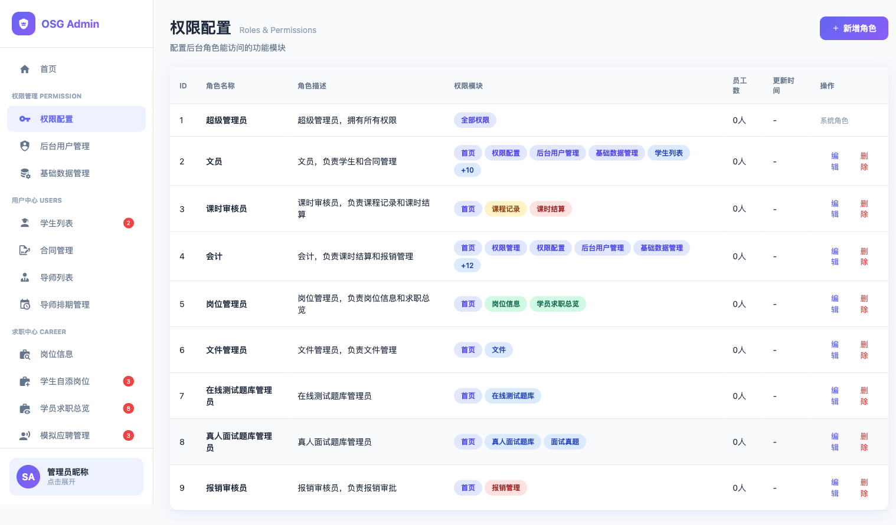

# 权限配置页面 — 权限颜色规划

> 设计原则：一看就懂、每个节点只做一件事、出口统一、上游有问题就停、
> 最少概念、最短路径、改动自洽、简约不等于省略。

## 一、目标

- **一句话**：为权限配置页面的每个功能模块组分配一个唯一颜色，解决当前颜色冲突
- **验收标准**：
  1. 页面上 7 个模块组各有独立颜色，视觉上可一眼区分
  2. 资源中心 ≠ 用户中心颜色
  3. `+N` 溢出徽章使用中性色，不与任何模块色相同

## 二、前置条件与假设

- 假设 1：后端菜单树结构稳定（8 个分组、24 个叶子权限），短期不会新增模块
- 假设 2：颜色按模块组分配（同组下所有子权限共用一个颜色）
- 假设 3：权限颜色只影响 roles/index.vue 列表页展示，不影响编辑弹窗

## 三、现状分析

### 相关文件

| 文件 | 职责 |
|------|------|
| `osg-frontend/packages/shared/src/utils/permissionColors.ts` | 颜色映射配置 + 工具函数 |
| `osg-frontend/packages/admin/src/views/permission/roles/index.vue` | 列表页模板 + CSS 样式 |

### 当前页面截图

### 存在的问题

| # | 问题 | 影响 |
|---|------|------|
| 1 | **用户中心**（蓝色 info）与**资源中心**（蓝色 info）颜色相同 | 无法区分两个模块 |
| 2 | 只有 6 种颜色类型分给 7 个模块组 | 颜色不够用 |
| 3 | `+N` 溢出徽章固定用 `info` 蓝色 | 和用户中心/资源中心混淆 |

## 四、设计决策

| # | 决策点 | 选项 | 推荐 | 理由 |
|---|--------|------|------|------|
| 1 | 资源中心颜色 | A: 新增 teal 青色 / B: 用 warning 橙色 | A | teal 与 blue 视觉区分度好，且 warning 已分配给教学中心 |
| 2 | CSS class 命名 | A: 语义化（blue/green/amber/rose/teal/slate） / B: 保持旧名（info/success/warning/danger） | B | 改名涉及所有引用处，增加改动量且无功能收益，最短路径原则 |
| 3 | +N 溢出徽章 | A: 改为 default 灰色 / B: 保持 info 蓝色 | A | 避免和模块色混淆 |

## 五、目标状态

### 颜色色板（7 色 + 1 溢出色）

| 色名 | CSS class | 背景色 | 文字色 | 分配给 |
|------|-----------|--------|--------|--------|
| 靛紫 | `--purple` | `#e0e7ff` | `#4f46e5` | 首页 + 权限管理 |
| 蓝色 | `--info` | `#dbeafe` | `#1e40af` | 用户中心 |
| 翠绿 | `--success` | `#d1fae5` | `#065f46` | 求职中心 |
| 琥珀 | `--warning` | `#fef3c7` | `#92400e` | 教学中心 |
| 玫红 | `--danger` | `#fee2e2` | `#991b1b` | 财务中心 |
| **青色** | **`--teal`** | **`#ccfbf1`** | **`#115e59`** | **资源中心（新增）** |
| 石板 | `--default` | `#f1f5f9` | `#64748b` | 个人中心 + `+N` 溢出 |

### 完整权限映射表（后端菜单树 → 颜色）

| 模块组 | 菜单ID | 权限名称 | 颜色类型 |
|--------|--------|----------|----------|
| 首页（独立） | 2010 | 首页 | purple |
| 权限管理 | 2001 | (分组) | purple |
| | 2011 | 权限配置 | purple |
| | 2012 | 后台用户管理 | purple |
| | 2013 | 基础数据管理 | purple |
| 用户中心 | 2002 | (分组) | info |
| | 2014 | 学生列表 | info |
| | 2015 | 合同管理 | info |
| | 2016 | 导师列表 | info |
| | 2017 | 导师排期管理 | info |
| 求职中心 | 2003 | (分组) | success |
| | 2018 | 岗位信息 | success |
| | 2019 | 学生自添岗位 | success |
| | 2020 | 学员求职总览 | success |
| | 2021 | 模拟应聘管理 | success |
| 教学中心 | 2004 | (分组) | warning |
| | 2022 | 课程记录 | warning |
| | 2023 | 人际关系沟通记录 | warning |
| 财务中心 | 2005 | (分组) | danger |
| | 2024 | 课时结算 | danger |
| | 2025 | 报销管理 | danger |
| **资源中心** | 2006 | (分组) | **teal** |
| | 2026 | 文件 | **teal** |
| | 2027 | 在线测试题库 | **teal** |
| | 2028 | 真人面试题库 | **teal** |
| | 2029 | 面试真题 | **teal** |
| 个人中心 | 2007 | (分组) | default |
| | 2030 | 邮件 | default |
| | 2031 | 消息管理 | default |
| | 2032 | 投诉建议 | default |
| | 2033 | 操作日志 | default |

### 角色示例预览

**课时审核员**: `[首页]靛紫` `[课程记录]琥珀` `[课时结算]玫红` → 三色区分系统/教学/财务

**文件管理员**: `[首页]靛紫` `[文件]青色` → 资源中心独立青色，不再与用户中心蓝色混淆

**报销审核员**: `[首页]靛紫` `[报销管理]玫红` → 财务红色醒目

## 六、执行清单

| # | 文件 | 位置 | 当前值 | 目标值 |
|---|------|------|--------|--------|
| 1 | `shared/src/utils/permissionColors.ts` 第 9 行 | `PermissionColorType` 类型 | `'purple' \| 'info' \| 'success' \| 'warning' \| 'danger' \| 'default'` | 新增 `'teal'` |
| 2 | `shared/src/utils/permissionColors.ts` 第 44-49 行 | 资源中心映射 | `'info'` | `'teal'` |
| 3 | `shared/src/utils/permissionColors.ts` 第 83-118 行 | `getPermissionColorConfig` 函数 | 无 teal 配置 | 新增 `teal: { bg: '#ccfbf1', text: '#115e59', border: '#99f6e4' }` |
| 4 | `shared/src/utils/permissionColors.ts` 第 136 行 | `validColorTypes` 数组 | 无 `'teal'` | 新增 `'teal'` |
| 5 | `admin/src/views/permission/roles/index.vue` 第 55-57 行 | `+N` 溢出徽章 | `class="permission-pill permission-pill--info"` | `class="permission-pill permission-pill--default"` |
| 6 | `admin/src/views/permission/roles/index.vue` CSS（第 367-370 行后） | `.permission-pill` 样式 | 无 `--teal` | 新增 `&--teal { background: #ccfbf1; color: #115e59; }` |

## 七、自校验结果

| 校验项 | 通过？ | 说明 |
|--------|--------|------|
| G1 一看就懂 | ✅ | 色板表 + 权限映射表，5 秒可理解 |
| G2 目标明确 | ✅ | 3 条可度量验收标准 |
| G3 假设显式 | ✅ | 3 条假设已列出 |
| G4 设计决策完整 | ✅ | 3 个决策点覆盖核心选择 |
| G5 执行清单可操作 | ✅ | 6 项均有精确行号 + 当前值/目标值 |
| G6 正向流程走读 | ✅ | 修改 TS 类型→映射→颜色值→CSS→模板，链路完整 |
| G7 改动自洽 | ✅ | 新增 teal 后，类型/映射/颜色值/CSS/验证数组全部同步 |
| G8 简约不等于省略 | ✅ | 保持旧 CSS class 命名，只新增 teal，最小改动 |
| G9 场景模拟 | ✅ | 文件管理员：首页(purple)+文件(teal)，两色可区分 ✓ |
| G10 数值回验 | ✅ | 7 模块组、24 叶子权限、6 项执行清单，数字与表格行数一致 |
| G11 引用回读 | ✅ | 行号基于实际文件内容确认（permissionColors.ts 148 行，index.vue 398 行） |
| C2 接口兼容 | ✅ | `getPermissionClassName` 返回 `permission-pill--teal`，CSS 对应 class 已新增 |
| C3 回归风险 | ✅ | 只新增 teal + 改资源中心映射，不影响已有颜色 |
