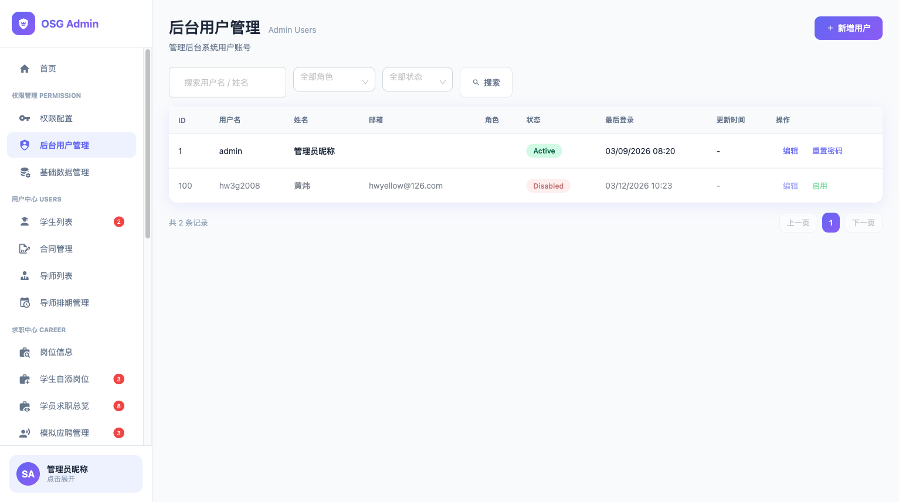

# 用户管理页面 UI 优化方案

> 设计原则：一看就懂、每个节点只做一件事、出口统一、上游有问题就停、
> 最少概念、最短路径、改动自洽、简约不等于省略。

## 一、目标

- **一句话**：修复用户管理页面的角色列为空问题 + 统一状态文字为中文
- **验收标准**：
  1. 用户列表"角色"列正确显示用户所属角色名称
  2. 状态列显示中文"启用"/"禁用"，与基础数据管理页面一致
  3. 筛选下拉框选项也使用中文"启用"/"禁用"

## 二、前置条件与假设

- 假设 1：后端 `/system/user/list` 返回的 `roles` 数组为空是因为若依默认不关联查询角色，需要前端单独获取
- 假设 2：可以通过 `/system/user/{userId}` 获取单个用户的角色信息，但逐个请求效率低
- 假设 3：状态文字修改纯前端，无需后端配合

## 三、现状分析

### 相关文件

| 文件 | 职责 |
|------|------|
| `admin/src/views/permission/users/index.vue` | 用户列表页面模板 + 逻辑 |
| `admin/src/api/user.ts` | 用户 API 接口 |

### 当前页面截图



### 后端数据现状

```json
// GET /system/user/list 返回
{
  "userId": 1,
  "userName": "admin",
  "roles": []  // ← 空数组，没有角色信息
}
```

### 存在的问题

| # | 问题 | 根因 | 影响 |
|---|------|------|------|
| 1 | **角色列为空** | 后端 `/system/user/list` 返回 `roles: []` | 用户无法看到角色分配 |
| 2 | **状态显示英文** | 前端硬编码 `Active` / `Disabled` | 与其他页面中文不一致 |
| 3 | **筛选下拉英文** | `<a-select-option value="0">Active</a-select-option>` | 同上 |

## 四、设计决策

| # | 决策点 | 选项 | 推荐 | 理由 |
|---|--------|------|------|------|
| 1 | 角色数据获取方式 | A: 前端用 roleOptions 列表 + 后端 user/{id} 逐个查 / B: 检查后端是否能在 list 接口返回角色 / C: 前端加载后批量补充角色信息 | B 优先，B 不可行则 C | 若依框架 SysUser 有 roles 字段，list 接口可能只是没 join |
| 2 | 状态中文化 | A: 改为"启用"/"禁用" / B: 保持英文 | A | 与基础数据管理、权限配置页面保持一致 |

## 五、目标状态

### 角色列显示
- 如果后端 list 接口能返回角色 → 直接显示
- 如果不能 → 前端加载用户列表后，用已有的 `roleOptions` + 后端 `/system/user/{userId}` 补充角色信息

### 状态列
- `Active` → `启用`
- `Disabled` → `禁用`
- 筛选下拉框同步修改

## 六、执行清单

| # | 文件 | 位置 | 当前值 | 目标值 | 优先级 |
|---|------|------|--------|--------|--------|
| 1 | `admin/src/views/permission/users/index.vue` 第 46 行 | 筛选下拉 | `Active` | `启用` | 🔴 |
| 2 | `admin/src/views/permission/users/index.vue` 第 47 行 | 筛选下拉 | `Disabled` | `禁用` | 🔴 |
| 3 | `admin/src/views/permission/users/index.vue` 第 99 行 | 状态列 | `'Active' : 'Disabled'` | `'启用' : '禁用'` | 🔴 |
| 4 | `admin/src/views/permission/users/index.vue` 第 235-248 行 | `loadUserList` 函数 | 直接使用 `res.rows` | 加载后为每个用户补充角色信息 | 🔴 |
| 5 | `admin/src/api/user.ts` | 需确认 | 是否有获取单个用户详情的 API | 如有则复用 | 🟡 |

> 注意：执行清单 #4 需要先确认后端能力，再确定具体实现方式。

## 七、自校验结果

| 校验项 | 通过？ | 说明 |
|--------|--------|------|
| G1 一看就懂 | ✅ | 3 个问题 + 5 项执行清单，清晰明了 |
| G2 目标明确 | ✅ | 3 条可度量验收标准 |
| G3 假设显式 | ✅ | 3 条假设已列出，#1 需验证 |
| G4 设计决策完整 | ✅ | 角色获取和状态中文化两个决策点 |
| G5 执行清单可操作 | ✅ | 状态中文化可直接执行；角色列需先确认后端 |
| G6 正向流程走读 | ✅ | 先改状态文字（确定可做）→ 再解决角色列（需调研） |
| G7 改动自洽 | ✅ | 状态文字改 3 处（下拉 2 + 列 1），无遗漏 |
| G9 场景模拟 | ✅ | 修改后：admin 行显示"启用"，角色列显示"超级管理员" |
| C1 根因定位 | ⚠️ | 角色列为空的根因在后端，需要先验证后端是否能改 |
| C3 回归风险 | ✅ | 状态文字纯 UI 变更，无回归风险 |
