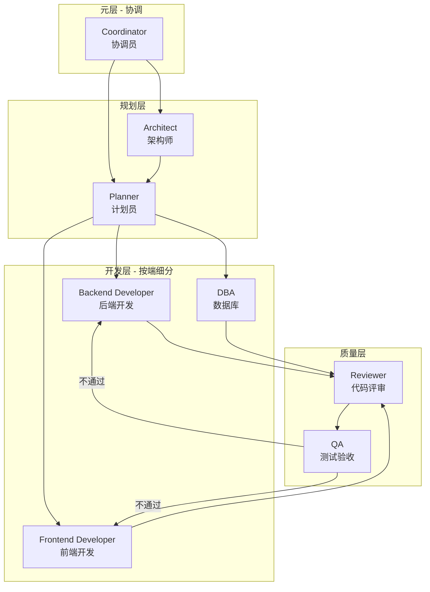

# 一人公司 AI 交付框架 - 概览

> 基于 obra/superpowers、Ralph Loop、Catalyst、TÂCHES、LangGraph 等业界最佳实践，独立实现一套 Skills + Agents 结合的工程化交付框架。

## 文档导航

| 编号 | 文档 | 内容 |
|------|------|------|
| 00 | **概览**（本文档） | 架构概述、核心原则、快速入门 |
| 01 | [工作流_RPIV](01_工作流_RPIV.md) | RPIV 四阶段、审批点、会话恢复 |
| 02 | [错误处理](02_错误处理.md) | 错误分类、回滚机制、Agent 信息传递 |
| 10 | [Skills_记忆管理](10_Skills_记忆管理.md) | memory-bank, context-compression, checkpoint-manager |
| 11 | [Skills_工作流](11_Skills_工作流.md) | brainstorming, story-splitter, ticket-splitter, deliver-ticket, using-git-worktrees |
| 12 | [Skills_质量](12_Skills_质量.md) | verification, tdd, code-review, debugging |
| 13 | [Skills_自动化](13_Skills_自动化.md) | ralph-loop, progress-tracker |
| 20 | [Agent_Coordinator](20_Agent_Coordinator.md) | 协调员 |
| 21 | [Agent_Architect](21_Agent_Architect.md) | 架构师 |
| 22 | [Agent_Planner](22_Agent_Planner.md) | 计划员 |
| 23 | [Agent_Developer](23_Agent_Developer.md) | 开发者 |
| 24 | [Agent_Reviewer](24_Agent_Reviewer.md) | 评审员 |
| 25 | [Agent_QA](25_Agent_QA.md) | QA |
| 30 | [格式规范](30_格式规范.md) | Ticket、Story、日志 YAML 格式 |
| 31 | [项目配置](31_项目配置.md) | config.yaml、目录结构、初始化流程 |
| 32 | [命令体系](32_命令体系.md) | 所有 /xxx 命令说明 |
| 40 | [commands_命令文件](40_commands_命令文件.md) | 17 个命令文件的具体内容 |
| 41 | [templates_模板文件](41_templates_模板文件.md) | 5 个 YAML 模板文件 |
| 42 | [实现细节](42_实现细节.md) | Subagent、上下文检测、Git 集成、平台适配 |
| 43 | [rules_代码规范](43_rules_代码规范.md) | Java、Vue、SQL 代码规范 |
| 44 | [低智商模型执行指南](44_低智商模型执行指南.md) | **重要** - 便宜模型执行的精确步骤 |
| 45 | [平台适配与Hooks机制](45_平台适配与Hooks机制.md) | subagent-dispatch, hooks-manager Skills，跨平台支持 |
| 50 | [参考_Superpowers分析](50_参考_Superpowers分析.md) | Superpowers 框架对比分析、实现细节 |
| 51 | [历史_实现计划](51_历史_实现计划.md) | 框架实现计划、Todos、详细设计（历史记录） |

---

## 参考来源

| 来源 | Stars | 借鉴内容 |
|------|-------|----------|
| [obra/superpowers](https://github.com/obra/superpowers) | 40k+ | 核心工作流、微任务拆解、证据先于断言 |
| [Ralph Loop](https://github.com/thecgaigroup/ralph-cc-loop) | - | 自主循环执行、完成承诺机制 |
| [Catalyst](https://github.com/coalesce-labs/catalyst) | - | RPIV 工作流、持久化记忆 |
| [TÂCHES](https://github.com/glittercowboy/taches-cc-resources) | 1.2k | Meta-skills、39 skills + 11 agents 架构 |
| [Context Engineering Kit](https://github.com/NeoLabHQ/context-engineering-kit) | 302 | 上下文工程优化 |
| [LangGraph](https://github.com/langchain-ai/langgraph) | - | 生产级 6 要素、状态机设计 |
| [claude-memory-bank](https://github.com/russbeye/claude-memory-bank) | - | 工作追踪、跨会话持久化 |
| ACON/ReSum/CaT 论文 | - | 上下文压缩技术（节省 26-54% token） |

---

## 核心设计原则

1. **Skills + Agents 结合**：Skills 定义"怎么做"，Agents 定义"谁来做"
2. **通用层 + 项目层分离**：通用框架可复用，项目配置可定制
3. **RPIV 工作流**：Research → Plan → Implement → Validate
4. **记忆管理**：工作记忆 + 长期记忆 + 上下文压缩
5. **检查点恢复**：支持长时任务的状态保存和恢复
6. **自主循环**：Ralph Loop 模式，持续执行直到完成
7. **多端并行**：Git Worktree 支持多 Agent 并行开发
8. **人工制定 + 机器执行**：拆解阶段人工参与，执行阶段全自动
9. **微任务拆解**：每个 Ticket 2-5 分钟可完成
10. **证据先于断言**：所有完成声明必须有命令输出证明
11. **自动迭代执行**：Skills 自动循环迭代，直到校验全部通过，不等待用户确认
12. **跨平台设计**：框架逻辑与平台实现分离，支持 Cursor/Claude CLI/MCP 等多平台
13. **校验维度矩阵**：校验必须覆盖结构/格式/语义/逻辑四层维度，不能只检查"想到的"
14. **公共/项目分离**：技术栈版本、路径、命令等从 config.yaml 读取，框架本身不硬编码任何项目特定内容

---

## 📦 公共部分 vs 项目部分

> ⚠️ **核心原则**：框架可移植到任何项目，技术栈版本等信息必须从 config.yaml 读取，不能硬编码在框架文档中。

### 公共部分（可直接复制到任何项目）

| 类别 | 内容 | 位置 |
|------|------|------|
| **Skills 定义** | brainstorming, tdd, verification 等 16 个 | `.claude/core/skills/` |
| **Agents 模板** | developer, reviewer 等 6 个 | `.claude/core/agents/` |
| **工作流规则** | RPIV、审批点、错误处理 | `.claude/core/workflows/` |
| **校验维度矩阵** | 结构/格式/语义/逻辑 | Skills 文档中 |
| **命令体系** | /brainstorm, /next 等 17 个 | `.claude/commands/` |
| **平台适配层** | Cursor/Claude CLI/MCP 适配 | `.claude/core/platform/` |

### 项目部分（每个项目不同，需要配置）

| 类别 | 配置项 | 配置位置 |
|------|--------|----------|
| **技术栈版本** | Java/Python 版本、框架版本 | `config.yaml → tech_stack` |
| **命令映射** | test/build/run 命令 | `config.yaml → commands` |
| **目录约定** | 源码/测试/控制器路径 | `config.yaml → paths` |
| **业务角色** | 学生/导师等（如果有） | `config.yaml → roles` |
| **端口配置** | 各服务端口号 | `config.yaml → ports` |

### 引用配置的方式

在 Agent 和 Skill 文档中，使用 `${config.xxx}` 占位符引用配置：

```yaml
# 正确：引用配置
技术栈: ${config.tech_stack.backend.runtime}
命令: ${config.commands.test}
路径: ${config.paths.backend.controllers}

# 错误：硬编码
技术栈: Java 17 + Spring Boot 3.x  # ❌ 不要这样
命令: mvn test                      # ❌ 不要这样
路径: ruoyi-admin/src/...           # ❌ 不要这样
```

### ⚠️ config.yaml 是项目的核心配置

> **重要**：`config.yaml` 是每个项目**必须首先创建**的配置文件。框架的所有 Skills 和 Agents 都依赖它来获取项目信息。

**项目初始化第一步**：
```bash
# 创建项目配置目录
mkdir -p .claude/project/

# 创建并编辑 config.yaml
vim .claude/project/config.yaml
```

**config.yaml 必填字段**：
```yaml
name: "{项目名}"           # 必填
type: "{类型}"             # 必填：backend | frontend | fullstack

tech_stack:                # 必填：技术栈
  backend:
    language: "{语言}"
    runtime: "{运行时版本}"
    
commands:                  # 必填：执行命令
  test: "{测试命令}"
  build: "{构建命令}"
  
paths:                     # 必填：代码路径
  backend:
    source: "{源码目录}"
```

**没有 config.yaml 会怎样**：
- ❌ `/brainstorm` 无法找到项目文档
- ❌ `tdd` 不知道用什么命令测试
- ❌ `deliver-ticket` 不知道代码放哪里
- ❌ 所有 Skills 都会失败

详见 [31_项目配置](31_项目配置.md) 获取完整的 config.yaml 模板。

---

## 🌐 跨平台支持

一人公司框架设计为**平台无关**，支持多种 AI 平台：

| 平台 | 子代理支持 | Hooks 支持 | 状态 |
|------|-----------|-----------|------|
| **Cursor IDE** | Prompt 模拟 | 首次响应自检 | ✅ 主要 |
| **Claude Code CLI** | 原生 Subagent | 原生 hooks.json | 🟡 计划 |
| **MCP Server** | MCP 工具调用 | MCP 协议 | 🟡 计划 |
| **OpenAI API** | Function Calling | 无 | 🟡 计划 |

**架构设计**：
```
┌─────────────────────────────┐
│      框架核心层（不变）       │
│  Skills + Agents + 工作流    │
└─────────────────────────────┘
              ↓
┌─────────────────────────────┐
│      平台适配层 (PAL)        │
│  子代理接口 + Hooks 接口     │
└─────────────────────────────┘
              ↓
┌───────┬───────┬───────┬─────┐
│Cursor │Claude │ MCP   │其他 │
│ IDE   │ CLI   │Server │平台 │
└───────┴───────┴───────┴─────┘
```

详见 [45_平台适配与Hooks机制](45_平台适配与Hooks机制.md)

---

## ⚠️ 自动执行模式

**本框架的 Skills 采用「自动执行模式」：**

- 一次触发，完整执行
- 循环迭代，直到校验通过
- 只输出最终结果，不输出中间结果
- 不等待用户确认

**关键约束**：
```
禁止的行为：
- ❌ 做完一步就停下来问用户
- ❌ 等用户说"继续"才执行下一步
- ❌ 把中间结果当作最终结果输出

必须的行为：
- ✅ 自动循环执行，直到全部 ✅
- ✅ 发现问题自动补充，然后继续校验
- ✅ 最终输出完整的、校验通过的结果
```

**适用的 Skills**：
- `brainstorming`：自动多轮校验（正向 + 反向）
- `ralph-loop`：自动循环执行 Tickets
- `deliver-ticket`：自动完成 TDD 流程

---

## Skills vs Agents

| 概念 | 类比 | 作用 | 位置 |
|------|------|------|------|
| **Skill** | 岗位职责手册 | 定义"怎么做"：规则、步骤、约束 | `core/skills/` |
| **Agent** | 员工 | 定义"谁来做"：角色、工具、加载哪些 Skills | `core/agents/` + `project/agents/` |

**关系**：Agent 通过 `skills:` 字段加载对应的 Skills，然后执行任务。

**Agent 配置格式**（Claude Code 官方规范）：

```yaml
---
name: agent-name
description: 什么时候调用这个 agent
tools: Read, Grep, Write, Bash    # 可用工具
skills: skill1, skill2            # 预加载的 skills
---
系统提示词...
```

---

## 分层架构

```
┌─────────────────────────────────────────────────────────┐
│  Core Layer（核心层 - 不变，可复用到任何项目）            │
│  ├── 工作流程（RPIV: Research → Plan → Implement → Validate）│
│  ├── 角色模板（Coordinator, Architect, Planner, Developer...）│
│  ├── 核心 Skills（16 个，分 5 类）                       │
│  ├── 记忆管理机制                                        │
│  ├── 错误处理机制                                        │
│  └── 状态管理、检查点机制                                │
└─────────────────────────────────────────────────────────┘
                            ↓ 继承/配置
┌─────────────────────────────────────────────────────────┐
│  Project Layer（项目层 - 可变，项目特定）                 │
│  ├── 技术栈配置（Java/Python/Go/Vue/React...）          │
│  ├── 开发者角色实例（backend-java, frontend-vue...）    │
│  ├── 代码规范（rules/）- 可引用外部规范                  │
│  └── 命令映射（test → mvn test / pytest...）           │
└─────────────────────────────────────────────────────────┘
```

---

## 角色体系总览



| 层级 | 角色 | 加载的 Skills | 说明 |
|------|------|---------------|------|
| **元层** | Coordinator | progress-tracker, memory-bank | 协调多 Agent、追踪进度 |
| **规划层** | Architect | brainstorming, context-compression | 方案设计、架构探索 |
| | Planner | story-splitter, ticket-splitter | 需求拆解、任务规划 |
| **开发层** | Backend Developer | deliver-ticket, tdd, checkpoint-manager | 后端代码实现 |
| | Frontend Developer | deliver-ticket, checkpoint-manager | 前端代码实现 |
| | DBA | deliver-ticket | 数据库变更 |
| **质量层** | Reviewer | code-review | 代码评审 |
| | QA | verification | 测试验收 |

---

## Skills 分类总览

| 类别 | Skills | 数量 |
|------|--------|------|
| **记忆管理** | memory-bank, context-compression, checkpoint-manager | 3 |
| **工作流** | brainstorming, story-splitter, ticket-splitter, deliver-ticket, using-git-worktrees | 5 |
| **质量** | verification, tdd, code-review, debugging | 4 |
| **自动化** | ralph-loop, progress-tracker | 2 |
| **平台适配** | subagent-dispatch, hooks-manager | 2 |
| **总计** | | **16** |

---

## 目录结构

```
.claude/
├── core/                        # 【不变】核心框架
│   ├── skills/                  # 核心技能（16 个）
│   │   ├── memory-bank/
│   │   ├── context-compression/
│   │   ├── checkpoint-manager/
│   │   ├── ralph-loop/
│   │   ├── progress-tracker/
│   │   ├── brainstorming/
│   │   ├── story-splitter/
│   │   ├── ticket-splitter/
│   │   ├── deliver-ticket/
│   │   ├── using-git-worktrees/
│   │   ├── verification/
│   │   ├── tdd/
│   │   ├── code-review/
│   │   ├── debugging/
│   │   ├── subagent-dispatch/   # 平台适配
│   │   └── hooks-manager/
│   ├── agents/                  # 角色模板（6 个）
│   ├── templates/               # 文件模板
│   └── platform/                # 平台适配层
│       ├── interface.yaml       # 接口定义
│       ├── cursor/              # Cursor 适配
│       ├── claude-cli/          # Claude CLI 适配
│       └── mcp/                 # MCP 适配
│
├── project/                     # 【可变】项目配置
│   ├── config.yaml              # 项目配置
│   ├── agents/                  # 项目角色实例
│   └── rules/                   # 项目代码规范
│
├── memory/                      # 持久化记忆
├── checkpoints/                 # 检查点
├── CLAUDE.md                    # 项目入口
└── commands/                    # 快捷命令

osg-spec-docs/tasks/                           # 任务管理
├── STATE.yaml                   # 全局状态
├── stories/
└── tickets/

workspace/logs/                  # 执行日志
artifacts/reviews/               # 评审记录
docs/requirements/               # 需求文档
```

---

## 快速入门

### 1. 初始化项目

```bash
/init-project ruoyi-vue --stack java,vue,mysql
```

### 2. 放置需求文档

将需求放到 `docs/requirements/REQ-001.md`

### 3. 执行工作流

```bash
/brainstorm              # 头脑风暴，细化需求
/split story             # 拆解为 Stories
/approve stories         # 审批 Stories
/split ticket S-001      # 拆解为 Tickets
/approve tickets         # 审批 Tickets
/next                    # 执行下一个 Ticket
/status                  # 查看进度
```

### 4. 恢复会话

新会话开始时，框架会自动：
1. 加载 `osg-spec-docs/tasks/STATE.yaml`
2. 读取 `memory/decisions.yaml`
3. 输出状态报告
4. 提示继续执行

---

## 下一步阅读

- 了解工作流程：[01_工作流_RPIV.md](01_工作流_RPIV.md)
- 了解错误处理：[02_错误处理.md](02_错误处理.md)
- 了解 Skills 详情：[10_Skills_记忆管理.md](10_Skills_记忆管理.md)
