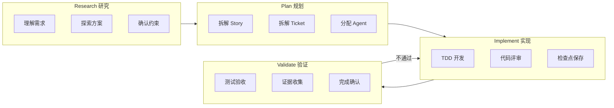
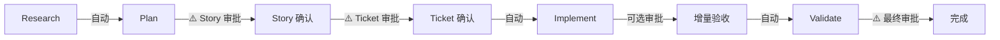
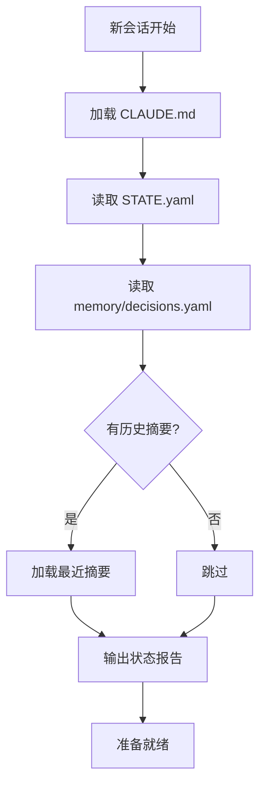

# RPIV 工作流

> Research → Plan → Implement → Validate

## 工作流总览



## 每阶段对应的 Skills 和 Agents

| 阶段 | Skills | Agent |
|------|--------|-------|
| Research | brainstorming | Architect |
| Plan | story-splitter, ticket-splitter | Planner |
| Implement | deliver-ticket, tdd, checkpoint-manager | Developer |
| Validate | verification, code-review | Reviewer, QA |

---

## Human-in-the-Loop 审批点



### 审批节点定义

| 节点 | 是否必须 | 审批内容 | 命令 |
|------|----------|----------|------|
| Story 拆解后 | **必须** | 确认范围正确、无遗漏 | `/approve stories` |
| Ticket 拆解后 | **必须** | 确认任务合理、粒度合适 | `/approve tickets` |
| 每个 Ticket 完成后 | 可选 | 快速验收单个任务 | `/approve T-xxx` 或自动 |
| Story 全部完成后 | **必须** | 整体功能验收 | `/approve S-xxx` |

### 审批配置

```yaml
# project/config.yaml 中的审批配置
approval:
  story_split: required      # required | optional | auto
  ticket_split: required
  ticket_done: auto          # 单个 Ticket 完成后自动继续
  story_done: required       # Story 完成需要人工确认
  
  # 自动审批条件（当 ticket_done: auto 时）
  auto_approve_if:
    - tests_pass: true
    - lint_pass: true
    - no_new_warnings: true
```

---

## 会话恢复流程

### 新会话启动时



### 恢复输出格式

```
## 🔄 会话恢复

**上次会话**: 2026-02-01 10:30
**当前阶段**: Implement
**当前任务**: S-001 / T-003

### 进度
- Story S-001: 用户管理模块 (2/6 完成)
- 下一个 Ticket: T-003 用户编辑 API

### 重要决策
- D-001: 使用 MyBatis-Plus 替代原生 MyBatis

### 可用操作
- `/next` - 继续执行 T-003
- `/status` - 查看详细状态
- `/restore CP-xxx` - 恢复到指定检查点

---
继续执行 T-003 吗？输入 `/next` 或其他命令。
```

---

## STATE.yaml 全局状态文件

```yaml
# osg-spec-docs/tasks/STATE.yaml
version: "1.0"
last_updated: "2026-02-01T10:30:00Z"

# 当前阶段
# 状态说明：
# - research: 需求研究阶段
# - plan: 任务规划阶段
# - implement: 代码实现阶段
# - validate: 验证验收阶段
# - blocked: 遇到阻塞，需人工介入
# - completed: 全部完成
phase: implement  # research | plan | implement | validate | blocked | completed

# 当前工作项
current:
  requirement: REQ-001
  story: S-001
  ticket: T-003
  agent: backend-java

# Stories 状态
stories:
  S-001:
    status: in_progress
    progress: "2/6"
    tickets:
      - id: T-001
        status: completed
        checkpoint: CP-20260201-100100
      - id: T-002
        status: completed
        checkpoint: CP-20260201-100300
      - id: T-003
        status: in_progress
      - id: T-004
        status: pending
      - id: T-005
        status: pending
      - id: T-006
        status: pending

# 统计
stats:
  total_stories: 1
  completed_stories: 0
  total_tickets: 6
  completed_tickets: 2
  failed_tickets: 0
  blocked_tickets: 0

# 最近检查点
last_checkpoint: CP-20260201-100300

# 上下文状态
context:
  usage_percent: 45
  last_compression: null
  
# 会话信息
session:
  id: "2026-02-01-001"
  started_at: "2026-02-01T09:00:00Z"
```

---

## 相关文档

- [00_概览](00_概览.md) - 返回概览
- [02_错误处理](02_错误处理.md) - 错误处理和回滚机制
- [32_命令体系](32_命令体系.md) - 所有命令说明
