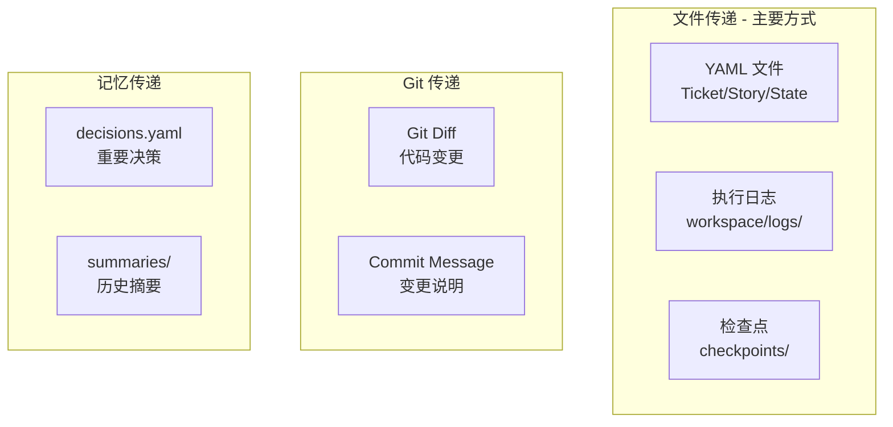
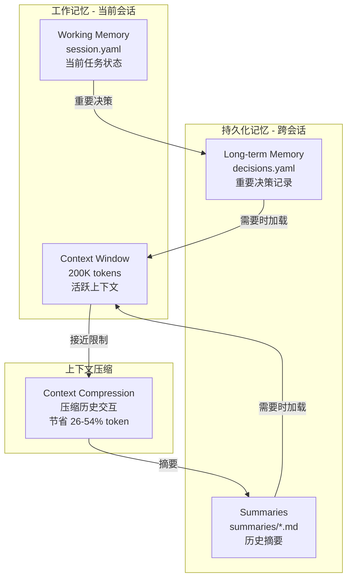

# 错误处理与回滚机制

## 错误分类与处理策略

```yaml
error_handling:
  # 1. Ticket 执行失败
  ticket_failed:
    actions:
      - 停止当前 Ticket 执行
      - 记录错误到 workspace/logs/{ticket_id}.yaml
      - 保存当前状态到 checkpoint
      - 通知人工介入（不自动回滚）
    recovery:
      - /retry T-xxx        # 重试当前 Ticket
      - /skip T-xxx         # 跳过（标记为 blocked）
      - /rollback T-xxx     # 回滚到 Ticket 开始前的 checkpoint

  # 2. 测试失败
  test_failed:
    max_retries: 3
    actions:
      - 第 1-2 次：自动触发 debugging skill 分析原因
      - 第 3 次：仍失败则停止，人工介入
    auto_fix:
      enabled: true
      scope: "only_test_file"  # 只允许修改测试文件或实现文件

  # 3. Lint 失败
  lint_failed:
    auto_fix: true             # 自动运行 lint --fix
    max_retries: 2
    fallback: "human_review"

  # 4. 上下文耗尽
  context_exhausted:
    threshold: 70%             # 触发阈值（保守估计）
    actions:
      - 自动触发 context-compression skill
      - 保存当前状态到 checkpoint
      - 压缩后继续执行
    if_compression_fails:
      - 保存完整状态
      - 提示用户开启新会话
      - 提供 /restore 命令
    
    # ⚠️ 重要说明：Cursor 中的上下文监控
    # 由于 Cursor 无法提供精确的 token 使用量 API，
    # 阈值检测采用以下估算方法：
    estimation_method: |
      1. 按消息长度估算（约 4 字符 = 1 token）
      2. 按交互轮数估算（每轮约 500-2000 tokens）
      3. 估算可能存在 ±20% 误差
    
    # 建议：用户主动触发
    user_trigger_recommendation: |
      由于自动检测不精确，建议用户在以下情况主动执行 /compress：
      - 感觉响应变慢时
      - 对话超过 20 轮时
      - 开始新的 Story 之前
      - 看到"context limit"相关警告时

  # 5. 文件冲突（修改了 allowed_paths 之外的文件）
  path_violation:
    actions:
      - 立即停止
      - 回滚该文件的修改
      - 记录违规到日志
      - 人工确认是否扩大 allowed_paths
```

---

## 回滚命令

```bash
/rollback T-xxx              # 回滚单个 Ticket
/rollback S-xxx              # 回滚整个 Story
/rollback CP-{timestamp}     # 回滚到指定 checkpoint
/rollback --last             # 回滚到上一个 checkpoint
```

---

## Agent 间信息传递

### 传递方式



### 具体传递路径

| 传递路径 | 传递内容 | 传递方式 |
|----------|----------|----------|
| Planner → Developer | 任务定义 | `tasks/tickets/T-xxx.yaml` |
| Developer → Reviewer | 代码变更 | `git diff` + `workspace/logs/T-xxx.yaml` |
| Reviewer → Developer | 评审意见 | `artifacts/reviews/T-xxx.md` |
| Developer → QA | 完成报告 | `workspace/logs/T-xxx.yaml` |
| Any → Any | 重要决策 | `memory/decisions.yaml` |
| Any → Future | 历史上下文 | `memory/summaries/{date}.md` |

### 信息隔离原则

```
⚠️ 关键原则：Agent 之间 **不传递对话历史**

原因：
1. 避免上下文污染
2. 每个 Agent 保持独立视角
3. 节省 token

传递的是：
✓ 结构化数据（YAML）
✓ 执行结果（日志、Git diff）
✓ 关键决策（decisions.yaml）

不传递的是：
✗ 对话历史
✗ 中间思考过程
✗ 探索性尝试
```

---

## 记忆管理架构

### 记忆层次



### 记忆文件结构

```yaml
# memory/session.yaml - 当前会话状态
session_id: "2026-02-01-001"
started_at: "2026-02-01T10:00:00Z"
current_phase: "implement"  # research | plan | implement | validate
current_story: "S-001"
current_ticket: "T-003"
context_usage: 45%
last_checkpoint: "CP-20260201-100500"

# memory/decisions.yaml - 重要决策记录（跨会话持久化）
decisions:
  - id: D-001
    date: "2026-02-01"
    context: "用户管理模块技术选型"
    decision: "使用 MyBatis-Plus 替代原生 MyBatis"
    rationale: "减少样板代码，提升开发效率"
    impact: "S-001, S-002"
    
# memory/summaries/2026-02-01.md - 历史摘要
## 2026-02-01 工作摘要
- 完成 Story S-001 的 Ticket T-001 到 T-003
- 主要改动：用户管理 API + 前端页面
- 遗留问题：T-004 权限校验待处理
```

---

## 相关文档

- [00_概览](00_概览.md) - 返回概览
- [01_工作流_RPIV](01_工作流_RPIV.md) - RPIV 工作流
- [10_Skills_记忆管理](10_Skills_记忆管理.md) - 记忆管理 Skills 详情
