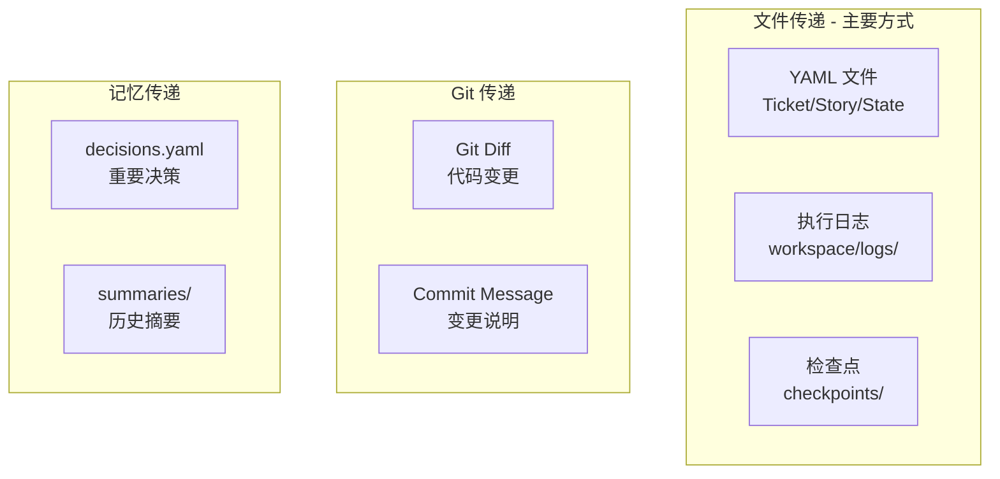
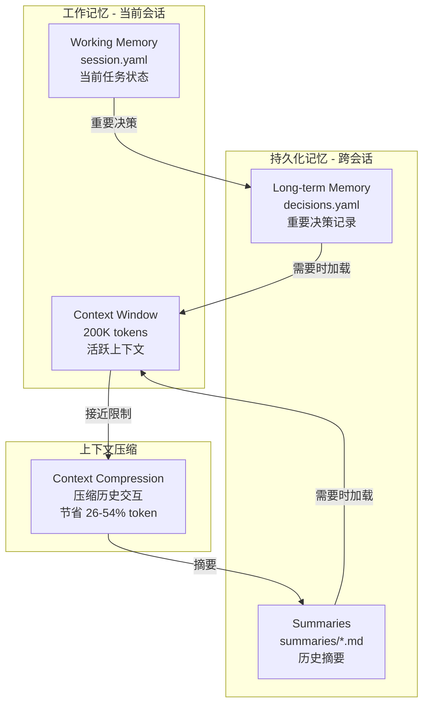

# 错误处理与回滚机制

## 错误分类与处理策略

```yaml
error_handling:
  # 1. Ticket 执行失败
  ticket_failed:
    actions:
      - 停止当前 Ticket 执行
      - 记录错误到 workspace/logs/{ticket_id}.yaml
      - 保存当前状态到 checkpoint
      - 通知人工介入（不自动回滚）
    recovery:
      - /retry T-xxx        # 重试当前 Ticket
      - /skip T-xxx         # 跳过（标记为 blocked）
      - /rollback T-xxx     # 回滚到 Ticket 开始前的 checkpoint

  # 1b. 边界条件：STATE.yaml 文件不存在
  state_file_missing:
    trigger: "osg-spec-docs/tasks/STATE.yaml 不存在或无法读取"
    actions:
      - 输出提示："检测到项目未初始化"
      - 提示执行 /init-project
    output: |
      ## ❌ 项目未初始化
      
      未找到 osg-spec-docs/tasks/STATE.yaml 文件。
      
      **请先执行**: `/init-project {项目名} --stack {技术栈}`

  # 1b2. 边界条件：config.yaml 文件不存在（核心配置缺失）
  config_file_missing:
    trigger: ".claude/project/config.yaml 不存在或无法读取"
    actions:
      - 输出提示："检测到项目配置缺失"
      - 提示创建 config.yaml
      - 提供模板链接
    output: |
      ## ❌ 项目配置缺失
      
      未找到 `.claude/project/config.yaml` 文件。
      
      **config.yaml 是框架运行的核心配置**，没有它：
      - Skills 无法获取项目技术栈信息
      - 无法知道使用什么命令测试/构建
      - 无法知道代码放在哪个目录
      
      **解决方案**:
      1. 运行 `/init-project {项目名} --stack {技术栈}` 自动生成
      2. 或手动创建，参考 [31_项目配置](31_项目配置.md) 中的模板
      
      **必填字段**:
      - `tech_stack`: 技术栈信息
      - `commands`: 测试/构建/运行命令
      - `paths`: 代码目录路径

  # 1c. 边界条件：Ticket YAML 文件不存在
  ticket_file_missing:
    trigger: "osg-spec-docs/tasks/tickets/T-xxx.yaml 不存在"
    actions:
      - 输出错误信息
      - 建议重新拆分 Tickets
    output: |
      ## ❌ Ticket 文件不存在
      
      未找到 T-{id}.yaml 文件。
      
      **可能原因**:
      1. Ticket 尚未拆分
      2. 文件被误删除
      
      **建议操作**: `/split ticket S-xxx`

  # 1d. 边界条件：没有 pending 的 Ticket
  no_pending_ticket:
    trigger: "/next 但所有 Ticket 都已完成或被阻塞"
    actions:
      - 检查是否有 blocked 的 Ticket
      - 输出状态报告
    output: |
      ## ℹ️ 无待执行 Ticket
      
      **当前状态**:
      - 已完成: {completed_count} 个
      - 阻塞中: {blocked_count} 个
      
      **下一步**:
      - 阻塞 Ticket: `/unblock --list`
      - 验收 Story: `/verify S-xxx`
      - 继续下个 Story: `/split ticket S-xxx`

  # 2. 测试失败
  test_failed:
    max_retries: 3
    actions:
      - 第 1-2 次：自动触发 debugging skill 分析原因
      - 第 3 次：仍失败则停止，人工介入
    auto_fix:
      enabled: true
      scope: "only_test_file"  # 只允许修改测试文件或实现文件

  # 3. Lint 失败
  lint_failed:
    auto_fix: true             # 自动运行 lint --fix
    max_retries: 2
    fallback: "human_review"

  # 4. 上下文耗尽
  context_exhausted:
    threshold: 70%             # 触发阈值（保守估计）
    actions:
      - 自动触发 context-compression skill
      - 保存当前状态到 checkpoint
      - 压缩后继续执行
    if_compression_fails:
      - 保存完整状态
      - 提示用户开启新会话
      - 提供 /restore 命令
    
    # ⚠️ 重要说明：Cursor 中的上下文监控
    # 由于 Cursor 无法提供精确的 token 使用量 API，
    # 阈值检测采用以下估算方法：
    estimation_method: |
      1. 按消息长度估算（约 4 字符 = 1 token）
      2. 按交互轮数估算（每轮约 500-2000 tokens）
      3. 估算可能存在 ±20% 误差
    
    # 建议：用户主动触发
    user_trigger_recommendation: |
      由于自动检测不精确，建议用户在以下情况主动执行 /compress：
      - 感觉响应变慢时
      - 对话超过 20 轮时
      - 开始新的 Story 之前
      - 看到"context limit"相关警告时

  # 5. 文件冲突（修改了 allowed_paths 之外的文件）
  path_violation:
    actions:
      - 立即停止
      - 回滚该文件的修改
      - 记录违规到日志
      - 人工确认是否扩大 allowed_paths
```

---

## 📐 精确错误处理步骤（低智商模型必读）

### 错误检测逻辑

```python
def 错误检测(操作类型: str, 操作结果: dict) -> tuple[str, str]:
    """
    检测操作是否出错
    返回：(错误类型, 错误详情) 或 (None, None)
    """
    
    # 1. 文件读取错误
    if 操作类型 == "读取文件":
        if 操作结果.get("status") == "not_found":
            文件名 = 操作结果.get("file")
            
            if "STATE.yaml" in 文件名:
                return ("state_file_missing", 文件名)
            elif "T-" in 文件名 and ".yaml" in 文件名:
                return ("ticket_file_missing", 文件名)
            elif "S-" in 文件名 and ".yaml" in 文件名:
                return ("story_file_missing", 文件名)
            else:
                return ("file_not_found", 文件名)
    
    # 2. 命令执行错误
    if 操作类型 == "执行命令":
        退出码 = 操作结果.get("exit_code", 0)
        输出 = 操作结果.get("output", "")
        
        if 退出码 != 0:
            if "test" in 操作结果.get("command", "").lower():
                if "FAILURE" in 输出 or "Failures:" in 输出:
                    return ("test_failed", 输出)
            elif "lint" in 操作结果.get("command", "").lower():
                return ("lint_failed", 输出)
            else:
                return ("command_failed", 输出)
    
    # 3. 状态逻辑错误
    if 操作类型 == "查找Ticket":
        if 操作结果.get("found") == False:
            return ("no_pending_ticket", "")
    
    return (None, None)
```

### 错误处理流程

```python
def 处理错误(错误类型: str, 错误详情: str) -> str:
    """
    根据错误类型执行相应的处理
    返回：用户可见的输出
    """
    
    处理逻辑 = {
        "state_file_missing": {
            "输出": """
## ❌ 项目未初始化

未找到 osg-spec-docs/tasks/STATE.yaml 文件。

**请先执行**:
```
/init-project
```
""",
            "动作": ["停止执行"]
        },
        
        "ticket_file_missing": {
            "输出": f"""
## ❌ Ticket 文件不存在

未找到 {错误详情} 文件。

**可能原因**:
1. Ticket 尚未拆分
2. 文件被误删除

**建议操作**: 重新拆分 Story
```
/split ticket S-xxx
```
""",
            "动作": ["停止执行"]
        },
        
        "no_pending_ticket": {
            "输出": """
## ✅ 所有任务已完成

当前没有待执行的 Ticket。

**下一步**:
- 如有阻塞 Ticket: `/unblock --list`
- 验收 Story: `/verify S-xxx`
- 开始新需求: `/brainstorm`
""",
            "动作": ["输出状态", "停止执行"]
        },
        
        "test_failed": {
            "输出": f"""
## ⚠️ 测试失败

**失败详情**:
```
{错误详情[:500]}...
```

**自动处理**: 调用 debugging skill 分析...
""",
            "动作": ["调用debugging", "重试"],
            "最大重试": 3
        },
        
        "lint_failed": {
            "输出": """
## ⚠️ Lint 失败

**自动处理**: 尝试自动修复...
""",
            "动作": ["执行lint_fix", "重试"],
            "最大重试": 2
        }
    }
    
    处理 = 处理逻辑.get(错误类型, {
        "输出": f"## ❌ 未知错误\n\n错误类型: {错误类型}\n详情: {错误详情}",
        "动作": ["停止执行"]
    })
    
    return 处理["输出"]
```

### 输出格式规范

**错误输出必须包含**：
1. **错误标识**：使用 `## ❌` 或 `## ⚠️` 开头
2. **错误描述**：一句话说明发生了什么
3. **详细信息**：代码块展示具体错误
4. **可能原因**：列出可能的原因
5. **建议操作**：明确的下一步命令

**示例**：
```markdown
## ❌ Ticket 执行失败

**Ticket**: T-003 - 用户编辑 API
**阶段**: TDD 绿灯
**错误**: 测试失败（第 3 次重试）

**失败详情**:
```
FAILED: testEditUser_success
Expected: HTTP 200
Actual: HTTP 500
NullPointerException at SysUserController.java:45
```

**可能原因**:
1. 参数校验缺失
2. 依赖服务未注入

**建议操作**:
- 查看日志: `workspace/logs/T-003.yaml`
- 手动修复后重试: `/retry T-003`
- 跳过此 Ticket: `/skip T-003`
```

---

## 回滚命令

```bash
/rollback T-xxx              # 回滚单个 Ticket
/rollback S-xxx              # 回滚整个 Story
/rollback CP-{timestamp}     # 回滚到指定 checkpoint
/rollback --last             # 回滚到上一个 checkpoint
```

---

## Agent 间信息传递

### 传递方式



### 具体传递路径

| 传递路径 | 传递内容 | 传递方式 |
|----------|----------|----------|
| Planner → Developer | 任务定义 | `osg-spec-docs/tasks/tickets/T-xxx.yaml` |
| Developer → Reviewer | 代码变更 | `git diff` + `workspace/logs/T-xxx.yaml` |
| Reviewer → Developer | 评审意见 | `artifacts/reviews/T-xxx.md` |
| Developer → QA | 完成报告 | `workspace/logs/T-xxx.yaml` |
| Any → Any | 重要决策 | `memory/decisions.yaml` |
| Any → Future | 历史上下文 | `memory/summaries/{date}.md` |

### 信息隔离原则

```
⚠️ 关键原则：Agent 之间 **不传递对话历史**

原因：
1. 避免上下文污染
2. 每个 Agent 保持独立视角
3. 节省 token

传递的是：
✓ 结构化数据（YAML）
✓ 执行结果（日志、Git diff）
✓ 关键决策（decisions.yaml）

不传递的是：
✗ 对话历史
✗ 中间思考过程
✗ 探索性尝试
```

---

## 记忆管理架构

### 记忆层次



### 记忆文件结构

```yaml
# memory/session.yaml - 当前会话状态
session_id: "2026-02-01-001"
started_at: "2026-02-01T10:00:00Z"
current_phase: "implement"  # research | plan | implement | validate
current_story: "S-001"
current_ticket: "T-003"
context_usage: 45%
last_checkpoint: "CP-20260201-100500"

# memory/decisions.yaml - 重要决策记录（跨会话持久化）
decisions:
  - id: D-001
    date: "2026-02-01"
    context: "用户管理模块技术选型"
    decision: "使用 MyBatis-Plus 替代原生 MyBatis"
    rationale: "减少样板代码，提升开发效率"
    impact: "S-001, S-002"
    
# memory/summaries/2026-02-01.md - 历史摘要
## 2026-02-01 工作摘要
- 完成 Story S-001 的 Ticket T-001 到 T-003
- 主要改动：用户管理 API + 前端页面
- 遗留问题：T-004 权限校验待处理
```

---

## 相关文档

- [00_概览](00_概览.md) - 返回概览
- [01_工作流_RPIV](01_工作流_RPIV.md) - RPIV 工作流
- [10_Skills_记忆管理](10_Skills_记忆管理.md) - 记忆管理 Skills 详情
