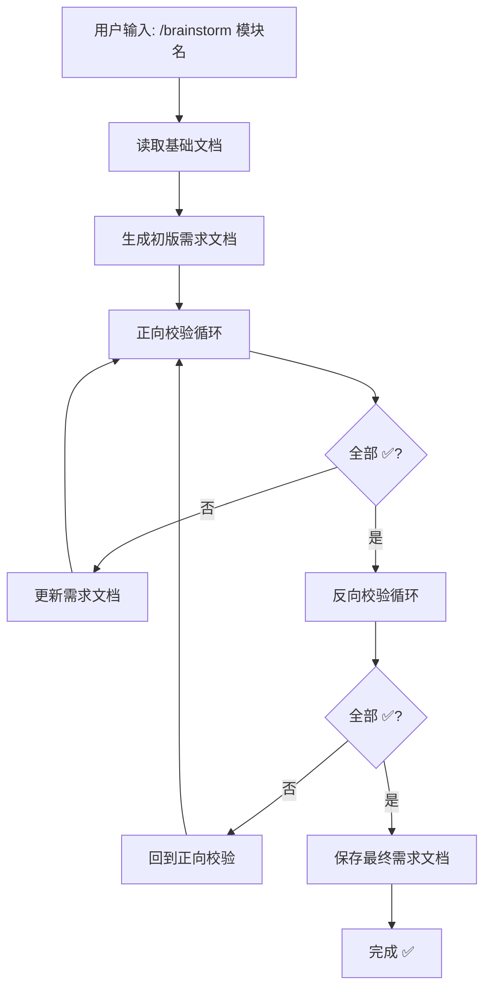

# Skills - 工作流类

本文档包含 5 个工作流相关的 Skills：
- brainstorming
- story-splitter
- ticket-splitter
- deliver-ticket
- using-git-worktrees

---

## 1. brainstorming

**参考来源**：obra/superpowers brainstorming skill

```yaml
---
name: brainstorming
description: "Use when refining requirements or when triggered with /brainstorm - automatically iterates through forward and backward validation until requirements are precise to code-line level"
invoked_by: user
auto_execute: true  # 自动执行模式，不等待用户确认
---
```

### ⚠️ 执行模式 - 自动迭代

**这是一个自动执行的流程，必须遵守以下规则：**

1. **不要停下来问用户** - 从开始到最终输出，全程自动执行
2. **必须循环迭代** - 正向校验、反向校验必须循环执行，直到所有检查项都是 ✅
3. **只输出最终结果** - 中间过程可以显示进度，但最终给用户的是完整的、校验通过的需求文档
4. **发现问题自动修复** - 校验发现 ⚠️ 时，自动更新需求文档，然后继续校验
5. **不需要用户确认** - 每轮校验之间不要等待用户输入

### 核心流程



### 执行流程伪代码

```python
def brainstorming(模块名):
    """
    自动执行的 brainstorming 流程
    整个流程是一个 while 循环，不需要用户中途介入
    """
    # Step 1: 读取基础文档
    docs = 读取基础文档(模块名)
    
    # Step 2: 生成初版需求文档
    需求文档 = 生成初版需求文档(docs)
    
    # Step 3: 外层循环 - 正向→反向，直到全部通过
    max_iterations = 10  # 安全限制
    iteration = 0
    
    while iteration < max_iterations:
        iteration += 1
        
        # Step 3.1: 正向校验循环
        forward_round = 0
        while not 正向校验全部通过(需求文档):
            forward_round += 1
            问题列表 = 执行正向校验(需求文档)
            需求文档 = 补充需求(需求文档, 问题列表)
            输出进度(f"正向校验第 {forward_round} 轮")
        
        # Step 3.2: 反向校验
        问题列表 = 执行反向校验(需求文档)
        if 反向校验全部通过(需求文档):
            break  # 全部通过，退出
        else:
            需求文档 = 补充需求(需求文档, 问题列表)
            # 继续外层循环，重新正向校验
    
    # Step 4: 保存最终需求文档
    保存需求文档(需求文档)
    记录决策(需求文档)
    
    # Step 5: 输出最终结果
    输出完成报告(需求文档)
```

### 输入规范

**触发命令**：`/brainstorm [模块名]`

**输入参数**：
- `模块名`：中文模块名，如"学生登录"、"用户管理"

**自动读取的文档**（按优先级）：

| 文档类型 | 路径 | 用途 |
|---------|------|------|
| API 规范 | `osg-spec-docs/docs/06-api/openapi.yaml` | 查找相关接口定义 |
| 数据库设计 | `osg-spec-docs/docs/07-database/DB-DDL-001_table-definitions.md` | 查找相关表结构 |
| 路由规格 | `osg-spec-docs/docs/03-design/routes/*-routes.ts` | 查找相关路由配置 |
| 功能需求 | `osg-spec-docs/docs/02-requirements/functional/REQ-FUN-*.md` | 查找相关功能描述 |
| 类型定义 | `osg-spec-docs/docs/07-database/types.ts` | 查找相关 TypeScript 类型 |
| 代码规范 | `docs/一人公司框架/43_rules_代码规范.md` | 参考代码规范 |

### 输出规范

**输出文件路径**：
```
osg-spec-docs/docs/12-implementation/{模块目录}/
├── REQ-{序号}-{模块名}.md          # 最终需求文档
└── decisions.yaml                  # 该模块的决策记录
```

**模块目录命名规则**（中文转 kebab-case）：
- "学生登录" → `student-login`
- "用户管理" → `user-management`
- "课程排期" → `course-scheduling`

### 正向校验项（5 项）- 详细判断标准

| 检查项 | ✅ 通过条件 | ⚠️ 不通过条件 | 检查问题 |
|--------|------------|--------------|----------|
| **细致度** | 所有文件都有完整路径（如 `osg-frontend/packages/student/src/views/login/index.vue`），所有方法都有参数和返回值说明 | 出现"相关文件"、"等"、"..."等模糊表述 | 1. 是否每个文件都有完整路径？2. 是否每个方法都说明了参数和返回值？3. 是否有代码片段示例？ |
| **最简路径** | 明确说明"复用 XXX 现有代码"，没有"新增 XXX 工具类"（除非必要） | 新增了可复用的代码，没有检查现有实现 | 1. 是否检查了现有代码库中的类似实现？2. 是否有不必要的新增代码？3. 能否用更少的改动实现？ |
| **影响范围** | 列出了"影响模块：A、B、C"，列出了"依赖：X、Y" | 没有列出影响范围，没有分析依赖 | 1. 修改这些文件会影响哪些其他模块？2. 这个功能依赖哪些已有功能？3. 是否需要同时修改前后端？ |
| **异常处理** | 列出了所有异常场景（空输入、超长输入、网络错误、权限不足等）及处理方式 | 只考虑正常流程，没有异常处理 | 1. 空输入怎么处理？2. 网络错误怎么处理？3. 用户无权限怎么处理？4. 并发访问怎么处理？ |
| **规范性** | 明确说明"符合若依开发模式"，Controller/Service/Mapper 分层清晰 | 没有遵循项目分层架构 | 1. 是否符合项目的分层架构？2. 命名是否符合规范？3. 是否有必要的注释？ |

#### 📐 量化判断规则（低智商模型必读）

**检查项 1 - 细致度**：
```python
def 检查细致度(文档: str) -> bool:
    # 规则 1：模糊词检测
    模糊词 = ["相关", "等", "...", "其他", "类似", "比如", "例如", "etc"]
    for 词 in 模糊词:
        if 词 in 文档:
            return False, f"发现模糊词: {词}"
    
    # 规则 2：文件路径必须完整
    # 完整路径格式：以 "osg-frontend/" 或 "ruoyi-" 开头，以 .vue/.ts/.java 结尾
    路径正则 = r"(osg-frontend/|ruoyi-)[^\s]+\.(vue|ts|java|xml)"
    所有路径 = 正则查找全部(文档, 路径正则)
    if len(所有路径) == 0:
        return False, "没有找到完整的文件路径"
    
    # 规则 3：方法必须有参数和返回值
    # 检查格式：methodName(param: Type): ReturnType 或 public ReturnType methodName(Param)
    方法正则 = r"(function|def|public|private)\s+\w+.*\(.*\)"
    所有方法 = 正则查找全部(文档, 方法正则)
    for 方法 in 所有方法:
        if ":" not in 方法 and "return" not in 方法.lower():
            return False, f"方法缺少返回值说明: {方法}"
    
    # 规则 4：必须有代码片段
    if "```" not in 文档:
        return False, "缺少代码片段示例"
    
    return True, "细致度检查通过"
```

**检查项 2 - 最简路径**：
```python
def 检查最简路径(文档: str) -> bool:
    # 规则 1：检查是否有"复用"关键词
    if "复用" not in 文档 and "reuse" not in 文档.lower():
        return False, "缺少对现有代码复用的说明"
    
    # 规则 2：如果有"新增"，必须说明原因
    if "新增" in 文档 or "create" in 文档.lower():
        if "因为" not in 文档 and "原因" not in 文档:
            return False, "新增代码未说明必要性"
    
    return True, "最简路径检查通过"
```

**检查项 3 - 影响范围**：
```python
def 检查影响范围(文档: str) -> bool:
    # 规则 1：必须有"影响"章节或表格
    if "影响" not in 文档 and "impact" not in 文档.lower():
        return False, "缺少影响范围分析"
    
    # 规则 2：必须有"依赖"章节或表格
    if "依赖" not in 文档 and "depend" not in 文档.lower():
        return False, "缺少依赖关系分析"
    
    return True, "影响范围检查通过"
```

**检查项 4 - 异常处理**：
```python
def 检查异常处理(文档: str) -> bool:
    # 规则：必须包含至少 3 种异常场景
    # 必须包含的异常类型
    必须异常 = ["空输入", "网络错误", "权限"]  # 至少匹配其中 3 个词
    匹配数 = 0
    
    异常关键词 = ["空输入", "null", "empty", "网络错误", "network", "timeout", 
                  "权限", "permission", "unauthorized", "超时", "错误", "异常",
                  "invalid", "fail", "error", "exception"]
    
    for 关键词 in 异常关键词:
        if 关键词 in 文档.lower():
            匹配数 += 1
    
    if 匹配数 < 3:
        return False, f"异常场景不足，当前只有 {匹配数} 种，需要至少 3 种"
    
    return True, "异常处理检查通过"
```

**检查项 5 - 规范性**：
```python
def 检查规范性(文档: str) -> bool:
    # 规则 1：后端必须有分层（Controller/Service/Mapper）
    后端分层 = ["Controller", "Service", "Mapper"]
    分层计数 = 0
    for 层 in 后端分层:
        if 层 in 文档:
            分层计数 += 1
    
    if 分层计数 < 2:  # 至少提到 2 个层
        return False, f"后端分层不清晰，只提到 {分层计数} 层"
    
    return True, "规范性检查通过"
```

### 反向校验项（6 项）- 详细判断标准

#### 结果倒推检查（3 项）

| 检查项 | ✅ 通过条件 | ⚠️ 不通过条件 | 检查问题 |
|--------|------------|--------------|----------|
| **用户视角** | 列出了至少 3 个用户可能遇到的问题场景及解决方案 | 只考虑理想流程，没有考虑用户实际使用问题 | 1. 用户忘记密码怎么办？2. 用户输入错误怎么提示？3. 用户在弱网环境下会怎样？ |
| **测试视角** | 列出了正向测试、反向测试、边界测试用例 | 只有正向测试，没有反向和边界测试 | 1. 测试人员会怎么测试这个功能？2. 有哪些可能的边界情况？3. 压力测试会暴露什么问题？ |
| **场景覆盖** | 所有用户场景都有对应的实现说明 | 有用户场景没有覆盖 | 1. 所有用户角色都能正常使用吗？2. 有没有遗漏的使用场景？3. 批量操作场景考虑了吗？ |

#### 删除法验证（3 项）

| 检查项 | ✅ 通过条件 | ⚠️ 不通过条件 | 检查问题 |
|--------|------------|--------------|----------|
| **代码必要性** | 每个文件、每个方法都有明确的存在理由 | 有文件/方法删掉后功能不受影响 | 1. 删掉这个文件会怎样？2. 删掉这个方法会怎样？3. 这行代码是必须的吗？ |
| **冗余检查** | 没有重复的逻辑，没有死代码 | 有重复实现，有永远不会执行的代码 | 1. 有没有重复的逻辑？2. 有没有可以合并的代码？3. 有没有永远不会执行的分支？ |
| **复用检查** | 所有可复用的代码都标注了"复用自 XXX" | 重新实现了已有的功能 | 1. 项目中是否已有类似实现？2. 是否可以抽取为共享组件？3. 是否可以使用现有工具类？ |

#### 📐 反向校验量化规则（低智商模型必读）

**检查项 1 - 用户视角**：
```python
def 检查用户视角(文档: str) -> bool:
    # 规则：必须有 "异常处理" 表格，且至少 3 行数据
    if "异常处理" not in 文档 and "异常场景" not in 文档:
        return False, "缺少异常处理章节"
    
    # 计数逻辑：检查表格行数
    # 表格行格式：以 | 开头，包含内容
    表格行 = [行 for 行 in 文档.split('\n') if 行.strip().startswith('|') and '---' not in 行]
    # 排除表头（第一行）
    数据行 = 表格行[1:] if len(表格行) > 1 else []
    
    if len(数据行) < 3:
        return False, f"异常场景不足，当前 {len(数据行)} 个，需要至少 3 个"
    
    return True, "用户视角检查通过"
```

**检查项 2 - 测试视角**：
```python
def 检查测试视角(文档: str) -> bool:
    # 规则：必须有 3 种测试类型
    测试类型 = {
        "正向": ["success", "正常", "正向", "happy path"],
        "反向": ["fail", "error", "异常", "反向", "invalid"],
        "边界": ["boundary", "边界", "极限", "最大", "最小"]
    }
    
    找到的类型 = []
    for 类型名, 关键词列表 in 测试类型.items():
        for 关键词 in 关键词列表:
            if 关键词 in 文档.lower():
                找到的类型.append(类型名)
                break
    
    if len(找到的类型) < 3:
        缺失 = set(测试类型.keys()) - set(找到的类型)
        return False, f"测试类型不全，缺少: {缺失}"
    
    return True, "测试视角检查通过"
```

**检查项 3 - 场景覆盖**：
```python
def 检查场景覆盖(文档: str) -> bool:
    # 规则：涉及的用户角色都必须有使用说明
    OSG项目角色 = ["学生", "导师", "班主任", "助教", "管理员"]
    
    # 从文档中提取涉及的角色
    涉及角色 = [角色 for 角色 in OSG项目角色 if 角色 in 文档]
    
    # 每个涉及的角色都必须有对应的使用场景
    # 简化判断：角色名后面必须跟着动词（能、可以、需要、应该）
    for 角色 in 涉及角色:
        角色场景正则 = f"{角色}.*(能|可以|需要|应该|使用)"
        if not 正则搜索(文档, 角色场景正则):
            return False, f"角色 '{角色}' 没有使用场景说明"
    
    return True, "场景覆盖检查通过"
```

**检查项 4 - 代码必要性**：
```python
def 检查代码必要性(文档: str) -> bool:
    # 规则：每个涉及的文件必须有"说明"列
    # 检查"涉及文件"表格是否每行都有非空的说明
    
    if "涉及文件" not in 文档:
        return False, "缺少涉及文件章节"
    
    # 简化判断：如果表格中有空的说明列
    # 假设表格格式：| 文件路径 | 操作 | 说明 |
    表格行 = 提取表格行(文档, "涉及文件")
    for 行 in 表格行:
        列 = 行.split('|')
        if len(列) >= 4:  # 包含前后的空列
            说明 = 列[3].strip() if len(列) > 3 else ""
            if not 说明 or 说明 == "-":
                return False, f"文件说明为空: {列[1].strip()}"
    
    return True, "代码必要性检查通过"
```

**检查项 5 - 冗余检查**：
```python
def 检查冗余(文档: str) -> bool:
    # 规则：不能有明显的重复实现
    # 检查是否有相同的方法名出现多次
    
    方法定义 = 正则查找全部(文档, r"(def|function|public|private)\s+(\w+)")
    方法名列表 = [m[1] for m in 方法定义]
    
    重复方法 = [名 for 名 in set(方法名列表) if 方法名列表.count(名) > 1]
    if 重复方法:
        return False, f"发现重复方法定义: {重复方法}"
    
    return True, "冗余检查通过"
```

**检查项 6 - 复用检查**：
```python
def 检查复用(文档: str) -> bool:
    # 规则：必须提到现有代码的复用
    复用关键词 = ["复用", "reuse", "已有", "existing", "使用现有", "调用"]
    
    找到复用 = False
    for 关键词 in 复用关键词:
        if 关键词 in 文档.lower():
            找到复用 = True
            break
    
    if not 找到复用:
        return False, "未说明对现有代码的复用"
    
    return True, "复用检查通过"
```

#### ⚠️ 校验维度矩阵（防止遗漏）

**除了上述正向/反向校验项，还需检查以下维度（详见 [12_Skills_质量](12_Skills_质量.md)）**：

| 维度 | 检查内容 | 示例 |
|------|---------|------|
| **结构一致性** | 数字、导航、目录、链接 | Skills=16 是否到处一致？ |
| **格式一致性** | ID、时间、路径、代码块 | 时间戳是否都是 ISO 8601？ |
| **语义一致性** | 版本号、配置值、术语 | 从 config.yaml 读取，是否匹配？ |
| **逻辑一致性** | 流程、依赖、条件、边界 | if/else 是否有遗漏分支？ |

**核心规则**：
1. **不能只检查"想到的"** - 必须按维度矩阵逐项检查
2. **换样提问** - 同一内容从不同角度反复检查
3. **无轮次限制** - 有修改就继续，直到所有维度都无修改

### 完整执行示例

以下是 `/brainstorm 学生登录` 的完整执行示例：

```
用户输入: /brainstorm 学生登录

---

## 📖 Step 1: 读取基础文档

正在读取以下文档：
- osg-spec-docs/docs/06-api/openapi.yaml ✅
- osg-spec-docs/docs/07-database/DB-DDL-001_table-definitions.md ✅
- osg-spec-docs/docs/03-design/routes/student-routes.ts ✅
- osg-spec-docs/docs/02-requirements/functional/REQ-FUN-001-auth.md ✅
- osg-spec-docs/docs/07-database/types.ts ✅

---

## 📖 Step 2: 生成初版需求文档

### 需求理解 - 学生登录

**来源文档**：
- API: `POST /api/student/auth/login`
- 类型: `StudentLoginRequest`, `StudentLoginResponse`
- 表: `osg_student`, `osg_student_token`

### 涉及文件
- `osg-frontend/packages/student/src/views/login/index.vue` (修改)
- `osg-frontend/packages/shared/src/api/auth.ts` (修改)
- `ruoyi-admin/src/main/java/com/osg/controller/StudentAuthController.java` (修改)
- `ruoyi-system/src/main/java/com/osg/service/IStudentAuthService.java` (修改)

### 需要修改的方法
- `StudentAuthController.login(StudentLoginRequest)` - 实现登录逻辑
- `auth.ts` 的 `studentLogin(email, password)` - 调用后端 API

### 测试用例
- testLogin_success - 正常登录
- testLogin_wrongPassword - 密码错误
- testLogin_userNotFound - 用户不存在

### 验收标准
- 学生可以使用邮箱+密码登录
- 登录成功返回 JWT Token
- 登录失败显示错误提示

---

## 🔍 Step 3: 正向校验 - 第 1 轮

| 检查项 | 状态 | 说明 |
|--------|------|------|
| 细致度 | ⚠️ | 缺少登录表单验证逻辑的具体实现，缺少 Token 存储位置 |
| 最简路径 | ✅ | 复用 ruoyi 现有的 JWT 工具类 |
| 影响范围 | ⚠️ | 未分析对权限系统的影响 |
| 异常处理 | ⚠️ | 缺少网络错误、服务器错误的处理 |
| 规范性 | ✅ | 符合若依 Controller/Service 分层 |

### 需要补充（自动执行）
1. 添加登录表单验证逻辑（邮箱格式、密码长度）
2. 明确 Token 存储位置（localStorage）
3. 分析对现有权限系统的影响
4. 添加网络错误、服务器错误的处理

[自动补充需求文档...]

---

## 🔍 Step 3: 正向校验 - 第 2 轮

| 检查项 | 状态 | 说明 |
|--------|------|------|
| 细致度 | ✅ | 已补充表单验证和 Token 存储 |
| 最简路径 | ✅ | - |
| 影响范围 | ✅ | 已分析：不影响现有权限系统，独立的学生端登录 |
| 异常处理 | ✅ | 已添加网络错误、服务器错误处理 |
| 规范性 | ✅ | - |

✅ 正向校验全部通过，进入反向校验

---

## 🔍 Step 4: 反向校验 - 第 1 轮

### 结果倒推检查
| 检查项 | 状态 | 说明 |
|--------|------|------|
| 用户视角 | ⚠️ | 用户可能忘记密码，需要找回密码功能 |
| 测试视角 | ✅ | 已覆盖正向、反向、边界测试 |
| 场景覆盖 | ✅ | 已覆盖所有登录场景 |

### 删除法验证
| 检查项 | 状态 | 说明 |
|--------|------|------|
| 代码必要性 | ✅ | 每个文件都有明确用途 |
| 冗余检查 | ✅ | 无冗余代码 |
| 复用检查 | ✅ | 已复用 JwtUtils |

### 发现问题（自动回到正向校验）
1. 需要添加"忘记密码"功能的说明（或标注为 Out of Scope）

[自动回到正向校验补充...]

---

## 🔍 Step 3: 正向校验 - 第 3 轮

| 检查项 | 状态 | 说明 |
|--------|------|------|
| 细致度 | ✅ | 已标注"忘记密码"为 Phase 2 |
| 最简路径 | ✅ | - |
| 影响范围 | ✅ | - |
| 异常处理 | ✅ | - |
| 规范性 | ✅ | - |

✅ 正向校验全部通过，进入反向校验

---

## 🔍 Step 4: 反向校验 - 第 2 轮

### 结果倒推检查
| 检查项 | 状态 | 说明 |
|--------|------|------|
| 用户视角 | ✅ | 已标注"忘记密码"为 Phase 2 |
| 测试视角 | ✅ | - |
| 场景覆盖 | ✅ | - |

### 删除法验证
| 检查项 | 状态 | 说明 |
|--------|------|------|
| 代码必要性 | ✅ | - |
| 冗余检查 | ✅ | - |
| 复用检查 | ✅ | - |

✅ 反向校验全部通过

---

## ✅ Step 5: Brainstorm 完成

**模块**: 学生登录
**需求文档**: osg-spec-docs/docs/12-implementation/student-login/REQ-001-student-login.md

**校验摘要**:
- 正向校验: 3 轮，全部通过 ✅
- 反向校验: 2 轮，全部通过 ✅

**下一步**: 运行 `/split story` 拆解为 Story

---

[完整需求文档内容...]
```

### Prompt 模板

```markdown
# Brainstorming Skill

## ⚠️ 执行模式
**自动执行**：整个流程自动完成，不等待用户确认。

## 触发
- 用户执行 `/brainstorm [模块名]`

## 流程

### Step 1: 读取基础文档

**必须读取的文档**（按以下顺序）：

```python
# 读取文档列表
docs_to_read = [
    "osg-spec-docs/docs/06-api/openapi.yaml",           # API 规范
    "osg-spec-docs/docs/07-database/DB-DDL-001_table-definitions.md",  # 数据库设计
    "osg-spec-docs/docs/03-design/routes/*-routes.ts",  # 路由规格（通配符匹配）
    "osg-spec-docs/docs/02-requirements/functional/REQ-FUN-*.md",     # 功能需求
    "osg-spec-docs/docs/07-database/types.ts",          # 类型定义
    "docs/一人公司框架/43_rules_代码规范.md",            # 代码规范
]

# 搜索关键词（根据模块名）
search_keywords = 模块名转关键词(模块名)  # 如 "学生登录" → ["student", "login", "auth", "学生", "登录"]
```

**输出格式**：
```
## 📖 Step 1: 读取基础文档

正在读取以下文档：
- {文档路径1} ✅/❌
- {文档路径2} ✅/❌
...

找到相关内容：
- API: {相关接口}
- 数据库: {相关表}
- 类型: {相关类型}
```

### Step 2: 生成初版需求文档

**输出文件**：`osg-spec-docs/docs/12-implementation/{模块目录}/REQ-{序号}-{模块名}.md`

**必须包含的章节**：

```markdown
# REQ-{序号}: {模块名}

## 需求信息
- **需求 ID**: REQ-{序号}
- **模块名**: {模块名}
- **创建时间**: {当前日期}
- **状态**: draft

## 需求概述

### 功能描述
{一段话描述功能}

### 业务价值
{为什么需要这个功能}

## 来源文档
- API 规范: `osg-spec-docs/docs/06-api/openapi.yaml` 第 {行号} 行
- 数据库设计: `osg-spec-docs/docs/07-database/...` 第 {行号} 行
- 功能需求: `osg-spec-docs/docs/02-requirements/functional/...`

## 涉及文件（精确路径）

### 前端文件
| 文件路径 | 操作 | 说明 |
|---------|------|------|
| `osg-frontend/packages/{端}/src/views/{页面}/index.vue` | 修改/新增 | {说明} |
| `osg-frontend/packages/shared/src/api/{模块}.ts` | 修改/新增 | {说明} |

### 后端文件
| 文件路径 | 操作 | 说明 |
|---------|------|------|
| `ruoyi-admin/src/main/java/com/osg/controller/{Controller}.java` | 修改/新增 | {说明} |
| `ruoyi-system/src/main/java/com/osg/service/I{Service}.java` | 修改/新增 | {说明} |

## 实现细节

### 需要修改的方法/函数

#### 前端
| 文件 | 方法/函数 | 参数 | 返回值 | 修改内容 |
|------|---------|------|--------|---------|
| `{文件}` | `{方法名}()` | `{参数类型}` | `{返回类型}` | {具体修改} |

#### 后端
| 文件 | 方法/函数 | 参数 | 返回值 | 修改内容 |
|------|---------|------|--------|---------|
| `{文件}` | `{方法名}()` | `{参数类型}` | `{返回类型}` | {具体修改} |

## 测试用例
| 用例名 | 类型 | 输入 | 预期输出 | 说明 |
|-------|------|------|---------|------|
| testXxx_success | 正向 | {输入} | {输出} | 正常场景 |
| testXxx_invalidInput | 反向 | {输入} | {错误} | 异常场景 |

## 验收标准
- [ ] {可验证的标准1}
- [ ] {可验证的标准2}

## 影响分析

### 影响的模块
| 模块 | 影响说明 |
|------|---------|
| {模块} | {影响} |

### 依赖关系
| 依赖项 | 说明 |
|-------|------|
| {依赖} | {说明} |

## 异常处理
| 异常场景 | 处理方式 | 用户提示 |
|---------|---------|---------|
| 空输入 | {处理} | {提示} |
| 网络错误 | {处理} | {提示} |
| 权限不足 | {处理} | {提示} |

## 安全考虑
- [ ] {安全检查项1}
- [ ] {安全检查项2}

## Out of Scope（不在本次范围）
- {不在范围的功能1}
- {不在范围的功能2}
```

### Step 3: 正向校验循环（自动迭代）
"""
## 🔍 正向校验 - 第 {N} 轮

| 检查项 | 状态 | 说明 |
|--------|------|------|
| 细致度 | ⚠️/✅ | {具体说明} |
| 最简路径 | ⚠️/✅ | {具体说明} |
| 影响范围 | ⚠️/✅ | {具体说明} |
| 异常处理 | ⚠️/✅ | {具体说明} |
| 规范性 | ⚠️/✅ | {具体说明} |

### 需要补充
{如果有 ⚠️，列出需要补充的内容，然后自动补充，继续下一轮}

{如果全部 ✅，进入反向校验}
"""

**循环逻辑**：
- 如果任何一项为 ⚠️，**自动**列出需要补充的内容
- **自动**更新需求文档
- **自动**重新检查，直到所有项为 ✅

### Step 4: 反向校验循环（自动迭代）
"""
## 🔍 反向校验 - 第 {N} 轮

### 结果倒推检查
| 检查项 | 状态 | 说明 |
|--------|------|------|
| 用户视角 | ⚠️/✅ | {具体说明} |
| 测试视角 | ⚠️/✅ | {具体说明} |
| 场景覆盖 | ⚠️/✅ | {具体说明} |

### 删除法验证
| 检查项 | 状态 | 说明 |
|--------|------|------|
| 代码必要性 | ⚠️/✅ | {具体说明} |
| 冗余检查 | ⚠️/✅ | {具体说明} |
| 复用检查 | ⚠️/✅ | {具体说明} |

### 发现问题
{如果有 ⚠️，列出问题，自动回到正向校验补充}

{如果全部 ✅，校验完成}
"""

**循环逻辑**：
- 如果发现问题（⚠️），**自动回到正向校验重新补充**
- 重新进行正向校验循环
- 直到反向校验也全部通过 ✅

### Step 5: 输出最终需求文档
"""
## ✅ Brainstorm 完成

**模块**: {模块名}
**需求文档**: {保存路径}

**校验摘要**:
- 正向校验: {N} 轮，全部通过 ✅
- 反向校验: {M} 轮，全部通过 ✅

**下一步**: 运行 `/split story` 拆解为 Story

---

[展示完整的需求文档内容]
"""

## 硬性约束

### 执行约束
1. **自动执行** - 整个流程不等待用户确认
2. **循环迭代** - 校验必须循环执行，直到全部 ✅
3. **自动修复** - 发现问题自动补充，不停下来问用户

### 内容约束
1. 需求必须精确到文件/方法/代码行
2. 所有方案必须有 trade-offs 分析
3. 决策必须记录到 memory/decisions.yaml
4. 最大迭代次数 10 轮（安全限制）

### 禁止的行为
- ❌ 做完一轮校验就停下来问用户
- ❌ 等用户说"继续"才执行下一轮
- ❌ 把中间结果当作最终结果输出
- ❌ 遇到 ⚠️ 就停止，不自动修复

### 必须的行为
- ✅ 自动循环执行，直到全部 ✅
- ✅ 发现问题自动补充，然后继续校验
- ✅ 反向校验发现问题，自动回到正向校验
- ✅ 最终输出完整的、校验通过的需求文档
```

---

## 2. story-splitter

```yaml
---
name: story-splitter
description: "Use when splitting requirements into Stories or when triggered with /split story - decomposes requirements into User Stories following INVEST principles"
invoked_by: user
---
```

### 输入要求

1. 需求文档路径（docs/requirements/REQ-xxx.md）
2. 或直接的需求描述

### INVEST 原则

| 原则 | 检查项 | 通过标准 |
|------|--------|----------|
| **I**ndependent | 是否独立 | 不依赖其他 Story 完成 |
| **N**egotiable | 是否可协商 | 细节可调整 |
| **V**aluable | 是否有价值 | 对用户有明确价值 |
| **E**stimable | 是否可估算 | 能估算 Ticket 数量 |
| **S**mall | 是否够小 | 5-10 个 Ticket 以内 |
| **T**estable | 是否可测试 | 有明确验收标准 |

### Prompt 模板

```markdown
# Story Splitter Skill

## 触发
- 用户执行 `/split story`

## 流程

### Step 1: 需求理解
"""
## 📖 需求理解

**需求来源**: {REQ-xxx}
**核心目标**: {一句话描述}
**涉及模块**: {模块列表}
**涉及端**: {backend/frontend/database}
"""

### Step 2: Story 识别
按以下维度拆解：
- 按用户角色拆分
- 按功能模块拆分
- 按数据实体拆分

### Step 3: INVEST 检验
每个 Story 必须满足 INVEST 原则。

### Step 4: 输出格式
"""
## 📝 Story 拆解结果

**需求**: {REQ-xxx} - {需求标题}

### Story 列表

| ID | 标题 | 涉及端 | 预估 Tickets | 优先级 |
|----|------|--------|--------------|--------|
| S-001 | {标题} | backend, frontend | 6 | P0 |
| S-002 | {标题} | backend | 4 | P1 |

### Story 详情

#### S-001: {标题}
- **描述**: {用户故事描述}
- **验收标准**:
  1. {标准1}
  2. {标准2}
- **INVEST 检查**: ✅ 全部通过

#### S-002: {标题}
...

### 依赖关系
```
S-001 (独立)
S-002 → S-001 (依赖 S-001 的用户数据)
```

### ⚠️ 需要确认
1. {需要人工确认的问题1}
2. {需要人工确认的问题2}

---
**下一步**: 请确认后运行 `/approve stories`，然后 `/split ticket S-001`
"""

## 输出文件
为每个 Story 创建 YAML 文件：
- `osg-spec-docs/tasks/stories/S-001.yaml`
- `osg-spec-docs/tasks/stories/S-002.yaml`

同时更新 `osg-spec-docs/tasks/STATE.yaml`
```

---

## 3. ticket-splitter

```yaml
---
name: ticket-splitter
description: "Use when splitting a Story into Tickets or when triggered with /split ticket S-xxx - decomposes Story into 2-5 minute executable Tickets with clear file paths and TDD structure"
invoked_by: user
---
```

### 拆解原则（借鉴 superpowers）

- 每个 Ticket 2-5 分钟可完成
- 明确的文件路径（不含模糊描述）
- TDD 结构（测试先行）
- 指定执行 Agent（backend/frontend/dba）

### Prompt 模板

```markdown
# Ticket Splitter Skill

## 触发
- 用户执行 `/split ticket S-xxx`

## 流程

### Step 1: 读取 Story
读取 `osg-spec-docs/tasks/stories/S-xxx.yaml`，理解范围。

### Step 2: 分析实现路径
1. 确定涉及的文件
2. 确定修改顺序
3. 确定测试策略

### Step 3: 拆解 Tickets
每个 Ticket 必须包含：
- 明确的文件路径
- TDD 测试用例
- 验收标准（可验证）
- 执行 Agent

### Step 4: 输出格式
"""
## 📝 Ticket 拆解结果

**Story**: S-001 - {标题}

### Ticket 列表

| ID | 标题 | 类型 | Agent | 预估 |
|----|------|------|-------|------|
| T-001 | 用户列表 API | backend | backend-java | 5min |
| T-002 | 新增用户 API | backend | backend-java | 5min |
| T-003 | 用户列表页面 | frontend | frontend-vue | 5min |

### Ticket 详情

#### T-001: 用户列表 API
- **类型**: backend
- **Agent**: backend-java
- **修改文件**:
  - `ruoyi-admin/src/.../SysUserController.java`
  - `ruoyi-system/src/.../ISysUserService.java`
- **测试用例**:
  - testListUsers_success
  - testListUsers_withCondition
- **验收**: `mvn test -Dtest=SysUserControllerTest` 通过

...

### 执行顺序
```
T-001 → T-002 → T-003 (顺序执行)
T-004 ∥ T-005 (可并行)
```

---
**下一步**: 请确认后运行 `/approve tickets`，然后 `/next`
"""

## 输出文件
为每个 Ticket 创建 YAML 文件：
- `osg-spec-docs/tasks/tickets/T-001.yaml`
- `osg-spec-docs/tasks/tickets/T-002.yaml`

## 硬性约束
1. 每个 Ticket 必须有明确的 allowed_paths
2. 每个 Ticket 必须有可验证的验收标准
3. 每个 Ticket 必须指定执行 Agent
4. 预估时间不超过 5 分钟
5. **超时拆分**：预估超过 5 分钟的任务必须进一步拆分
6. **阻塞标记**：无法确定 allowed_paths 时，标记 `status: blocked` 并说明原因

## 阻塞处理

当遇到以下情况时，Ticket 应标记为 `blocked`：

| 场景 | 处理 |
|------|------|
| 无法确定修改哪些文件 | 标记 blocked，提示需要人工确认 |
| 依赖未完成的 Ticket | 标记 blocked，记录依赖 |
| 需要访问项目外资源 | 标记 blocked，说明所需资源 |
| 需求不明确 | 标记 blocked，列出需要澄清的问题 |

### 阻塞 Ticket 格式

```yaml
# osg-spec-docs/tasks/tickets/T-xxx.yaml
id: "T-003"
title: "用户角色关联"
status: blocked  # 标记为阻塞
blocked_reason: "无法确定角色表结构，需要确认是否使用现有 sys_role 表"
blocked_questions:
  - "是否复用 sys_role 表？"
  - "新增字段还是新建关联表？"
next_action: "等待人工确认后执行 /unblock T-003"
```
```

---

## 4. deliver-ticket

```yaml
---
name: deliver-ticket
description: "Use when executing a Ticket - enforces TDD, path constraints, and self-review before completion"
invoked_by: user, agent
---
```

### 自我审查清单（参考 Superpowers）

> **重要**：在标记 Ticket 完成前，**必须**完成自我审查。这是对后续 Reviewer 和 QA 审查的前置保证。

#### 完整性检查
- [ ] 实现了所有要求？
- [ ] 没有遗漏边界情况？
- [ ] 没有多做的功能？

#### 质量检查
- [ ] 代码清晰可维护？
- [ ] 命名准确（匹配功能，不匹配实现）？
- [ ] 遵循 YAGNI（只做要求的）？

#### 测试检查
- [ ] 测试验证行为（不是 mock 行为）？
- [ ] 遵循了 TDD？
- [ ] 测试全面？

**任何一项未通过 → 修复后再继续**

### Prompt 模板

```markdown
# Deliver Ticket Skill

## 强制首步：理解确认

读取 Ticket 后，**必须**先输出理解确认：

"""
## 📋 任务理解

**Ticket**: {id} - {title}

**目标**: 
{description 的一句话总结}

**允许修改的文件**:
- {allowed_paths.modify 列表}

**可以新建的文件**:
- {allowed_paths.create 列表}

**验收标准**:
1. {acceptance[0]}
2. {acceptance[1]}
...

**参考文件**:
- {allowed_paths.read 列表}

✅ 理解确认，开始执行。
"""

**如有任何不清楚的地方，现在提问。不要在不理解的情况下开始执行。**

## 执行流程

### Phase 1: TDD 红灯
1. 根据 `tdd.test_cases` 编写测试
2. 运行测试，**确认失败**（红灯）
3. **验证失败原因是"缺少功能"，不是拼写错误**
4. 输出：
"""
### 🔴 红灯阶段
测试文件: {test_file}
测试用例: {test_cases}
运行结果:
```
{测试输出，显示失败}
```
✅ 失败原因: 缺少功能（不是拼写错误）
"""

### Phase 2: 实现代码
1. 阅读参考文件（allowed_paths.read）
2. 实现**最少的**功能代码
3. **严格限制**在 allowed_paths.modify 范围内
4. **不要**添加额外功能、"改进"超出范围的代码

### Phase 3: TDD 绿灯
1. 运行测试，确认通过
2. 输出：
"""
### 🟢 绿灯阶段
运行结果:
```
{测试输出，显示成功}
```
"""

### Phase 4: 代码检查
1. 运行 lint 命令
2. 如有问题，自动修复
3. 输出：
"""
### ✅ 代码检查
```
{lint 输出}
```
"""

### Phase 5: 自我审查（必须执行）

在标记完成前，**必须**执行自我审查：

"""
### 🔍 自我审查

#### 完整性
- [ ] 实现了所有要求？{是/否}
- [ ] 没有遗漏边界情况？{是/否}
- [ ] 没有多做的功能？{是/否}

#### 质量
- [ ] 代码清晰可维护？{是/否}
- [ ] 命名准确？{是/否}
- [ ] 遵循 YAGNI？{是/否}

#### 测试
- [ ] 测试验证行为？{是/否}
- [ ] 遵循了 TDD？{是/否}
- [ ] 测试全面？{是/否}

**自我审查结果**: ✅ 全部通过 / ⚠️ 需要修复
"""

**如果有任何项为"否" → 修复后重新审查**

## 完成报告格式

"""
## ✅ Ticket {id} 完成报告

### 修改文件
| 文件 | 变更 | 说明 |
|------|------|------|
| {file1} | +{added} -{removed} | {变更说明} |

### 验证证据

**测试结果**:
```
{mvn test 输出}
```

**Lint 结果**:
```
{lint 输出}
```

### 自我审查
✅ 完整性: 通过
✅ 质量: 通过
✅ 测试: 通过

### 检查点
已保存: **{checkpoint_id}**

### 下一步
- 等待 Reviewer 代码审查 (`/review T-{id}`)
- 或运行 `/next` 继续下一个 Ticket
"""

## 硬性约束（违反则立即停止）

1. **禁止修改 allowed_paths 之外的文件**
   - 违反时：立即停止，输出违规报告

2. **禁止跳过测试**
   - 必须先写测试，测试必须先失败

3. **禁止跳过验证命令**
   - 所有 acceptance 检查必须执行

4. **禁止跳过自我审查**
   - 必须在完成前执行自我审查

5. **遇到阻塞立即停止**
   - 不猜测、不假设
   - 输出阻塞原因，等待人工介入

6. **完成后必须创建检查点**
```

---

## 5. using-git-worktrees

**参考来源**：obra/superpowers using-git-worktrees

```yaml
---
name: using-git-worktrees
description: "Use when starting feature work that needs isolation or when triggered with /worktree - creates isolated git worktrees with smart directory selection and safety verification"
invoked_by: user, agent
---
```

### 核心原则

Git worktrees 创建隔离的工作空间，共享同一仓库，允许同时处理多个分支而不切换。

**系统化目录选择 + 安全验证 = 可靠隔离**

### 目录选择优先级

遵循此优先级顺序：

1. **检查现有目录**
   ```bash
   ls -d .worktrees 2>/dev/null     # 首选（隐藏）
   ls -d worktrees 2>/dev/null      # 替代
   ```
   如果找到，使用该目录。如果两者都存在，`.worktrees` 优先。

2. **检查 CLAUDE.md**
   ```bash
   grep -i "worktree.*director" .claude/CLAUDE.md 2>/dev/null
   ```
   如果指定了偏好，使用它而不询问。

3. **询问用户**
   如果目录不存在且没有偏好，询问用户。

### 安全验证

**对于项目本地目录（.worktrees 或 worktrees）**：

**必须在创建 worktree 前验证目录被 gitignore**：

```bash
git check-ignore -q .worktrees 2>/dev/null || git check-ignore -q worktrees 2>/dev/null
```

**如果未忽略**：
1. 添加适当行到 .gitignore
2. 提交变更
3. 继续创建 worktree

**为什么关键**：防止意外将 worktree 内容提交到仓库。

### 创建流程

#### Step 1: 检测项目名
```bash
project=$(basename "$(git rev-parse --show-toplevel)")
```

#### Step 2: 创建 Worktree
```bash
# 创建 worktree 和新分支
git worktree add "$path" -b "$BRANCH_NAME"
cd "$path"
```

#### Step 3: 运行项目设置

自动检测并运行适当设置：

```bash
# Node.js
if [ -f package.json ]; then npm install; fi

# Java (Maven)
if [ -f pom.xml ]; then mvn install -DskipTests; fi

# Python
if [ -f requirements.txt ]; then pip install -r requirements.txt; fi
```

#### Step 4: 验证干净基线

运行测试确保 worktree 从干净开始：

```bash
# 使用项目适当的命令
mvn test  # Java
npm test  # Node.js
```

**如果测试失败**：报告失败，询问是否继续或调查。

#### Step 5: 报告位置

```
Worktree 就绪于 <完整路径>
测试通过（<N> 测试，0 失败）
准备实现 <功能名>
```

### 快速参考

| 情况 | 操作 |
|------|------|
| `.worktrees/` 存在 | 使用它（验证忽略） |
| `worktrees/` 存在 | 使用它（验证忽略） |
| 两者都存在 | 使用 `.worktrees/` |
| 都不存在 | 检查 CLAUDE.md → 询问用户 |
| 目录未忽略 | 添加到 .gitignore + 提交 |
| 基线测试失败 | 报告失败 + 询问 |

### 常见错误

| 错误 | 问题 | 修复 |
|------|------|------|
| 跳过忽略验证 | Worktree 内容被跟踪，污染 git status | 在创建前总是使用 `git check-ignore` |
| 假设目录位置 | 创建不一致，违反项目约定 | 遵循优先级：现有 > CLAUDE.md > 询问 |
| 在失败测试时继续 | 无法区分新 bug 和预先存在的问题 | 报告失败，获得明确许可继续 |

### 集成

**被调用**：
- **story-splitter** - 当 Story 批准后，创建隔离工作空间
- **deliver-ticket** - 在执行任务前检查是否在 worktree 中

**配对**：
- **checkpoint-manager** - 工作完成后清理 worktree

### Prompt 模板

```markdown
# Using Git Worktrees Skill

## 触发
- 用户执行 `/worktree create <branch-name>`
- Story 批准后自动调用

## 流程

### Step 1: 目录选择
"""
## 🔍 Worktree 目录选择

检查现有目录...
- .worktrees/: {存在/不存在}
- worktrees/: {存在/不存在}
- CLAUDE.md 偏好: {有/无}

**选择**: {选择的目录}
"""

### Step 2: 安全验证
"""
## 🔒 安全验证

验证目录被 gitignore...
命令: `git check-ignore -q {directory}`
结果: {已忽略/未忽略}

{如果未忽略}
添加到 .gitignore 并提交...
"""

### Step 3: 创建 Worktree
"""
## 📁 创建 Worktree

命令: `git worktree add {path} -b {branch}`
结果: {成功/失败}
"""

### Step 4: 项目设置
"""
## ⚙️ 项目设置

检测到: {package.json/pom.xml/...}
运行: {npm install/mvn install/...}
结果: {成功/失败}
"""

### Step 5: 基线验证
"""
## ✅ 基线验证

命令: {测试命令}
结果:
```
{测试输出}
```
状态: {通过/失败}
"""

### Step 6: 完成报告
"""
## ✅ Worktree 就绪

**路径**: {完整路径}
**分支**: {branch_name}
**测试**: {N} 通过，0 失败

准备开始开发。
"""

## 硬性约束
1. **必须验证目录被 gitignore**（项目本地目录）
2. **必须验证基线测试通过**
3. **测试失败时必须报告，不能静默继续**
```

---

## 相关文档

- [00_概览](00_概览.md) - 返回概览
- [10_Skills_记忆管理](10_Skills_记忆管理.md) - 记忆管理 Skills
- [12_Skills_质量](12_Skills_质量.md) - 质量 Skills
- [30_格式规范](30_格式规范.md) - Ticket YAML 格式详情
