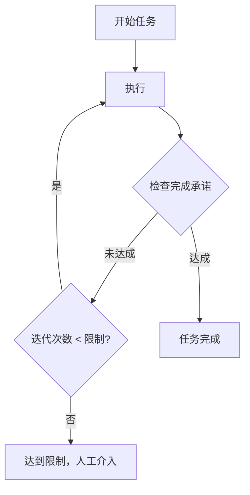
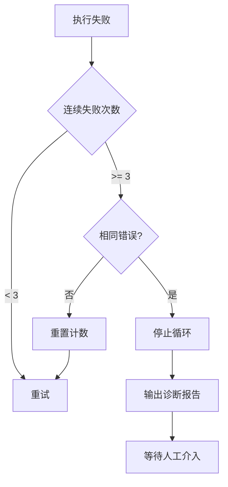

# Skills - 自动化类

本文档包含 2 个自动化相关的 Skills：
- ralph-loop
- progress-tracker

---

## 1. ralph-loop

**来源**：Ralph Loop（259 PRs、40k+ 行代码/30天）

```yaml
---
name: ralph-loop
description: 自主循环执行。持续工作直到完成承诺达成或迭代限制。
invoked_by: user
---
```

### 核心机制



### 配置参数

- `completion_promise`: 完成标志（如 "ALL_TESTS_PASS"）
- `max_iterations`: 最大迭代次数（默认 20）
- `verification_command`: 验证命令（如 `mvn test`）

### 安全机制配置

```yaml
# 安全保护配置
safety:
  # 连续失败保护：连续失败 N 次后自动停止
  consecutive_failures_limit: 3
  
  # 相同错误检测：检测到相同错误连续出现时停止，避免无限循环
  same_error_detection: true
  
  # 上下文保护：上下文使用率超过阈值时暂停并压缩
  context_threshold: 70%
  
  # 超时保护：单次迭代超过此时间则标记为超时
  iteration_timeout_minutes: 10
```

### 失败处理逻辑



### 使用示例

```bash
/ralph-loop "完成 S-001 所有 Ticket" \
  --completion-promise "STORY_S001_DONE" \
  --max-iterations 50 \
  --verify "mvn test && npm run lint"
```

### 铁律

- 必须使用**可验证的二元标准**（测试通过/lint 通过）
- 不使用主观标准（"代码质量好"）

### Prompt 模板

```markdown
# Ralph Loop Skill

## 核心原则
**持续执行直到完成承诺达成**

## 触发
- 用户执行 `/ralph-loop`

## 循环流程

### 初始化
"""
## 🔄 Ralph Loop 启动

**目标**: {goal}
**完成承诺**: {completion_promise}
**最大迭代**: {max_iterations}
**验证命令**: {verification_command}

开始执行...
"""

### 每次迭代
"""
### 迭代 {n}/{max}

**当前任务**: {current_ticket}
**执行结果**: {result}

**验证**:
```
{verification_output}
```

**状态**: {PASS/FAIL}
"""

### 完成报告
"""
## ✅ Ralph Loop 完成

**总迭代次数**: {iterations}
**完成的 Tickets**: {completed_tickets}
**耗时**: {duration}

**验证证据**:
```
{final_verification_output}
```
"""

### 失败报告
"""
## ⚠️ Ralph Loop 达到迭代限制

**已完成迭代**: {iterations}
**完成的 Tickets**: {completed_tickets}
**未完成**: {pending_tickets}

**最后状态**:
```
{last_output}
```

**建议**: {suggestion}
"""

## 硬性约束
1. 必须有可验证的完成承诺
2. 每次迭代必须执行验证命令
3. 达到迭代限制必须停止
4. 不使用主观判断标准
5. **连续失败 3 次必须停止**，输出诊断报告
6. **检测到相同错误重复出现必须停止**，避免无限循环
7. **上下文使用率超过 70% 时暂停**，先执行压缩再继续

## 诊断报告格式（连续失败时）
"""
## ❌ Ralph Loop 安全停止

**停止原因**: 连续失败 {n} 次
**最后错误**:
```
{error_message}
```

**错误分析**:
- 错误类型: {error_type}
- 影响文件: {affected_files}
- 可能原因: {possible_causes}

**建议操作**:
1. {suggestion_1}
2. {suggestion_2}

**恢复命令**: `/ralph-loop --continue` 或 `/retry T-xxx`
"""
```

---

## 2. progress-tracker

**来源**：TÂCHES meta-skills

```yaml
---
name: progress-tracker
description: 进度追踪。追踪整体进度，生成状态报告。
invoked_by: user, agent
---
```

### 输出格式

```
📊 项目进度报告
================
Story S-001: 用户管理模块
  ├── [✓] T-001 用户列表 API
  ├── [✓] T-002 用户新增 API  
  ├── [→] T-003 用户编辑 API (进行中)
  ├── [ ] T-004 用户删除 API
  └── [ ] T-005 前端页面

进度: 40% (2/5 Tickets)
预估剩余: 3 个 Ticket × 5 分钟 ≈ 15 分钟
上下文使用: 45%
最近检查点: CP-20260201-100500
```

### Prompt 模板

```markdown
# Progress Tracker Skill

## 触发
- 用户执行 `/status`
- Agent 需要报告进度时

## 数据来源
1. 读取 `tasks/STATE.yaml`
2. 读取 `tasks/stories/S-xxx.yaml`
3. 读取 `tasks/tickets/T-xxx.yaml`
4. 读取 `memory/session.yaml`

## 输出格式

### 简洁模式（默认）
"""
## 📊 进度报告

**当前阶段**: {phase}
**当前任务**: {story_id} / {ticket_id}

### Story 进度
```
{story_id}: {story_title}
  ├── [✓] {completed_ticket_1}
  ├── [→] {current_ticket} (进行中)
  └── [ ] {pending_ticket_1}
```

**整体进度**: {progress}% ({completed}/{total} Tickets)
**上下文使用**: {context_usage}%
**最近检查点**: {last_checkpoint}
"""

### 详细模式（`/status --detail`）
"""
## 📊 详细进度报告

### 当前状态
| 项目 | 值 |
|------|-----|
| 阶段 | {phase} |
| Story | {story_id} - {story_title} |
| Ticket | {ticket_id} - {ticket_title} |
| Agent | {current_agent} |
| 上下文 | {context_usage}% |

### Stories 汇总
| ID | 标题 | 进度 | 状态 |
|----|------|------|------|
| S-001 | {title} | 2/6 | in_progress |

### Tickets 详情 (S-001)
| ID | 标题 | 类型 | 状态 | 检查点 |
|----|------|------|------|--------|
| T-001 | {title} | backend | ✅ completed | CP-xxx |
| T-002 | {title} | backend | ✅ completed | CP-xxx |
| T-003 | {title} | backend | 🔄 in_progress | - |
| T-004 | {title} | frontend | ⏳ pending | - |

### 统计
- 总 Stories: {total_stories}
- 完成 Stories: {completed_stories}
- 总 Tickets: {total_tickets}
- 完成 Tickets: {completed_tickets}
- 失败 Tickets: {failed_tickets}
- 阻塞 Tickets: {blocked_tickets}

### 最近活动
{recent_activities}

### 重要决策
{recent_decisions}
"""

## 硬性约束
1. 数据必须来自 STATE.yaml，不猜测
2. 进度计算必须准确
3. 检查点信息必须包含
```

---

## 相关文档

- [00_概览](00_概览.md) - 返回概览
- [12_Skills_质量](12_Skills_质量.md) - 质量 Skills
- [01_工作流_RPIV](01_工作流_RPIV.md) - RPIV 工作流
- [32_命令体系](32_命令体系.md) - 命令说明
