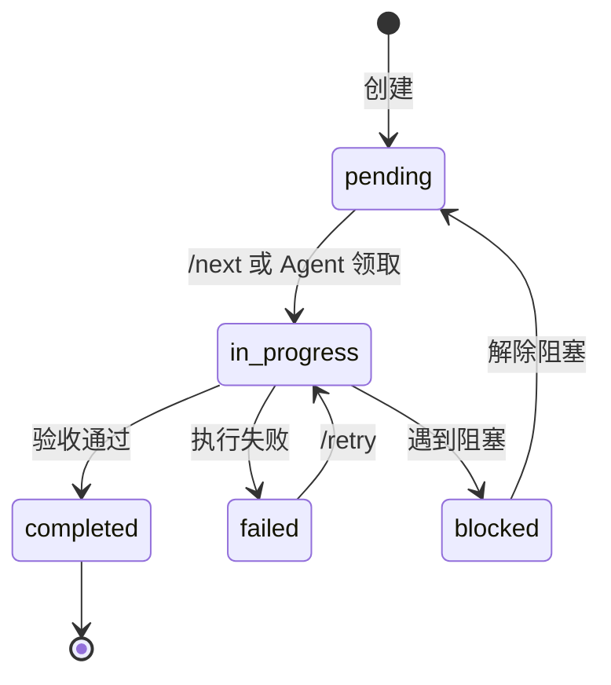

# 格式规范

本文档定义 Ticket、Story、日志的 YAML 格式规范。

---

## 基础格式标准

### 时间戳格式

**统一使用 ISO 8601 格式 (UTC)**：

```yaml
# 完整格式
"2026-02-01T10:30:00Z"

# 示例
created_at: "2026-02-01T10:30:00Z"
started_at: "2026-02-01T10:35:00Z"
completed_at: null  # 未完成时为 null
```

**禁止使用**：
- `2026/02/01 10:30:00`
- `Feb 1, 2026`
- Unix 时间戳

### ID 格式

| 类型 | 格式 | 示例 |
|------|------|------|
| 需求 | `REQ-{3位数字}` | REQ-001, REQ-002 |
| Story | `S-{3位数字}` | S-001, S-002 |
| Ticket | `T-{3位数字}` | T-001, T-002 |
| 检查点 | `CP-{YYYYMMDD}-{HHMMSS}` | CP-20260201-103000 |
| 决策 | `D-{3位数字}` | D-001, D-002 |
| 会话 | `{YYYY-MM-DD}-{3位序号}` | 2026-02-01-001 |

### 文件路径格式

**相对路径（推荐）**：
```yaml
# 相对于项目根目录
allowed_paths:
  modify:
    - "ruoyi-admin/src/main/java/**/controller/SysUserController.java"
    - "ruoyi-system/src/main/java/**/service/ISysUserService.java"
```

**通配符规则**：
- `**` 匹配任意层级目录
- `*` 匹配单层目录或文件名部分
- 禁止使用绝对路径

### 状态值枚举

| 字段 | 可选值 | 说明 |
|------|--------|------|
| Ticket.status | `pending`, `in_progress`, `completed`, `failed`, `blocked` | 任务状态 |
| Story.status | `pending`, `in_progress`, `completed`, `blocked` | Story 状态 |
| phase | `research`, `plan`, `implement`, `validate`, `completed` | 工作阶段 |

---

## Ticket 格式规范

### 完整 Ticket 结构

```yaml
# tasks/tickets/T-001.yaml
id: T-001
story_id: S-001
title: 实现用户列表分页查询 API
description: |
  实现 /system/user/list 接口，支持分页、条件筛选。
  参考现有 SysDept 的实现模式。

# 执行配置
type: backend                    # backend | frontend | database | fullstack
agent: backend-java              # 指定执行的 Agent
priority: 1                      # 执行顺序
estimated_minutes: 5             # 预估时间

# 关键：明确的文件边界（强制约束）
allowed_paths:
  modify:                        # 可修改的文件
    - "ruoyi-admin/src/main/java/**/controller/SysUserController.java"
    - "ruoyi-system/src/main/java/**/service/ISysUserService.java"
    - "ruoyi-system/src/main/java/**/service/impl/SysUserServiceImpl.java"
    - "ruoyi-system/src/main/java/**/mapper/SysUserMapper.java"
    - "ruoyi-system/src/resources/mapper/system/SysUserMapper.xml"
  create:                        # 可新建的文件
    - "ruoyi-admin/src/test/java/**/SysUserControllerTest.java"
  read:                          # 可读取参考的文件
    - "ruoyi-admin/src/main/java/**/controller/SysDeptController.java"
    - "ruoyi-system/src/main/java/**/service/impl/SysDeptServiceImpl.java"

# TDD 结构（测试先行）
tdd:
  test_file: "ruoyi-admin/src/test/java/**/controller/SysUserControllerTest.java"
  test_cases:
    - name: "testListUsers_success"
      description: "正常分页查询，返回用户列表"
    - name: "testListUsers_withCondition"
      description: "带条件筛选查询"
    - name: "testListUsers_emptyResult"
      description: "无匹配数据时返回空列表"

# 验收标准（必须可验证）
acceptance:
  - type: command
    run: "mvn test -Dtest=SysUserControllerTest"
    expect: "BUILD SUCCESS"
  - type: command
    run: "mvn checkstyle:check"
    expect: "BUILD SUCCESS"
  - type: api_test               # 可选：API 测试
    method: GET
    url: "/system/user/list?pageNum=1&pageSize=10"
    expect_status: 200

# 依赖关系
dependencies:
  tickets: []                    # 依赖的前置 Ticket
  files:                         # 依赖的已存在文件
    - "ruoyi-common/src/main/java/**/BaseController.java"

# 状态追踪
status: pending                  # pending | in_progress | completed | failed | blocked
created_at: "2026-02-01T09:00:00Z"
started_at: null
completed_at: null
checkpoint_id: null              # 完成后的检查点 ID
```

### Ticket 状态流转



---

## Story 格式规范

```yaml
# tasks/stories/S-001.yaml
id: S-001
requirement_id: REQ-001
title: 用户管理模块
description: |
  实现系统用户的增删改查功能，包括：
  - 用户列表分页查询
  - 新增用户
  - 编辑用户
  - 删除用户
  - 用户状态切换

# INVEST 检查
invest:
  independent: true              # 不依赖其他 Story
  negotiable: true               # 细节可协商
  valuable: true                 # 对用户有价值
  estimable: true                # 可估算工作量
  small: true                    # 足够小（5-10 个 Ticket）
  testable: true                 # 有明确验收标准

# 涉及端
endpoints:
  - backend
  - frontend
  - database

# 关联 Tickets
tickets:
  - T-001  # 用户列表 API
  - T-002  # 新增用户 API
  - T-003  # 编辑用户 API
  - T-004  # 删除用户 API
  - T-005  # 用户列表前端页面
  - T-006  # 用户表单前端组件

# 验收标准（Story 级别）
acceptance:
  - "用户列表正常显示，支持分页"
  - "可以新增用户，必填项校验正常"
  - "可以编辑用户信息"
  - "可以删除用户（软删除）"
  - "所有 API 有单元测试覆盖"

# 状态
status: in_progress              # pending | in_progress | completed | blocked
progress: "3/6"                  # 已完成 Ticket 数
created_at: "2026-02-01T09:00:00Z"
```

---

## 日志格式规范

### Ticket 执行日志

```yaml
# workspace/logs/T-001.yaml
ticket_id: T-001
story_id: S-001
agent: backend-java
session_id: "2026-02-01-001"

# 时间信息
started_at: "2026-02-01T10:00:00Z"
finished_at: "2026-02-01T10:04:32Z"
duration_seconds: 272

# 执行结果
status: success                  # success | failed | blocked
exit_reason: "all_acceptance_passed"

# 执行步骤详情
steps:
  - step: 1
    action: "read_ticket"
    status: success
    timestamp: "2026-02-01T10:00:00Z"
    details: "读取 Ticket T-001 定义"

  - step: 2
    action: "read_reference"
    status: success
    timestamp: "2026-02-01T10:00:15Z"
    files_read:
      - "ruoyi-admin/src/main/java/**/controller/SysDeptController.java"
    details: "读取参考实现"

  - step: 3
    action: "write_test"
    status: success
    timestamp: "2026-02-01T10:00:45Z"
    files_created:
      - "ruoyi-admin/src/test/java/**/SysUserControllerTest.java"
    details: "编写测试用例"

  - step: 4
    action: "run_test_red"
    status: success
    timestamp: "2026-02-01T10:01:00Z"
    command: "mvn test -Dtest=SysUserControllerTest"
    output: |
      Tests run: 3, Failures: 3, Errors: 0
      BUILD FAILURE
    details: "红灯阶段：测试按预期失败"

  - step: 5
    action: "implement"
    status: success
    timestamp: "2026-02-01T10:01:30Z"
    files_modified:
      - path: "ruoyi-admin/src/main/java/**/controller/SysUserController.java"
        changes: "+45 -2"
    details: "实现用户列表查询功能"

  - step: 6
    action: "run_test_green"
    status: success
    timestamp: "2026-02-01T10:03:00Z"
    command: "mvn test -Dtest=SysUserControllerTest"
    output: |
      Tests run: 3, Failures: 0, Errors: 0
      BUILD SUCCESS
    details: "绿灯阶段：所有测试通过"

  - step: 7
    action: "run_lint"
    status: success
    timestamp: "2026-02-01T10:03:30Z"
    command: "mvn checkstyle:check"
    output: "BUILD SUCCESS"
    details: "代码规范检查通过"

  - step: 8
    action: "create_checkpoint"
    status: success
    timestamp: "2026-02-01T10:04:00Z"
    checkpoint_id: "CP-20260201-100400"
    details: "创建检查点"

# 验收证据
evidence:
  - type: test_output
    command: "mvn test -Dtest=SysUserControllerTest"
    output: |
      [INFO] Tests run: 3, Failures: 0, Errors: 0, Skipped: 0
      [INFO] BUILD SUCCESS
    timestamp: "2026-02-01T10:03:00Z"

  - type: lint_output
    command: "mvn checkstyle:check"
    output: "[INFO] BUILD SUCCESS"
    timestamp: "2026-02-01T10:03:30Z"

# 文件变更汇总
files_changed:
  created:
    - "ruoyi-admin/src/test/java/**/SysUserControllerTest.java"
  modified:
    - "ruoyi-admin/src/main/java/**/controller/SysUserController.java"
    - "ruoyi-system/src/main/java/**/service/ISysUserService.java"
    - "ruoyi-system/src/main/java/**/service/impl/SysUserServiceImpl.java"
  deleted: []

# 检查点信息
checkpoint:
  id: "CP-20260201-100400"
  git_commit: "abc1234"
  can_rollback: true
```

### 错误日志示例

```yaml
# workspace/logs/T-002.yaml (失败示例)
ticket_id: T-002
status: failed
exit_reason: "test_failed_after_max_retries"

steps:
  # ... 前面步骤省略 ...
  
  - step: 6
    action: "run_test_green"
    status: failed
    attempt: 1
    command: "mvn test -Dtest=SysUserControllerTest"
    output: |
      Tests run: 3, Failures: 1, Errors: 0
      testAddUser_success FAILED
      java.lang.NullPointerException at SysUserServiceImpl.java:42
    
  - step: 7
    action: "debug_analyze"
    status: success
    analysis: |
      根因分析：
      - SysUserServiceImpl.java:42 行 userMapper 未注入
      - 原因：缺少 @Autowired 注解
      修复建议：
      - 添加 @Autowired 到 userMapper 字段

  - step: 8
    action: "auto_fix"
    status: success
    files_modified:
      - "ruoyi-system/src/main/java/**/service/impl/SysUserServiceImpl.java"

  - step: 9
    action: "run_test_green"
    status: failed
    attempt: 2
    # ... 仍然失败 ...

  - step: 12
    action: "run_test_green"
    status: failed
    attempt: 3
    details: "达到最大重试次数，停止执行"

error:
  type: "test_failure"
  message: "测试失败，已重试 3 次"
  last_failure: |
    testAddUser_success FAILED
    Expected: 200
    Actual: 500
  suggested_action: "人工检查 SysUserServiceImpl 的依赖注入配置"
```

---

## 需求文档格式

```markdown
# docs/requirements/REQ-001.md

# REQ-001: 用户管理模块

## 背景
系统需要完善的用户管理功能，支持管理员对系统用户进行增删改查操作。

## 目标用户
- 系统管理员

## 功能需求

### 1. 用户列表
- 分页展示用户列表
- 支持按用户名、手机号、状态筛选
- 支持按创建时间排序

### 2. 新增用户
- 必填：用户名、密码、手机号
- 选填：邮箱、部门、角色
- 校验：用户名唯一、手机号格式

### 3. 编辑用户
- 可修改：基本信息、部门、角色
- 不可修改：用户名
- 支持重置密码

### 4. 删除用户
- 软删除（逻辑删除）
- 支持批量删除
- 删除前确认

### 5. 状态管理
- 启用/禁用用户
- 禁用用户无法登录

## 非功能需求
- 列表加载时间 < 1s
- 所有操作需要记录日志

## 验收标准
- [ ] 用户列表正常显示
- [ ] 可新增用户，校验正常
- [ ] 可编辑用户信息
- [ ] 可删除用户（软删除）
- [ ] 状态切换正常
- [ ] 所有接口有单元测试

## 优先级
P0 - 核心功能

## 预估
- Stories: 1-2 个
- Tickets: 8-12 个
- 工作量: 约 1 小时
```

---

## 相关文档

- [00_概览](00_概览.md) - 返回概览
- [11_Skills_工作流](11_Skills_工作流.md) - Ticket 执行流程
- [31_项目配置](31_项目配置.md) - 项目配置文件
