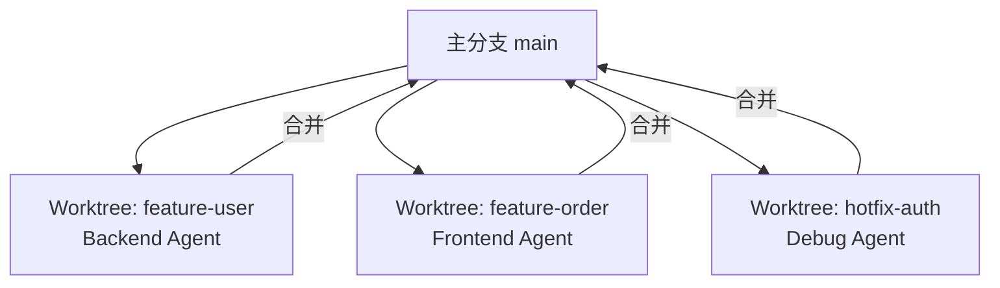

# 命令体系

本文档定义所有可用的 `/xxx` 命令。

---

## 命令总览

| 命令 | 触发 Agent | 加载 Skills | 作用 |
|------|------------|-------------|------|
| `/init-project` | - | - | 初始化项目框架结构 |
| `/add-requirement` | - | - | 注册新需求文档 |
| `/brainstorm` | Architect | brainstorming, context-compression | 对话细化需求 |
| `/split story` | Planner | story-splitter | 需求 → Stories |
| `/split ticket S-xxx` | Planner | ticket-splitter | Story → Tickets |
| `/approve stories` | - | - | 审批 Story 拆解结果 |
| `/approve tickets` | - | - | 审批 Ticket 拆解结果 |
| `/approve T-xxx` | - | - | 审批单个 Ticket |
| `/approve S-xxx` | - | - | 审批整个 Story |
| `/next` | Developer (按端分派) | deliver-ticket, tdd, checkpoint-manager | 执行下一个 Ticket |
| `/review T-xxx` | Reviewer | code-review | 代码评审 |
| `/verify S-xxx` | QA | verification | 测试验收 |
| `/status` | Coordinator | progress-tracker | 查看当前状态 |
| `/status --detail` | Coordinator | progress-tracker | 查看详细状态 |
| `/checkpoint` | - | checkpoint-manager | 手动创建检查点 |
| `/restore {id}` | - | checkpoint-manager | 恢复到指定检查点 |
| `/restore --last` | - | checkpoint-manager | 恢复到最近检查点 |
| `/rollback T-xxx` | - | checkpoint-manager | 回滚单个 Ticket |
| `/rollback S-xxx` | - | checkpoint-manager | 回滚整个 Story |
| `/rollback --last` | - | checkpoint-manager | 回滚到上一个检查点 |
| `/ralph-loop` | Coordinator + Developer | ralph-loop | 自主循环执行 |
| `/compress` | Coordinator | context-compression | 手动触发上下文压缩 |
| `/retry T-xxx` | Developer | deliver-ticket | 重试失败的 Ticket |
| `/skip T-xxx` | - | - | 跳过 Ticket（标记为 blocked） |
| `/unblock T-xxx` | - | - | 解除 Ticket 阻塞状态 |
| `/unblock --list` | - | - | 列出所有阻塞的 Tickets |
| `/save` | - | checkpoint-manager, memory-bank | `/checkpoint` 的别名 |
| `/worktree create` | - | - | 创建 Git Worktree（并行模式） |
| `/worktree list` | - | - | 列出所有 Worktree |
| `/worktree switch` | - | - | 切换 Worktree |

---

## 命令详情

### /init-project

**用途**：初始化项目框架结构

**使用方式**：
```bash
/init-project                         # 交互式初始化
/init-project myproject               # 指定项目名
/init-project myproject --stack java,vue,mysql  # 指定技术栈
```

**执行内容**：
1. 创建 `.claude/` 目录结构
2. 复制核心框架文件
3. 生成项目配置 `config.yaml`
4. 初始化 `tasks/STATE.yaml`
5. 创建 `CLAUDE.md` 入口文件

**预期输出**：项目初始化完成报告

---

### /add-requirement

**用途**：注册新需求文档

**使用方式**：
```bash
/add-requirement REQ-001              # 按 ID 注册
/add-requirement docs/requirements/REQ-001.md  # 按路径注册
```

**执行内容**：
1. 验证需求文件存在
2. 解析需求 ID
3. 更新 `tasks/STATE.yaml` 的 requirements 列表
4. 设置为当前需求

**预期输出**：需求注册确认

---

### /brainstorm

**用途**：头脑风暴，细化需求

**使用方式**：
```bash
/brainstorm                           # 开始头脑风暴
/brainstorm REQ-001                   # 针对特定需求
/brainstorm "如何实现用户权限管理"      # 针对特定问题
```

**触发的 Agent**：Architect

**预期输出**：需求理解 → 澄清问题 → 方案探索 → 决策记录

---

### /split story

**用途**：将需求拆解为 User Stories

**使用方式**：
```bash
/split story                          # 拆解当前需求
/split story REQ-001                  # 拆解指定需求
```

**触发的 Agent**：Planner

**预期输出**：Story 列表 + INVEST 检查 + 等待审批

---

### /split ticket S-xxx

**用途**：将 Story 拆解为可执行 Tickets

**使用方式**：
```bash
/split ticket S-001                   # 拆解指定 Story
```

**触发的 Agent**：Planner

**预期输出**：Ticket 列表 + 执行顺序 + 等待审批

---

### /approve

**用途**：审批拆解结果或完成状态

**使用方式**：
```bash
/approve stories                      # 审批所有 Stories
/approve tickets                      # 审批所有 Tickets
/approve T-001                        # 审批单个 Ticket
/approve S-001                        # 审批整个 Story
```

**说明**：审批后才能继续执行

---

### /next

**用途**：执行下一个待处理的 Ticket

**使用方式**：
```bash
/next                                 # 执行下一个 Ticket
```

**触发的 Agent**：根据 Ticket 类型自动分派
- backend → backend-java
- frontend → frontend-vue
- database → dba-mysql

**预期输出**：理解确认 → TDD 执行 → 完成报告 → 检查点

---

### /status

**用途**：查看当前进度

**使用方式**：
```bash
/status                               # 简洁模式
/status --detail                      # 详细模式
```

**触发的 Agent**：Coordinator

**预期输出**：进度报告

---

### /checkpoint

**用途**：手动创建检查点

**使用方式**：
```bash
/checkpoint                           # 创建当前状态的检查点
/checkpoint "完成用户模块"             # 带备注的检查点
```

**预期输出**：检查点 ID 和恢复命令

---

### /restore

**用途**：恢复到指定检查点

**使用方式**：
```bash
/restore CP-20260201-100500          # 恢复到指定检查点
/restore --last                       # 恢复到最近检查点
```

**预期输出**：恢复报告 + 当前状态

---

### /rollback

**用途**：回滚变更

**使用方式**：
```bash
/rollback T-001                       # 回滚单个 Ticket
/rollback S-001                       # 回滚整个 Story
/rollback CP-20260201-100500         # 回滚到指定检查点
/rollback --last                      # 回滚到上一个检查点
```

**预期输出**：回滚报告 + 当前状态

---

### /ralph-loop

**用途**：自主循环执行，直到完成承诺达成

**使用方式**：
```bash
/ralph-loop "完成 S-001 所有 Ticket"
/ralph-loop "完成 S-001" --max-iterations 50
/ralph-loop "完成 S-001" --verify "mvn test"
```

**参数**：
- `--completion-promise`：完成标志
- `--max-iterations`：最大迭代次数（默认 20）
- `--verify`：验证命令

**触发的 Agent**：Coordinator + Developer

**预期输出**：循环执行报告

---

### /compress

**用途**：手动触发上下文压缩

**使用方式**：
```bash
/compress                             # 压缩当前上下文
```

**预期输出**：压缩报告（压缩前后对比）

---

### /retry

**用途**：重试失败的 Ticket

**使用方式**：
```bash
/retry T-001                          # 重试指定 Ticket
```

**触发的 Agent**：对应的 Developer

---

### /skip

**用途**：跳过 Ticket，标记为 blocked

**使用方式**：
```bash
/skip T-001                           # 跳过指定 Ticket
/skip T-001 "依赖外部 API 未就绪"      # 带原因的跳过
```

---

### /unblock

**用途**：解除 Ticket 阻塞状态

**使用方式**：
```bash
/unblock T-001                        # 解除指定 Ticket 的阻塞
/unblock T-001 "已确认使用 sys_role 表"  # 带说明的解除
/unblock --list                       # 列出所有阻塞的 Tickets
/unblock T-001 --cascade              # 级联解除依赖阻塞
```

**预期输出**：
- 列出阻塞原因和待回答问题
- 解除后更新 Ticket 状态为 pending
- 提示下一步操作

---

## Subagent 调用语法

### Claude Code 官方语法

```markdown
# 在主 Agent 中调用 Subagent

Task(agent="backend-java", prompt="执行 Ticket T-003")
```

### 自动分派逻辑

```python
# 伪代码：根据 Ticket 类型分派 Agent
def dispatch_agent(ticket):
    type_to_agent = {
        "backend": "backend-java",
        "frontend": "frontend-vue", 
        "database": "dba-mysql",
        "fullstack": "backend-java"  # 默认后端
    }
    return type_to_agent.get(ticket.type, "developer")
```

### /next 命令的分派流程

```mermaid
flowchart TD
    Next[/next 命令] --> GetTicket[获取下一个 pending Ticket]
    GetTicket --> CheckType{Ticket 类型?}
    CheckType -->|backend| BE[调用 backend-java Agent]
    CheckType -->|frontend| FE[调用 frontend-vue Agent]
    CheckType -->|database| DBA[调用 dba-mysql Agent]
    BE --> Execute[执行 deliver-ticket Skill]
    FE --> Execute
    DBA --> Execute
```

---

## Git Worktree 并行开发（可选）



**使用场景**：
- 多个独立 Story 并行开发
- 不同端的工作互不干扰

**命令**：
```bash
/worktree create feature-user    # 创建新 worktree
/worktree list                   # 列出所有 worktree
/worktree switch feature-order   # 切换 worktree
```

---

## 相关文档

- [00_概览](00_概览.md) - 返回概览
- [01_工作流_RPIV](01_工作流_RPIV.md) - 工作流程
- [13_Skills_自动化](13_Skills_自动化.md) - ralph-loop 详情
