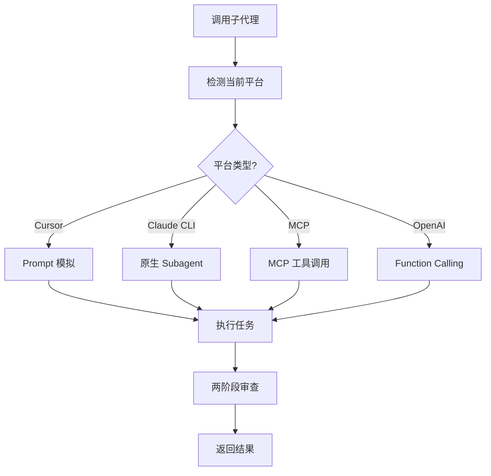

# 平台适配与 Hooks 机制

> 本文档定义跨平台适配层和 Hooks 机制，确保一人公司框架可以在不同 AI 平台上运行。

---

## 目录

- [第一部分：平台适配层](#第一部分平台适配层)
- [第二部分：子代理机制跨平台实现](#第二部分子代理机制跨平台实现)
- [第三部分：Hooks 机制](#第三部分hooks-机制)
- [第四部分：平台检测与自动适配](#第四部分平台检测与自动适配)

---

## 第一部分：平台适配层

### 1.1 设计目标

**核心原则**：框架逻辑与平台实现分离

```
┌─────────────────────────────────────────────────────────┐
│                 一人公司框架核心层                        │
│  ├── Skills（16 个）                                    │
│  ├── Agents（6 个）                                     │
│  ├── 工作流（RPIV）                                     │
│  └── 状态管理（STATE.yaml）                             │
└─────────────────────────────────────────────────────────┘
                            ↓
┌─────────────────────────────────────────────────────────┐
│                   平台适配层 (PAL)                       │
│  ├── 子代理调用接口                                     │
│  ├── Hooks 触发接口                                     │
│  ├── 工具调用接口                                       │
│  └── 上下文管理接口                                     │
└─────────────────────────────────────────────────────────┘
                            ↓
┌───────────┬───────────┬───────────┬───────────┬─────────┐
│  Cursor   │  Claude   │   MCP     │  OpenAI   │  其他   │
│   IDE     │  Code CLI │  Server   │  API      │  平台   │
└───────────┴───────────┴───────────┴───────────┴─────────┘
```

### 1.2 支持的平台

| 平台 | 子代理支持 | Hooks 支持 | 工具调用 | 状态 |
|------|-----------|-----------|---------|------|
| **Cursor IDE** | Prompt 模拟 | CLAUDE.md 入口 | 内置工具 | ✅ 主要 |
| **Claude Code CLI** | 原生 Subagent | hooks.json | Bash/Read/Write | 🟡 计划 |
| **MCP Server** | MCP 工具调用 | MCP 协议 | 自定义工具 | 🟡 计划 |
| **OpenAI API** | Function Calling | 无 | Functions | 🟡 计划 |
| **自定义平台** | 按需实现 | 按需实现 | 按需实现 | 📋 未来 |

### 1.3 平台适配层接口定义

```yaml
# .claude/core/platform/interface.yaml
# 平台适配层接口定义

interfaces:
  # 1. 子代理调用接口
  subagent:
    dispatch:
      description: "分派子代理执行任务"
      parameters:
        agent_name: string      # 子代理名称
        task_context: object    # 任务上下文
        prompt_template: string # Prompt 模板路径
      returns:
        result: object          # 执行结果
        status: string          # success | failed | needs_review
    
    review:
      description: "子代理审查"
      parameters:
        review_type: string     # spec | quality
        implementation: object  # 实现内容
        requirements: object    # 需求定义
      returns:
        passed: boolean
        issues: array
  
  # 2. Hooks 触发接口
  hooks:
    session_start:
      description: "会话开始钩子"
      triggers:
        - "startup"
        - "resume"
        - "clear"
        - "compact"
      actions:
        - "load_state"
        - "inject_framework"
        - "output_status"
    
    session_end:
      description: "会话结束钩子"
      triggers:
        - "exit"
        - "timeout"
      actions:
        - "save_checkpoint"
        - "compress_context"
    
    ticket_complete:
      description: "Ticket 完成钩子"
      triggers:
        - "ticket_done"
      actions:
        - "create_checkpoint"
        - "update_state"
        - "trigger_review"
  
  # 3. 工具调用接口
  tools:
    read_file:
      description: "读取文件"
      parameters:
        path: string
      returns:
        content: string
        exists: boolean
    
    write_file:
      description: "写入文件"
      parameters:
        path: string
        content: string
      returns:
        success: boolean
    
    run_command:
      description: "执行命令"
      parameters:
        command: string
        cwd: string
      returns:
        output: string
        exit_code: integer
    
    search_files:
      description: "搜索文件"
      parameters:
        pattern: string
        path: string
      returns:
        matches: array
```

---

## 第二部分：子代理机制跨平台实现

### 2.1 统一的子代理调用流程



### 2.2 各平台实现详情

#### 2.2.1 Cursor IDE 实现（Prompt 模拟）

```markdown
# .claude/core/platform/cursor/subagent.md

## Cursor 平台子代理实现

### 实现方式
由于 Cursor 不支持真正的子代理调用，使用 **Prompt 角色切换** 模拟：

### 调用模板

"""
## 🔄 角色切换：{agent_name} 子代理

**切换到**: {agent_name} Agent
**任务**: {task_description}

---

### 加载配置
- Agent: {agent_config_path}
- Skills: {skills_list}
- Rules: {rules_path}

### 系统提示词
{agent_system_prompt}

---

### 任务上下文
{task_context}

---

### 你的工作
{task_instructions}

---

开始执行任务。
"""

### 上下文隔离模拟

**问题**：Cursor 中角色切换后，前面的对话历史仍然可见。

**解决方案**：
1. 在角色切换 Prompt 中明确声明"忽略之前的对话"
2. 提供完整的任务上下文，避免子代理需要回看历史
3. 在审查时明确要求"只看代码，不信任报告"

### 审查循环

"""
## 🔄 审查循环

{reviewer_type} 发现问题：
{issues_list}

**切换到**: Implementer 子代理
**任务**: 修复问题

{issues_list}

请修复这些问题，然后重新提交。
"""

### 限制
- 不是真正的上下文隔离
- 依赖 Prompt 约束，可能不够严格
- 无法真正并行执行
```

#### 2.2.2 Claude Code CLI 实现（原生 Subagent）

```markdown
# .claude/core/platform/claude-cli/subagent.md

## Claude Code CLI 平台子代理实现

### 实现方式
使用 Claude Code 的原生 Subagent 功能：

```bash
# 分派 Implementer 子代理
claude --agent implementer --prompt "
Task: {ticket_id} - {ticket_title}

## 任务描述
{task_description}

## 上下文
{context}

## 你的工作
1. 实现任务要求
2. 遵循 TDD
3. 自我审查
4. 报告
"
```

### 子代理配置

```yaml
# .claude/agents/implementer.yaml
---
name: implementer
description: "执行 Ticket 实现任务"
tools: Read, Write, Bash, Grep
skills: deliver-ticket, tdd, checkpoint-manager
---
你是 Implementer 子代理，负责执行 Ticket 任务。
...
```

### 两阶段审查

```bash
# Step 1: Spec Compliance Review
claude --agent spec-reviewer --prompt "
## 任务要求
{ticket_yaml}

## Implementer 报告
{implementer_report}

验证规格合规性...
"

# Step 2: Code Quality Review (仅在 spec 通过后)
if [ "$spec_passed" = "true" ]; then
  claude --agent quality-reviewer --prompt "
  ## 实现内容
  {implementer_report}

  ## Git 变更
  git diff {base_sha}..{head_sha}

  评估代码质量...
  "
fi
```

### 优势
- 真正的上下文隔离
- 原生支持，稳定可靠
- 可配置工具和权限
```

#### 2.2.3 MCP Server 实现

```markdown
# .claude/core/platform/mcp/subagent.md

## MCP Server 平台子代理实现

### 实现方式
使用 MCP (Model Context Protocol) 实现子代理分派：

### MCP Server 定义

```typescript
// mcp-server/src/subagent.ts
import { Server } from '@modelcontextprotocol/sdk/server/index.js';

const server = new Server({
  name: 'one-person-company',
  version: '1.0.0',
});

// 子代理分派工具
server.setRequestHandler(CallToolRequestSchema, async (request) => {
  if (request.params.name === 'dispatch_subagent') {
    const { agent_name, task_context, prompt_template } = request.params.arguments;
    
    // 1. 加载 Agent 配置
    const agentConfig = await loadAgentConfig(agent_name);
    
    // 2. 加载 Skills
    const skills = await loadSkills(agentConfig.skills);
    
    // 3. 构建系统提示词
    const systemPrompt = buildSystemPrompt(agentConfig, skills);
    
    // 4. 调用 Claude API
    const result = await claude.chat({
      system: systemPrompt,
      messages: [{ role: 'user', content: task_context }]
    });
    
    return {
      content: [{ type: 'text', text: result.content }]
    };
  }
});

// 审查工具
server.setRequestHandler(CallToolRequestSchema, async (request) => {
  if (request.params.name === 'review_implementation') {
    const { review_type, implementation, requirements } = request.params.arguments;
    
    // 根据审查类型选择审查 Agent
    const reviewerAgent = review_type === 'spec' 
      ? 'spec-reviewer' 
      : 'quality-reviewer';
    
    // 执行审查
    const result = await dispatchSubagent(reviewerAgent, {
      implementation,
      requirements
    });
    
    return {
      content: [{ type: 'text', text: JSON.stringify(result) }]
    };
  }
});
```

### MCP 工具定义

```json
{
  "tools": [
    {
      "name": "dispatch_subagent",
      "description": "分派子代理执行任务",
      "inputSchema": {
        "type": "object",
        "properties": {
          "agent_name": {
            "type": "string",
            "description": "子代理名称"
          },
          "task_context": {
            "type": "string",
            "description": "任务上下文"
          },
          "prompt_template": {
            "type": "string",
            "description": "Prompt 模板路径"
          }
        },
        "required": ["agent_name", "task_context"]
      }
    },
    {
      "name": "review_implementation",
      "description": "审查实现",
      "inputSchema": {
        "type": "object",
        "properties": {
          "review_type": {
            "type": "string",
            "enum": ["spec", "quality"]
          },
          "implementation": {
            "type": "object"
          },
          "requirements": {
            "type": "object"
          }
        },
        "required": ["review_type", "implementation", "requirements"]
      }
    }
  ]
}
```

### 优势
- 真正的上下文隔离（每次调用是独立的）
- 可扩展的工具系统
- 支持多种 AI 模型
```

### 2.3 统一的子代理调用 Skill

```yaml
# .claude/core/skills/subagent-dispatch/SKILL.md
---
name: subagent-dispatch
description: "Use when executing a Ticket that needs subagent isolation - automatically detects platform and uses appropriate dispatch method"
invoked_by: agent
---

# Subagent Dispatch Skill

## 概述

自动检测当前平台，使用最佳的子代理调用方式。

## 平台检测

在调用子代理前，**必须**先检测平台：

```python
def detect_platform() -> str:
    """
    检测当前运行的平台
    返回: "cursor" | "claude-cli" | "mcp" | "openai" | "unknown"
    """
    # 1. 检查是否在 Cursor IDE 中
    if 环境变量存在("CURSOR_IDE"):
        return "cursor"
    
    # 2. 检查是否有 Claude Code CLI
    if 命令存在("claude"):
        return "claude-cli"
    
    # 3. 检查是否有 MCP 配置
    if 文件存在(".claude/mcp-config.json"):
        return "mcp"
    
    # 4. 检查是否有 OpenAI 配置
    if 环境变量存在("OPENAI_API_KEY"):
        return "openai"
    
    return "unknown"
```

## 调用流程

### Step 1: 检测平台

```
## 🔍 平台检测

正在检测当前平台...

**检测结果**: {platform_name}
**子代理方式**: {dispatch_method}
```

### Step 2: 准备上下文

```python
def prepare_context(ticket_id: str) -> dict:
    """
    准备子代理执行所需的完整上下文
    """
    ticket = load_yaml(f"tasks/tickets/{ticket_id}.yaml")
    story = load_yaml(f"tasks/stories/{ticket['story_id']}.yaml")
    
    return {
        "ticket": ticket,
        "story": story,
        "related_decisions": load_related_decisions(ticket),
        "architectural_context": get_architecture_context(story),
        "base_sha": run_command("git rev-parse HEAD")
    }
```

### Step 3: 分派子代理

```python
def dispatch_subagent(platform: str, agent: str, context: dict) -> dict:
    """
    根据平台分派子代理
    """
    if platform == "cursor":
        return dispatch_cursor(agent, context)
    elif platform == "claude-cli":
        return dispatch_claude_cli(agent, context)
    elif platform == "mcp":
        return dispatch_mcp(agent, context)
    else:
        # 默认使用 Prompt 模拟
        return dispatch_cursor(agent, context)
```

### Step 4: 两阶段审查

无论哪个平台，都必须执行两阶段审查：

1. **Spec Compliance Review** - 规格合规性审查
2. **Code Quality Review** - 代码质量审查（仅在 spec 通过后）

### Step 5: 审查循环

如果审查发现问题，返回 Implementer 修复，直到通过。

## 输出格式

```
## ✅ 子代理执行完成

**平台**: {platform}
**Ticket**: {ticket_id}

**执行结果**:
- Implementer: ✅ 完成
- Spec Review: ✅ 通过（第 1 轮）
- Quality Review: ✅ 通过（第 1 轮）

**下一步**: 更新 STATE.yaml
```
```

---

## 第三部分：Hooks 机制

### 3.1 Hooks 设计目标

| Hook 类型 | 触发时机 | 作用 |
|----------|---------|------|
| **SessionStart** | 会话开始时 | 加载状态、注入框架、输出恢复报告 |
| **SessionEnd** | 会话结束时 | 保存检查点、压缩上下文 |
| **TicketComplete** | Ticket 完成时 | 创建检查点、触发审查 |
| **StoryComplete** | Story 完成时 | 触发 QA 验收 |
| **ErrorOccur** | 错误发生时 | 记录日志、触发恢复 |

### 3.2 Hooks 配置文件

```json
// .claude/hooks/hooks.json
{
  "version": "1.0",
  "hooks": {
    "SessionStart": [
      {
        "matcher": "startup|resume|clear|compact",
        "hooks": [
          {
            "type": "script",
            "command": "${CLAUDE_ROOT}/hooks/session-start.sh"
          },
          {
            "type": "prompt",
            "template": "${CLAUDE_ROOT}/hooks/session-start-prompt.md"
          }
        ]
      }
    ],
    "SessionEnd": [
      {
        "matcher": "exit|timeout|context_limit",
        "hooks": [
          {
            "type": "script",
            "command": "${CLAUDE_ROOT}/hooks/session-end.sh"
          }
        ]
      }
    ],
    "TicketComplete": [
      {
        "matcher": "ticket_done",
        "hooks": [
          {
            "type": "skill",
            "skill": "checkpoint-manager",
            "action": "create"
          },
          {
            "type": "skill",
            "skill": "subagent-dispatch",
            "action": "review"
          }
        ]
      }
    ],
    "StoryComplete": [
      {
        "matcher": "story_done",
        "hooks": [
          {
            "type": "skill",
            "skill": "verification",
            "action": "story_verification"
          }
        ]
      }
    ],
    "ErrorOccur": [
      {
        "matcher": "test_failed|lint_failed|command_failed",
        "hooks": [
          {
            "type": "skill",
            "skill": "debugging",
            "action": "analyze"
          }
        ]
      }
    ]
  }
}
```

### 3.3 SessionStart Hook 详细实现

#### 3.3.1 脚本实现

```bash
#!/bin/bash
# .claude/hooks/session-start.sh
# 会话开始时执行的脚本

set -e

CLAUDE_ROOT="${CLAUDE_ROOT:-.claude}"
STATE_FILE="tasks/STATE.yaml"

echo "## 🚀 一人公司框架初始化"
echo ""

# 1. 检查 STATE.yaml 是否存在
if [ ! -f "$STATE_FILE" ]; then
    echo "⚠️ 项目未初始化，请先执行 /init-project"
    exit 0
fi

# 2. 读取当前状态
phase=$(yq '.phase' "$STATE_FILE")
current_ticket=$(yq '.current.ticket' "$STATE_FILE")
current_story=$(yq '.current.story' "$STATE_FILE")
last_checkpoint=$(yq '.checkpoints.last' "$STATE_FILE")

# 3. 统计进度
total_tickets=$(yq '.stats.total_tickets' "$STATE_FILE")
completed_tickets=$(yq '.stats.completed_tickets' "$STATE_FILE")

# 4. 输出状态报告
echo "### 📊 当前状态"
echo ""
echo "| 字段 | 值 |"
echo "|------|-----|"
echo "| 阶段 | $phase |"
echo "| 当前 Story | $current_story |"
echo "| 当前 Ticket | $current_ticket |"
echo "| 进度 | $completed_tickets / $total_tickets |"
echo "| 最近检查点 | $last_checkpoint |"
echo ""

# 5. 检查是否有未完成的任务
if [ "$current_ticket" != "null" ] && [ -n "$current_ticket" ]; then
    echo "### ⏳ 未完成任务"
    echo ""
    echo "检测到上次会话有未完成的 Ticket: **$current_ticket**"
    echo ""
    echo "**建议操作**："
    echo "- 继续执行: \`/next\`"
    echo "- 查看详情: \`/status --detail\`"
    echo "- 从检查点恢复: \`/restore --last\`"
fi

# 6. 检查上下文使用情况
context_usage=$(yq '.context.usage_percent' "$STATE_FILE")
if [ "$context_usage" -gt 70 ]; then
    echo ""
    echo "### ⚠️ 上下文警告"
    echo ""
    echo "上下文使用率: **${context_usage}%**"
    echo ""
    echo "建议执行 \`/compress\` 压缩上下文。"
fi

echo ""
echo "---"
echo ""
echo "**可用命令**: /brainstorm, /split, /next, /status, /checkpoint"
```

#### 3.3.2 Prompt 模板

```markdown
<!-- .claude/hooks/session-start-prompt.md -->
# 会话初始化

你是一人公司 AI 交付框架的执行者。

## 必须首先执行

在响应用户任何请求之前，**必须**先：

1. 读取 `tasks/STATE.yaml` 获取当前状态
2. 输出状态报告（使用下方格式）
3. 如有未完成任务，提示用户

## 状态报告格式

"""
## 📊 会话恢复报告

**当前阶段**: {phase}
**当前 Story**: {current.story} - {story_title}
**当前 Ticket**: {current.ticket} - {ticket_title}
**进度**: {completed}/{total} Tickets

### 上次会话
- 最后操作: {last_action}
- 最近检查点: {last_checkpoint}

### 下一步
- {根据状态建议的下一步操作}

---

**可用命令**: /brainstorm, /split, /next, /status, /checkpoint
"""

## 框架规则

1. **证据先于断言** - 所有完成声明必须有命令输出证明
2. **微任务拆解** - 每个 Ticket 2-5 分钟完成
3. **自动迭代执行** - Skills 自动循环，不等待用户确认
4. **显式审批** - Story/Ticket 拆解后需要 /approve

## 加载的 Skills

- 记忆管理: memory-bank, context-compression, checkpoint-manager
- 工作流: brainstorming, story-splitter, ticket-splitter, deliver-ticket
- 质量: verification, tdd, code-review, debugging
- 自动化: ralph-loop, progress-tracker
```

### 3.4 各平台 Hooks 实现

#### 3.4.1 Cursor IDE

```markdown
# .claude/core/platform/cursor/hooks.md

## Cursor 平台 Hooks 实现

### 限制
Cursor IDE 目前**不支持**自动触发 Hooks。

### 替代方案

#### 方案 A：CLAUDE.md 入口文件

在 CLAUDE.md 中声明首次响应规则：

```markdown
# CLAUDE.md

## ⚠️ 首次响应规则

每次会话的**第一条响应**，必须：

1. 读取 tasks/STATE.yaml
2. 输出状态报告
3. 如有未完成任务，提示用户

**禁止跳过此步骤**
```

#### 方案 B：用户主动触发

提供 `/session-start` 命令让用户主动触发：

```markdown
# .claude/commands/session-start.md

## /session-start 命令

执行会话初始化，输出状态报告。

用法: /session-start

等效于手动触发 SessionStart Hook。
```

#### 方案 C：AI 自检

训练 AI 在每次对话开始时自检：

```
IF 这是会话的第一条消息:
    执行 SessionStart Hook
```

### 实现建议

**推荐 方案 A + C**：
1. 在 CLAUDE.md 中明确声明首次响应规则
2. AI 每次对话开始时自检并执行
```

#### 3.4.2 Claude Code CLI

```markdown
# .claude/core/platform/claude-cli/hooks.md

## Claude Code CLI 平台 Hooks 实现

### 原生支持

Claude Code CLI 原生支持 Hooks 机制：

```json
// .claude/hooks/hooks.json
{
  "hooks": {
    "SessionStart": [{
      "matcher": "startup|resume|clear|compact",
      "hooks": [{
        "type": "command",
        "command": "${CLAUDE_ROOT}/hooks/session-start.sh"
      }]
    }]
  }
}
```

### 配置方式

1. 创建 hooks.json 文件
2. 创建对应的脚本文件
3. Claude Code 会自动在指定时机触发

### 支持的 Hook 类型

| Hook 类型 | 触发时机 |
|----------|---------|
| SessionStart | 会话开始 |
| PreToolCall | 工具调用前 |
| PostToolCall | 工具调用后 |
| Error | 错误发生 |
```

#### 3.4.3 MCP Server

```markdown
# .claude/core/platform/mcp/hooks.md

## MCP Server 平台 Hooks 实现

### 实现方式

通过 MCP 协议的通知机制实现 Hooks：

```typescript
// mcp-server/src/hooks.ts
import { Server } from '@modelcontextprotocol/sdk/server/index.js';

const server = new Server({
  name: 'one-person-company',
  version: '1.0.0',
});

// 注册 SessionStart Hook
server.setNotificationHandler('session/started', async (notification) => {
  // 1. 读取状态
  const state = await loadState();
  
  // 2. 输出状态报告
  await outputStatusReport(state);
  
  // 3. 如有未完成任务，提示用户
  if (state.current.ticket) {
    await notifyUnfinishedTask(state.current.ticket);
  }
});

// 注册 TicketComplete Hook
server.setNotificationHandler('ticket/completed', async (notification) => {
  const { ticket_id } = notification.params;
  
  // 1. 创建检查点
  await createCheckpoint(ticket_id);
  
  // 2. 触发审查
  await triggerReview(ticket_id);
});
```

### MCP 通知定义

```json
{
  "notifications": [
    {
      "method": "session/started",
      "params": {
        "session_id": "string",
        "timestamp": "string"
      }
    },
    {
      "method": "ticket/completed",
      "params": {
        "ticket_id": "string",
        "status": "string"
      }
    }
  ]
}
```
```

### 3.5 Hooks Skill

```yaml
# .claude/core/skills/hooks-manager/SKILL.md
---
name: hooks-manager
description: "Use when managing session lifecycle events - handles SessionStart, SessionEnd, and other hooks across platforms"
invoked_by: auto
---

# Hooks Manager Skill

## 概述

管理框架的生命周期钩子，自动检测平台并执行相应的 Hook 动作。

## 支持的 Hooks

| Hook | 触发条件 | 动作 |
|------|---------|------|
| SessionStart | 会话开始 | 加载状态、输出报告、提示继续 |
| SessionEnd | 会话结束 | 保存检查点、压缩上下文 |
| TicketComplete | Ticket 完成 | 创建检查点、触发审查 |
| StoryComplete | Story 完成 | 触发 QA 验收 |
| ErrorOccur | 错误发生 | 记录日志、触发恢复 |

## SessionStart Hook

### 触发条件

- 会话的第一条用户消息
- /session-start 命令
- 恢复会话

### 执行流程

```python
def session_start_hook():
    """
    会话开始钩子
    """
    # 1. 检查 STATE.yaml 是否存在
    if not file_exists("tasks/STATE.yaml"):
        output("⚠️ 项目未初始化，请先执行 /init-project")
        return
    
    # 2. 读取状态
    state = load_yaml("tasks/STATE.yaml")
    
    # 3. 输出状态报告
    output_status_report(state)
    
    # 4. 检查未完成任务
    if state["current"]["ticket"]:
        suggest_continue(state["current"]["ticket"])
    
    # 5. 检查上下文使用率
    if state["context"]["usage_percent"] > 70:
        warn_context_usage(state["context"]["usage_percent"])
```

### 输出格式

```
## 📊 会话恢复报告

**当前阶段**: implement
**当前 Story**: S-001 - 用户管理模块
**当前 Ticket**: T-003 - 用户编辑 API
**进度**: 8/15 Tickets (53%)

### 上次会话
- 最后操作: 完成 T-002
- 最近检查点: CP-20260203-103430

### 下一步建议
- 继续执行: `/next`
- 查看详情: `/status --detail`

---

**可用命令**: /brainstorm, /split, /next, /status, /checkpoint
```

## TicketComplete Hook

### 触发条件

- Ticket 所有验收标准通过
- 自我审查通过

### 执行流程

```python
def ticket_complete_hook(ticket_id: str):
    """
    Ticket 完成钩子
    """
    # 1. 创建检查点
    checkpoint_id = create_checkpoint(ticket_id, "ticket_completed")
    
    # 2. 更新 STATE.yaml
    update_state_ticket_completed(ticket_id)
    
    # 3. 如果配置了自动审查，触发审查
    if config["auto_review"]:
        trigger_review(ticket_id)
    
    # 4. 输出完成报告
    output_ticket_complete_report(ticket_id, checkpoint_id)
```

## 首次响应检测（Cursor 特供）

由于 Cursor 不支持自动 Hooks，使用以下逻辑检测首次响应：

```python
def is_first_response() -> bool:
    """
    检测是否是会话的第一条响应
    
    判断逻辑：
    1. 检查 STATE.yaml 的 session.last_active 字段
    2. 如果距离上次活跃超过 30 分钟，视为新会话
    3. 如果 session.id 为空，视为新会话
    """
    state = load_yaml("tasks/STATE.yaml")
    
    if not state.get("session", {}).get("id"):
        return True
    
    last_active = parse_datetime(state["session"]["last_active"])
    now = datetime.now()
    
    if (now - last_active).total_seconds() > 1800:  # 30 分钟
        return True
    
    return False

# 在每次响应开始时
if is_first_response():
    session_start_hook()
```
```

---

## 第四部分：平台检测与自动适配

### 4.1 平台检测脚本

```bash
#!/bin/bash
# .claude/core/platform/detect.sh
# 检测当前运行的平台

detect_platform() {
    # 1. 检查 Cursor IDE
    if [ -n "$CURSOR_IDE" ] || [ -n "$CURSOR_VERSION" ]; then
        echo "cursor"
        return
    fi
    
    # 2. 检查 Claude Code CLI
    if command -v claude &> /dev/null; then
        echo "claude-cli"
        return
    fi
    
    # 3. 检查 MCP 配置
    if [ -f ".claude/mcp-config.json" ]; then
        echo "mcp"
        return
    fi
    
    # 4. 检查 OpenAI 配置
    if [ -n "$OPENAI_API_KEY" ]; then
        echo "openai"
        return
    fi
    
    # 5. 默认
    echo "unknown"
}

# 获取平台能力
get_platform_capabilities() {
    platform=$1
    
    case $platform in
        "cursor")
            echo "subagent:prompt,hooks:manual,tools:builtin"
            ;;
        "claude-cli")
            echo "subagent:native,hooks:native,tools:configured"
            ;;
        "mcp")
            echo "subagent:mcp,hooks:mcp,tools:mcp"
            ;;
        "openai")
            echo "subagent:function,hooks:none,tools:function"
            ;;
        *)
            echo "subagent:prompt,hooks:manual,tools:basic"
            ;;
    esac
}

# 输出平台信息
platform=$(detect_platform)
capabilities=$(get_platform_capabilities $platform)

echo "Platform: $platform"
echo "Capabilities: $capabilities"
```

### 4.2 平台配置文件

```yaml
# .claude/project/platform-config.yaml
# 项目的平台配置

# 当前使用的平台
current_platform: "cursor"  # cursor | claude-cli | mcp | openai

# 各平台配置
platforms:
  cursor:
    # Cursor 特定配置
    subagent_method: "prompt"  # 使用 Prompt 模拟
    hooks_method: "manual"     # 手动触发或首次响应自检
    first_response_check: true # 启用首次响应检测
    
  claude-cli:
    # Claude Code CLI 配置
    subagent_method: "native"
    hooks_method: "native"
    hooks_config: ".claude/hooks/hooks.json"
    
  mcp:
    # MCP Server 配置
    server_path: "mcp-server/"
    subagent_method: "mcp"
    hooks_method: "mcp"
    tools_config: ".claude/mcp-tools.json"
    
  openai:
    # OpenAI API 配置
    subagent_method: "function"
    hooks_method: "none"
    functions_config: ".claude/openai-functions.json"

# 平台切换指南
switch_guide: |
  要切换平台，修改 current_platform 字段。
  
  Cursor → Claude CLI:
  1. 安装 Claude Code CLI
  2. 设置 current_platform: "claude-cli"
  3. 创建 .claude/hooks/hooks.json
  
  Cursor → MCP:
  1. 设置 MCP Server
  2. 设置 current_platform: "mcp"
  3. 配置 MCP 工具
```

### 4.3 更新 00_概览.md

添加平台支持说明：

```markdown
## 跨平台支持

一人公司框架支持多个 AI 平台：

| 平台 | 子代理 | Hooks | 状态 |
|------|--------|-------|------|
| Cursor IDE | Prompt 模拟 | 首次响应自检 | ✅ 主要支持 |
| Claude Code CLI | 原生支持 | 原生支持 | 🟡 计划中 |
| MCP Server | MCP 工具 | MCP 协议 | 🟡 计划中 |
| OpenAI API | Function Calling | 无 | 🟡 计划中 |

详见 [45_平台适配与Hooks机制](45_平台适配与Hooks机制.md)
```

---

## 第五部分：低智商模型精确执行指南

> 本部分为便宜/低智商模型提供精确到字符级别的执行指令。

### 5.1 平台检测精确步骤

```python
def 检测平台() -> str:
    """
    检测当前运行的平台
    返回: "cursor" | "claude-cli" | "mcp" | "unknown"
    
    执行步骤（必须按顺序）：
    """
    
    # Step 1: 检查 Cursor IDE 环境变量
    # 判断逻辑：在 Cursor 中，通常会有特定的环境变量或上下文
    # 由于无法直接检测，使用以下规则：
    if 当前对话在Cursor中进行:
        # 判断条件：用户使用 /xxx 命令、对话在 IDE 中进行
        return "cursor"
    
    # Step 2: 检查 Claude Code CLI
    # 判断逻辑：检查是否有 claude 命令
    结果 = 执行命令("which claude || command -v claude")
    if 结果.exit_code == 0:
        return "claude-cli"
    
    # Step 3: 检查 MCP 配置
    # 判断逻辑：检查是否有 MCP 配置文件
    if 文件存在(".claude/mcp-config.json"):
        return "mcp"
    
    # Step 4: 默认返回
    return "unknown"
```

**输出格式**：
```markdown
## 🔍 平台检测

**检测过程**:
1. 检查 Cursor IDE: ✅ 是（当前在 Cursor 对话中）
2. 检查 Claude CLI: ⏭️ 跳过（已确定为 Cursor）
3. 检查 MCP 配置: ⏭️ 跳过

**检测结果**: cursor
**子代理方式**: Prompt 模拟
**Hooks 方式**: 首次响应自检
```

### 5.2 SessionStart Hook 精确执行步骤

**触发条件**：
- 这是会话的第一条用户消息
- 用户执行了 `/session-start` 命令

**执行步骤**：

```python
def 执行SessionStart_Hook():
    """
    会话开始钩子的精确执行步骤
    """
    
    # Step 1: 检查 STATE.yaml 是否存在
    state文件 = "tasks/STATE.yaml"
    if not 文件存在(state文件):
        输出("""
## ⚠️ 项目未初始化

未找到 tasks/STATE.yaml 文件。

**请先执行**: `/init-project {项目名} --stack {技术栈}`
""")
        return
    
    # Step 2: 读取 STATE.yaml
    state = 读取yaml(state文件)
    
    # Step 3: 提取关键字段
    phase = state.get("phase", "unknown")
    current_story = state.get("current", {}).get("story", None)
    current_ticket = state.get("current", {}).get("ticket", None)
    
    # Step 4: 统计进度
    总Tickets = 0
    完成Tickets = 0
    for story_id, story_data in state.get("stories", {}).items():
        for ticket in story_data.get("tickets", []):
            总Tickets += 1
            if ticket.get("status") == "completed":
                完成Tickets += 1
    
    # Step 5: 获取检查点信息
    最近检查点 = state.get("checkpoints", {}).get("last", "无")
    
    # Step 6: 输出状态报告（精确格式）
    输出(f"""
## 📊 会话恢复报告

**当前阶段**: {phase}
**当前 Story**: {current_story or "无"}
**当前 Ticket**: {current_ticket or "无"}
**进度**: {完成Tickets}/{总Tickets} Tickets ({round(完成Tickets/总Tickets*100) if 总Tickets > 0 else 0}%)

### 最近检查点
- ID: {最近检查点}

### 下一步建议
{生成下一步建议(current_ticket, current_story)}

---

**可用命令**: /brainstorm, /split, /next, /status, /checkpoint
""")
    
    # Step 7: 更新会话时间戳
    state["session"] = state.get("session", {})
    state["session"]["last_active"] = 当前时间ISO格式()
    写入yaml(state文件, state)

def 生成下一步建议(current_ticket, current_story) -> str:
    """
    根据当前状态生成下一步建议
    """
    if current_ticket:
        return f"- 继续执行: `/next`（将继续 {current_ticket}）"
    elif current_story:
        return f"- 拆分 Tickets: `/split ticket {current_story}`"
    else:
        return "- 开始新需求: `/brainstorm`"
```

**完整输出示例**：

```markdown
## 📊 会话恢复报告

**当前阶段**: implement
**当前 Story**: S-001 - 用户管理模块
**当前 Ticket**: T-003 - 用户编辑 API
**进度**: 8/15 Tickets (53%)

### 最近检查点
- ID: CP-20260203-103430

### 下一步建议
- 继续执行: `/next`（将继续 T-003）

---

**可用命令**: /brainstorm, /split, /next, /status, /checkpoint
```

### 5.3 子代理分派精确步骤

**Cursor 平台专用**：

```python
def 分派子代理_Cursor(agent_name: str, ticket_id: str, context: dict):
    """
    在 Cursor 中使用 Prompt 模拟分派子代理
    """
    
    # Step 1: 读取 Agent 配置
    agent_path = f".claude/project/agents/{agent_name}.md"
    if not 文件存在(agent_path):
        agent_path = f".claude/core/agents/{agent_name}.md"
    
    if not 文件存在(agent_path):
        报错(f"Agent 文件不存在: {agent_name}")
        return
    
    agent_content = 读取文件(agent_path)
    frontmatter = 解析yaml头(agent_content)
    
    # Step 2: 加载 Skills
    skills_content = []
    for skill_name in frontmatter.get("skills", []):
        skill_path = f".claude/core/skills/{skill_name}/SKILL.md"
        if 文件存在(skill_path):
            skills_content.append(读取文件(skill_path))
    
    # Step 3: 读取 Ticket 定义
    ticket_path = f"tasks/tickets/{ticket_id}.yaml"
    ticket = 读取yaml(ticket_path)
    
    # Step 4: 输出角色切换 Prompt（精确格式）
    输出(f"""
## 🔄 角色切换：{agent_name} 子代理

**切换到**: {agent_name} Agent
**任务**: {ticket_id} - {ticket.get("title", "")}

---

### 加载配置
- Agent: {agent_path}
- Skills: {", ".join(frontmatter.get("skills", []))}
- Rules: {frontmatter.get("rules", "无")}

---

### 📋 任务上下文

**Ticket 定义**:
```yaml
{yaml转字符串(ticket)}
```

---

### 你的工作

1. 阅读 Ticket 定义
2. 执行 deliver-ticket Skill 的步骤
3. 遵循 TDD (红灯→绿灯→重构)
4. 完成后报告

---

**⚠️ 重要约束**:
- 只能修改 allowed_paths.modify 中的文件
- 只能新建 allowed_paths.create 中的文件
- 不要修改任何其他文件

开始执行任务。
""")
```

### 5.4 首次响应检测逻辑

**问题**：Cursor 不支持自动触发 Hooks，需要 AI 自检。

**检测逻辑**：

```python
def 是否需要执行SessionStart() -> bool:
    """
    判断是否需要执行 SessionStart Hook
    
    判断标准（满足任一即为 True）：
    1. STATE.yaml 中 session.last_active 为空
    2. 距离上次活跃超过 30 分钟
    3. 用户的第一条消息（对话历史为空）
    """
    
    # 条件 1: 检查对话历史
    if 对话历史为空():
        return True
    
    # 条件 2: 检查 STATE.yaml
    if not 文件存在("tasks/STATE.yaml"):
        return True  # 需要执行，会提示初始化
    
    state = 读取yaml("tasks/STATE.yaml")
    session = state.get("session", {})
    
    # 条件 3: last_active 为空
    if not session.get("last_active"):
        return True
    
    # 条件 4: 超过 30 分钟
    last_active = 解析时间(session["last_active"])
    now = 当前时间()
    差值秒 = (now - last_active).total_seconds()
    
    if 差值秒 > 1800:  # 30 分钟 = 1800 秒
        return True
    
    return False
```

**AI 自检输出格式**：

```markdown
## 🔍 会话检测

**检测项**:
- 对话历史: {有/空}
- STATE.yaml: {存在/不存在}
- 上次活跃: {时间} ({N} 分钟前)

**判断结果**: {需要/不需要} 执行 SessionStart Hook

{如果需要，执行 SessionStart Hook 并输出状态报告}
```

### 5.5 量化判断标准

| 判断项 | 条件 | 量化标准 |
|-------|------|---------|
| 需要 SessionStart | 距离上次活跃超时 | > 1800 秒 (30 分钟) |
| 上下文接近限制 | 需要压缩 | usage_percent > 70% |
| 测试失败重试 | 超过最大重试 | retries >= 3 |
| Lint 失败重试 | 超过最大重试 | retries >= 2 |
| 需要创建检查点 | Ticket 完成 | 状态变为 completed |

---

## 相关文档

- [00_概览](00_概览.md) - 返回概览
- [42_实现细节](42_实现细节.md) - 技术实现细节
- [44_低智商模型执行指南](44_低智商模型执行指南.md) - 更多精确执行步骤
- [50_参考_Superpowers分析](50_参考_Superpowers分析.md) - Superpowers 分析
