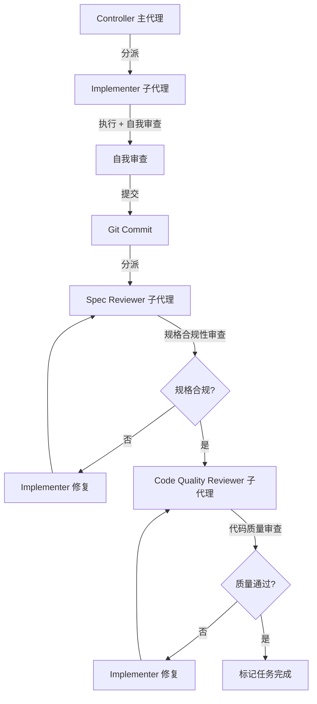
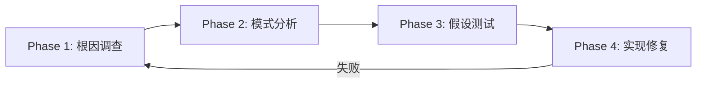
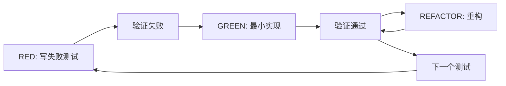
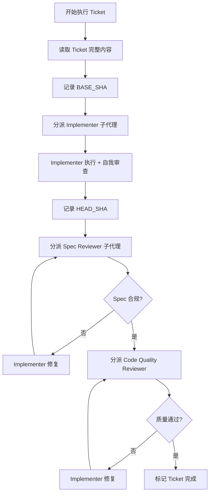

# Superpowers 框架对比分析

> 本文档详细分析 Superpowers 框架的核心特性，对比我们的一人公司框架，提炼可借鉴的改进点。

**参考来源**：https://github.com/obra/superpowers (40k+ stars)

---

## 目录

- [第一部分：Superpowers 框架概述](#第一部分superpowers-框架概述)
- [第二部分：核心 Skills 详解](#第二部分核心-skills-详解)
- [第三部分：反合理化系统](#第三部分反合理化系统)
- [第四部分：对比分析](#第四部分对比分析)
- [第五部分：改进建议](#第五部分改进建议)

---

## 第一部分：Superpowers 框架概述

### 1.1 框架定位

Superpowers 是一个**完整的软件开发工作流框架**，基于可组合的 Skills 系统，确保 AI 代理在编码前先进行设计、遵循 TDD、系统化调试等最佳实践。

**核心理念**：
- **Test-Driven Development** - 先写测试，总是
- **Systematic over ad-hoc** - 流程优于猜测
- **Complexity reduction** - 简单性为首要目标
- **Evidence over claims** - 验证先于声明

### 1.2 目录结构

```
superpowers/
├── .claude-plugin/          # Claude Code 插件配置
├── .codex/                  # Codex 配置
├── .opencode/               # OpenCode 配置
├── agents/                  # 代理定义（如 code-reviewer）
├── commands/                # 命令定义（brainstorm, execute-plan, write-plan）
├── hooks/                   # 钩子脚本（session-start.sh）
├── lib/                     # 核心库（skills-core.js）
├── skills/                   # Skills 库（核心）
│   ├── brainstorming/
│   ├── test-driven-development/
│   ├── subagent-driven-development/
│   ├── systematic-debugging/
│   ├── using-git-worktrees/
│   └── ...
└── tests/                   # 测试用例
```

### 1.3 Skills 架构设计

#### YAML Frontmatter 规范

```yaml
---
name: skill-name-with-hyphens   # 只能用字母、数字、连字符
description: "Use when [触发条件] - 只描述什么时候用，不描述流程"
---
```

**关键发现**：
- `description` 字段**绝不能包含流程摘要**！
- 测试发现：如果 description 包含流程，AI 会走捷径，只读 description 跳过正文
- 正确的 description 只描述**触发条件**，不描述"做什么"

#### Skills 分类

| 类型 | 说明 | 例子 |
|------|------|------|
| **Rigid（刚性）** | 必须严格遵循，不能适应 | TDD、debugging |
| **Flexible（柔性）** | 可根据上下文调整 | patterns、brainstorming |

#### 文件组织结构

```
skill-name/
├── SKILL.md              # 主文件（必需）
├── supporting-file.md    # 100+ 行的重型参考资料
└── scripts/              # 可执行脚本
```

**原则**：
- SKILL.md 保持 < 500 行
- 重型参考资料分离到独立文件
- 可执行脚本放在 `scripts/` 目录

---

## 第二部分：核心 Skills 详解

### 2.1 子代理驱动开发（subagent-driven-development）

**这是 Superpowers 的最大亮点！**

#### 工作流程



#### 核心原则

1. **每个子代理上下文清零** - 不会被前面任务污染
2. **两阶段审查是强制的** - 先 spec compliance，再 code quality
3. **子代理可以问问题** - 不是盲目执行
4. **主代理提供完整上下文** - 子代理不需要读文件

#### 子代理 Prompt 模板

**Implementer Prompt**：
- 任务完整文本（不读文件）
- 场景设置上下文
- 允许提问
- 自我审查清单

**Spec Reviewer Prompt**：
- 验证是否实现了要求的
- 验证是否多做了
- 验证是否少做了
- **不信任报告，必须读代码**

**Code Quality Reviewer Prompt**：
- 只在 spec compliance 通过后执行
- 评估代码质量、可维护性
- 提供具体改进建议

#### 优势

| 优势 | 说明 |
|------|------|
| **上下文隔离** | 每个任务独立，无污染 |
| **质量保证** | 两阶段审查确保规格和质量 |
| **并行安全** | 子代理不互相干扰 |
| **问题发现早** | 审查循环确保修复有效 |

### 2.2 系统化调试（systematic-debugging）

#### 四阶段流程



**Phase 1: 根因调查**
- 仔细读错误消息
- 复现问题
- 检查最近变更
- 收集多组件系统的证据
- 追踪数据流

**Phase 2: 模式分析**
- 找工作的例子
- 对比参考实现
- 识别差异
- 理解依赖

**Phase 3: 假设测试**
- 形成单一假设
- 最小化测试
- 验证假设

**Phase 4: 实现修复**
- 创建失败测试用例
- 实现单一修复
- 验证修复

#### "三次失败规则"

> **如果连续 3 次修复都失败 → 停下来质疑架构**

这不是失败的假设，而是**错误的架构**。应该：
- 质疑模式本身是否合理
- 讨论是否应该重构架构
- 而不是继续尝试修复

#### 铁律

```
NO FIXES WITHOUT ROOT CAUSE INVESTIGATION FIRST
```

### 2.3 测试驱动开发（test-driven-development）

#### RED-GREEN-REFACTOR 循环



#### 铁律

```
NO PRODUCTION CODE WITHOUT A FAILING TEST FIRST
```

**违反铁律的情况**：
- 先写代码再写测试 → **删除代码，重新开始**
- 测试立即通过 → 证明测试无效
- "保留作为参考" → 你会去适配它，这就是事后测试

#### 关键原则

1. **必须先看测试失败** - 如果没看到失败，就不知道测试是否正确
2. **删除代码，不是保留** - 违反铁律时，删除所有代码
3. **最小实现** - 只写足够让测试通过的代码
4. **验证失败和通过** - 必须运行命令确认

### 2.4 完成验证（verification-before-completion）

#### 铁律

```
NO COMPLETION CLAIMS WITHOUT FRESH VERIFICATION EVIDENCE
```

#### 门控函数

```
BEFORE 声明任何状态或表达满意：

1. IDENTIFY: 什么命令证明这个声明？
2. RUN: 执行完整命令（新鲜、完整）
3. READ: 完整输出，检查退出码，统计失败
4. VERIFY: 输出是否确认声明？
   - 如果 NO: 用证据说明实际状态
   - 如果 YES: 用证据说明声明
5. ONLY THEN: 做出声明

跳过任何步骤 = 撒谎，不是验证
```

#### 常见失败

| 声明 | 需要 | 不够 |
|------|------|------|
| "测试通过" | 测试命令输出: 0 失败 | "应该通过"、之前的运行 |
| "Linter 干净" | Linter 输出: 0 错误 | 部分检查、推断 |
| "构建成功" | 构建命令: exit 0 | Linter 通过、日志看起来好 |
| "Bug 修好了" | 测试原症状: 通过 | 代码改了，假设修好了 |
| "需求满足" | 逐行检查清单 | 测试通过 |

### 2.5 Git Worktree 隔离（using-git-worktrees）

#### 目录选择优先级

1. 检查 `.worktrees/` 是否存在
2. 检查 `worktrees/` 是否存在
3. 检查 `CLAUDE.md` 是否有偏好
4. 询问用户

#### 安全验证

**对于项目本地目录（.worktrees 或 worktrees）**：
```bash
# 必须验证目录被 gitignore
git check-ignore -q .worktrees
```

**如果未忽略**：
1. 添加到 .gitignore
2. 提交更改
3. 继续创建 worktree

#### 创建流程

```bash
# 1. 检测项目名
project=$(basename "$(git rev-parse --show-toplevel)")

# 2. 创建 worktree
git worktree add .worktrees/feature-auth -b feature/auth

# 3. 运行项目设置（自动检测）
if [ -f package.json ]; then npm install; fi
if [ -f Cargo.toml ]; then cargo build; fi
# ...

# 4. 验证干净基线
npm test  # 或其他测试命令

# 5. 报告位置
```

### 2.6 接收代码审查（receiving-code-review）

#### 禁止的回应

- ❌ "You're absolutely right!"
- ❌ "Great point!"
- ❌ "Thanks for catching that!"
- ❌ 任何感谢表达

#### 正确的回应

- ✅ "Fixed. [简述改了什么]"
- ✅ "Good catch - [具体问题]. Fixed in [位置]."
- ✅ 直接修，代码本身就是回应

#### 处理不清楚的反馈

```
IF 任何项目不清楚:
  STOP - 不要实现任何东西
  ASK 澄清不清楚的项目

WHY: 项目可能相关。部分理解 = 错误实现。
```

#### 技术评估

对于外部审查者：
1. 检查：技术上对**这个代码库**是否正确？
2. 检查：是否破坏现有功能？
3. 检查：当前实现的原因？
4. 检查：是否在所有平台/版本上工作？
5. 检查：审查者是否理解完整上下文？

**如果建议似乎错误**：
- 用技术推理推回
- 不要防御性，要技术性

---

## 第三部分：反合理化系统

Superpowers 在多个 Skills 中精心设计了反合理化表格，这是其最大亮点之一。

### 3.1 TDD 反合理化表格

| 借口 | 现实 |
|------|------|
| "太简单不用测试" | 简单代码也会坏。测试只需 30 秒。 |
| "我之后写测试" | 事后写的测试通过不能证明任何事。 |
| "测试后达到相同目标" | 测试后 = "这做什么？" 测试先 = "这应该做什么？" |
| "已经手动测试了" | 临时 ≠ 系统化。无记录，无法重跑。 |
| "删掉 X 小时的工作太浪费了" | 沉没成本谬误。保留不可信的代码才是技术债。 |
| "保留作为参考，先写测试" | 你会去适配它。这就是事后测试。删除就是删除。 |
| "需要先探索" | 可以。扔掉探索，用 TDD 开始。 |
| "测试难 = 设计不清楚" | 听测试的。难测试 = 难用。 |
| "TDD 会慢下来" | TDD 比调试快。务实 = 测试先。 |
| "手动测试更快" | 手动不证明边界情况。每次变更都要重测。 |

### 3.2 调试反合理化表格

| 借口 | 现实 |
|------|------|
| "问题很简单，不需要流程" | 简单问题也有根因。流程对简单 bug 也快。 |
| "紧急，没时间走流程" | 系统化调试比猜测-检查更快。 |
| "先试这个，然后调查" | 第一个修复定调。从一开始就做对。 |
| "一次修复多个，节省时间" | 无法隔离什么有效。导致新 bug。 |
| "参考太长，我会适配模式" | 部分理解保证 bug。完整读它。 |
| "我看到问题了，让我修" | 看到症状 ≠ 理解根因。 |
| "再试一次修复"（已经试了2次+） | 3次失败 = 架构问题。质疑模式，不是再修。 |

### 3.3 验证反合理化表格

| 借口 | 现实 |
|------|------|
| "应该现在工作了" | 运行验证 |
| "我很有信心" | 信心 ≠ 证据 |
| "就这一次" | 无例外 |
| "Linter 通过了" | Linter ≠ 编译器 |
| "代理说成功了" | 独立验证 |
| "我累了" | 疲惫 ≠ 借口 |
| "部分检查就够了" | 部分证明不了什么 |
| "不同措辞所以规则不适用" | 精神胜过文字 |

### 3.4 反合理化系统的设计原则

1. **明确禁止具体规避** - 不只是说规则，还要禁止具体的工作方式
2. **解决"精神 vs 文字"论证** - 早期添加基础原则："违反规则的文字就是违反规则的精神"
3. **建立合理化表格** - 从基线测试中捕获所有借口
4. **创建红旗列表** - 让代理容易自检何时在合理化
5. **更新 CSO 以发现违规症状** - 在 description 中添加何时即将违反规则的症状

---

## 第四部分：对比分析

### 4.1 功能对比表

| 维度 | Superpowers | 一人公司框架 | 结论 |
|------|-------------|--------------|------|
| **子代理机制** | ✅ 核心功能，两阶段审查 | ❌ 无 | **必须添加** |
| **反合理化表格** | ✅ 精心设计，多 Skills 都有 | ⚠️ 较弱 | **值得学习** |
| **Worktree 隔离** | ✅ 完善，安全验证 | ❌ 无 | **建议添加** |
| **Hooks 机制** | ✅ SessionStart 自动注入 | ❌ 无 | **可选** |
| **Skills 结构** | ✅ 标准化 YAML frontmatter | ⚠️ 较松散 | **改进** |
| **状态管理** | ❓ 不明确 | ✅ STATE.yaml 完整 | **保留** |
| **显式审批** | 隐式 | ✅ /approve 命令 | **保留** |
| **文档库集成** | ❌ 无 | ✅ 考虑了 index.yaml | **保留** |
| **检查点恢复** | ❓ 不明确 | ✅ 完整 checkpoint-manager | **保留** |
| **RPIV 工作流** | ❌ 无 | ✅ 完整四阶段 | **保留** |
| **记忆管理** | ❌ 无 | ✅ memory-bank, context-compression | **保留** |
| **多角色分工** | 有 agents/ | ✅ 6 个角色 | **类似** |
| **TDD 执行** | ✅ 非常严格 | ⚠️ 有但不够严格 | **改进** |
| **调试流程** | ✅ 四阶段系统化 | ⚠️ 有但不够系统化 | **改进** |
| **验证机制** | ✅ verification-before-completion | ⚠️ verification skill 较弱 | **改进** |

### 4.2 我们框架的优势

1. **完整的状态管理**
   - `STATE.yaml` 全局状态
   - `checkpoint-manager` 检查点恢复
   - `memory-bank` 决策记录

2. **显式审批机制**
   - `/approve stories` 审批 Stories
   - `/approve tickets` 审批 Tickets
   - 人类控制关键节点

3. **文档库集成**
   - 考虑了 `index.yaml` 索引
   - 支持远程 Markdown 和本地 HTML

4. **RPIV 工作流**
   - Research → Plan → Implement → Validate
   - 明确的阶段划分

5. **记忆管理**
   - `memory-bank` 工作记忆和长期记忆
   - `context-compression` 上下文压缩
   - `checkpoint-manager` 检查点

6. **多角色分工**
   - 6 个角色：Coordinator, Architect, Planner, Developer, Reviewer, QA
   - 清晰的职责划分

### 4.3 Superpowers 的优势

1. **子代理机制**
   - 上下文隔离
   - 两阶段审查（spec + quality）
   - 并行安全

2. **反合理化系统**
   - 精心设计的表格
   - 明确禁止规避
   - 多 Skills 都有

3. **Skills 结构标准化**
   - YAML frontmatter 规范
   - description 只描述触发条件
   - 文件组织清晰

4. **Git Worktree 隔离**
   - 完善的目录选择逻辑
   - 安全验证（gitignore 检查）
   - 自动项目设置

5. **Hooks 机制**
   - SessionStart 自动注入
   - 确保 AI 知道如何使用 Skills

6. **严格的 TDD**
   - 铁律：先写失败测试
   - 违反时删除代码
   - 详细的验证步骤

7. **系统化调试**
   - 四阶段流程
   - 三次失败规则
   - 根因调查优先

8. **完成验证**
   - 铁律：证据先于声明
   - 门控函数
   - 常见失败表格

### 4.4 可借鉴特性清单

#### P0（必须添加）

1. **子代理机制**
   - 为每个 Ticket 创建独立子代理
   - 两阶段审查：spec compliance → code quality
   - 子代理可以提问
   - 主代理提供完整上下文

2. **反合理化表格**
   - TDD 反合理化
   - 调试反合理化
   - 验证反合理化
   - 添加到对应 Skills

#### P1（高优先级）

3. **Skills 结构标准化**
   - YAML frontmatter：name, description
   - description 只描述触发条件
   - SKILL.md < 500 行
   - 重型参考资料分离

4. **强化 TDD Skill**
   - 添加铁律
   - 添加反合理化表格
   - 添加详细验证步骤
   - 违反时删除代码

5. **强化调试 Skill**
   - 四阶段流程
   - 三次失败规则
   - 根因调查优先
   - 反合理化表格

6. **强化验证 Skill**
   - 铁律：证据先于声明
   - 门控函数
   - 常见失败表格

#### P2（中优先级）

7. **Git Worktree 隔离**
   - 目录选择优先级
   - 安全验证（gitignore）
   - 自动项目设置
   - 基线测试验证

8. **Hooks 机制**
   - SessionStart 钩子
   - 自动注入框架说明
   - 检查配置

---

## 第五部分：改进建议

### 5.1 P0：子代理机制

#### 实现方案

**在 `deliver-ticket` Skill 中集成**：

```yaml
# skills/deliver-ticket/SKILL.md
---
name: deliver-ticket
description: 执行 Ticket 时，使用子代理机制，两阶段审查
---

# Deliver Ticket Skill

## 子代理工作流

1. **分派 Implementer 子代理**
   - 提供 Ticket 完整文本（不读文件）
   - 提供场景设置上下文
   - 允许提问

2. **Implementer 执行**
   - 遵循 TDD
   - 自我审查
   - 提交代码

3. **分派 Spec Reviewer 子代理**
   - 验证是否实现了要求的
   - 验证是否多做了
   - 验证是否少做了
   - **必须读代码，不信任报告**

4. **分派 Code Quality Reviewer 子代理**（仅在 spec 通过后）
   - 评估代码质量
   - 提供改进建议

5. **审查循环**
   - 如果审查发现问题，Implementer 修复
   - 重新审查直到通过

## 子代理 Prompt 模板

### Implementer Prompt
```
Task: {ticket_id} - {ticket_title}

## 任务描述
{完整 Ticket 文本}

## 上下文
{场景设置、依赖、架构上下文}

## 你的工作
1. 实现任务要求
2. 遵循 TDD
3. 自我审查
4. 提交代码
5. 报告

如有问题，现在提问。
```

### Spec Reviewer Prompt
```
## 任务要求
{完整 Ticket 文本}

## Implementer 报告
{Implementer 的报告}

## 你的工作
**不信任报告，必须读代码**

验证：
- 是否实现了所有要求？
- 是否多做了？
- 是否少做了？

报告：✅ 规格合规 或 ❌ 问题列表
```

### Code Quality Reviewer Prompt
```
## 实现内容
{Implementer 的报告}

## Git 变更
BASE_SHA: {commit_before}
HEAD_SHA: {commit_after}

## 你的工作
评估代码质量：
- 可读性
- 可维护性
- 测试覆盖
- 错误处理

报告：优势 + 问题（Critical/Important/Minor）
```

### 集成到现有框架

**修改 `deliver-ticket` Skill**：
- 添加子代理分派逻辑
- 添加两阶段审查流程
- 保留现有的 TDD、checkpoint 等机制

**修改 `Agent_Developer`**：
- 添加子代理分派能力
- 添加审查协调能力

### 5.2 P1：Skills 结构标准化

#### 标准化模板

```yaml
---
name: skill-name-with-hyphens
description: "Use when [具体触发条件和症状] - 只描述触发条件，不描述流程"
---

# Skill Name

## Overview
核心原则，1-2 句话

## When to Use
触发条件 + 流程图（仅用于决策点）

## The Process / Core Pattern
主要内容

## Quick Reference
表格形式的速查

## Common Mistakes
常见错误 + 修复方法

## Red Flags
警告信号列表

## Integration
与其他 Skills 的关系
```

#### 改进现有 Skills

**需要改进的 Skills**：
1. `tdd` - 添加铁律、反合理化表格
2. `debugging` - 添加四阶段流程、三次失败规则
3. `verification` - 添加铁律、门控函数
4. `deliver-ticket` - 添加子代理机制

### 5.3 P1：反合理化表格

#### 添加到对应 Skills

**`tdd` Skill**：
- 添加 TDD 反合理化表格
- 添加铁律
- 添加违反时的处理（删除代码）

**`debugging` Skill**：
- 添加调试反合理化表格
- 添加四阶段流程
- 添加三次失败规则

**`verification` Skill**：
- 添加验证反合理化表格
- 添加门控函数
- 添加常见失败表格

### 5.4 P2：Git Worktree 隔离

#### 实现方案

**创建新 Skill：`using-git-worktrees`**

```yaml
---
name: using-git-worktrees
description: "Use when starting feature work that needs isolation - creates isolated git worktrees"
---

# Using Git Worktrees

## 目录选择优先级
1. 检查 .worktrees/ 是否存在
2. 检查 worktrees/ 是否存在
3. 检查 CLAUDE.md 是否有偏好
4. 询问用户

## 安全验证
- 对于项目本地目录，必须验证被 gitignore
- 如果未忽略，添加到 .gitignore 并提交

## 创建流程
1. 检测项目名
2. 创建 worktree
3. 运行项目设置（自动检测）
4. 验证干净基线
5. 报告位置
```

**集成到工作流**：
- Story 开始时创建 worktree
- 所有 Tickets 在 worktree 中执行
- Story 完成后清理 worktree

### 5.5 P2：Hooks 机制

#### 实现方案

**创建 `hooks/` 目录**：
```
.claude/
├── hooks/
│   ├── hooks.json
│   └── session-start.sh
```

**`hooks.json`**：
```json
{
  "hooks": {
    "SessionStart": [{
      "matcher": "startup|resume|clear|compact",
      "hooks": [{
        "type": "command",
        "command": "${CLAUDE_ROOT}/hooks/session-start.sh"
      }]
    }]
  }
}
```

**`session-start.sh`**：
- 读取框架说明
- 检查配置
- 输出恢复报告

---

## 第六部分：实现细节

### 6.1 子代理机制实现细节

#### 6.1.1 修改 deliver-ticket Skill

**文件路径**：`.claude/core/skills/deliver-ticket/SKILL.md`

**修改内容**：

```markdown
---
name: deliver-ticket
description: "Use when executing a Ticket - dispatches subagents with two-stage review (spec compliance then code quality)"
---

# Deliver Ticket Skill

## 子代理工作流（必须遵循）

### Step 1: 分派 Implementer 子代理

**在分派前**：
1. 读取 Ticket 完整内容（`osg-spec-docs/tasks/tickets/{ticket_id}.yaml`）
2. 读取相关 Story 上下文（`osg-spec-docs/tasks/stories/{story_id}.yaml`）
3. 记录当前 Git commit（BASE_SHA）

**分派方式**（在 Cursor 中使用 Prompt 模拟）：

```markdown
## 🔄 角色切换：Implementer 子代理

**切换到**: {ticket.agent} Agent（Implementer 模式）
**任务**: 执行 Ticket {ticket_id}

---

### 加载配置
- Agent: .claude/project/agents/{ticket.agent}.md
- Skills: deliver-ticket, tdd, checkpoint-manager
- Rules: {根据 agent 类型加载}

### 系统提示词
{加载 agent 配置 + deliver-ticket skill + tdd skill}

---

### 任务上下文

**Ticket 完整内容**：
```yaml
{完整 Ticket YAML 内容，不读文件}
```

**Story 上下文**：
- Story: {story_id} - {story_title}
- 依赖: {dependencies}
- 架构决策: {architectural_decisions}

**场景设置**：
- 这是 {story_title} 的一部分
- 需要与 {related_tickets} 保持一致
- 遵循项目规范: {project_rules}

---

### 你的工作

1. **理解任务**：如有问题，现在提问
2. **遵循 TDD**：先写失败测试，看它失败，再实现
3. **自我审查**：完成后自我审查（见下方清单）
4. **提交代码**：Git commit
5. **报告**：使用下方报告格式

### 自我审查清单

**完整性**：
- [ ] 实现了所有要求？
- [ ] 没有遗漏边界情况？
- [ ] 没有多做的功能？

**质量**：
- [ ] 代码清晰可维护？
- [ ] 命名准确（匹配功能，不匹配实现）？
- [ ] 遵循 YAGNI（只做要求的）？

**测试**：
- [ ] 测试验证行为（不是 mock 行为）？
- [ ] 遵循了 TDD？
- [ ] 测试全面？

### 报告格式

```
## ✅ Implementer 报告

**Ticket**: {ticket_id} - {ticket_title}

**实现内容**：
- {实现的功能1}
- {实现的功能2}

**修改文件**：
- {file1}: {变更说明}
- {file2}: {变更说明}

**测试结果**：
```
{测试命令输出}
```

**自我审查发现**：
- {如有问题，列出}

**Git Commit**: {commit_hash}
```

---

开始执行任务。
```

**关键点**：
- 提供 Ticket **完整文本**，不让子代理读文件
- 提供**场景设置上下文**，让子代理理解任务位置
- 允许子代理**提问**，在开始前澄清

#### 6.1.2 创建子代理 Prompt 模板文件

**文件路径**：`.claude/core/skills/deliver-ticket/prompts/`

**创建文件**：

1. **`implementer-prompt.md`**：
```markdown
# Implementer Subagent Prompt Template

使用此模板分派 Implementer 子代理。

## 模板内容

{见上方 Step 1 的完整 Prompt}
```

2. **`spec-reviewer-prompt.md`**：
```markdown
# Spec Compliance Reviewer Prompt Template

使用此模板分派 Spec Reviewer 子代理。

## 模板内容

## 🔄 角色切换：Spec Reviewer 子代理

**切换到**: Reviewer Agent（Spec Compliance 模式）
**任务**: 审查 Ticket {ticket_id} 的规格合规性

---

### 任务要求（完整文本）

```yaml
{完整 Ticket YAML 内容}
```

### Implementer 报告

{Implementer 的报告内容}

---

### ⚠️ 关键：不信任报告

Implementer 可能：
- 报告不完整
- 报告不准确
- 报告过于乐观

**你必须**：
- 读取实际代码
- 逐行对比实现与要求
- 检查 Implementer 声称实现但未实现的部分
- 查找未提及的额外功能

---

### 你的工作

**验证清单**：

1. **缺失要求**：
   - [ ] 是否实现了所有要求？
   - [ ] 是否有要求被跳过或遗漏？
   - [ ] Implementer 声称实现但实际未实现？

2. **额外工作**：
   - [ ] 是否构建了未要求的功能？
   - [ ] 是否过度设计或添加"锦上添花"？
   - [ ] 是否添加了不在 spec 中的功能？

3. **误解**：
   - [ ] 是否误解了需求？
   - [ ] 是否解决了错误的问题？
   - [ ] 是否用错误的方式实现了正确功能？

**验证方法**：
- 读取实际代码文件
- 对比代码与 Ticket 要求
- 运行测试验证功能

---

### 报告格式

**如果规格合规**：
```
## ✅ Spec Compliance Review

**Ticket**: {ticket_id}

**验证结果**：
- ✅ 所有要求已实现
- ✅ 没有额外功能
- ✅ 没有遗漏

**代码检查**：
- 已读取文件: {file_list}
- 实现与要求一致

**结论**: 规格合规，可进入代码质量审查
```

**如果发现问题**：
```
## ❌ Spec Compliance Review

**Ticket**: {ticket_id}

**问题列表**：

### 缺失要求
- ❌ {要求1}: {说明}
  - 文件: {file}:{line}
  - 证据: {代码片段或缺失说明}

### 额外功能
- ⚠️ {功能1}: {说明}
  - 文件: {file}:{line}
  - 证据: {代码片段}

### 误解
- ❌ {问题1}: {说明}
  - 文件: {file}:{line}
  - 证据: {代码片段}

**结论**: 规格不合规，需要修复后重新审查
```

---

开始审查。
```

3. **`code-quality-reviewer-prompt.md`**：
```markdown
# Code Quality Reviewer Prompt Template

使用此模板分派 Code Quality Reviewer 子代理。

**重要**：仅在 Spec Compliance Review 通过后执行。

## 模板内容

## 🔄 角色切换：Code Quality Reviewer 子代理

**切换到**: Reviewer Agent（Code Quality 模式）
**任务**: 审查 Ticket {ticket_id} 的代码质量

---

### 实现内容

{Implementer 的报告}

### Git 变更

**BASE_SHA**: {commit_before}
**HEAD_SHA**: {commit_after}

**查看变更**：
```bash
git diff {BASE_SHA}..{HEAD_SHA}
```

---

### 你的工作

**评估维度**：

1. **可读性**：
   - 命名是否清晰准确？
   - 代码结构是否清晰？
   - 注释是否适当？

2. **可维护性**：
   - 是否有重复代码？
   - 是否遵循 DRY？
   - 是否遵循项目规范？

3. **测试覆盖**：
   - 测试是否全面？
   - 是否覆盖边界情况？
   - 测试是否验证行为（不是实现）？

4. **错误处理**：
   - 是否有适当的错误处理？
   - 是否有输入验证？
   - 是否有防御性编程？

5. **性能**：
   - 是否有明显的性能问题？
   - 是否有不必要的操作？

---

### 报告格式

```
## Code Quality Review

**Ticket**: {ticket_id}

### 优势
- ✅ {优势1}
- ✅ {优势2}

### 问题

#### Critical（必须修复）
- ❌ {问题1}
  - 文件: {file}:{line}
  - 说明: {详细说明}
  - 建议: {修复建议}

#### Important（应该修复）
- ⚠️ {问题1}
  - 文件: {file}:{line}
  - 说明: {详细说明}
  - 建议: {修复建议}

#### Minor（可选）
- 💡 {问题1}
  - 文件: {file}:{line}
  - 说明: {详细说明}
  - 建议: {修复建议}

### 评估

**总体质量**: {优秀/良好/需要改进}

**结论**: 
- ✅ 通过（无 Critical 问题）
- ❌ 需要修复（有 Critical 问题）
```

---

开始审查。
```

#### 6.1.3 修改 deliver-ticket Skill 主文件

**在 `deliver-ticket/SKILL.md` 中添加子代理工作流**：

```markdown
# Deliver Ticket Skill

## 子代理工作流（必须遵循）

### 工作流程图



### 详细步骤

#### Step 1: 准备上下文

```python
# 伪代码示例
def prepare_context(ticket_id):
    ticket = load_yaml(f"osg-spec-docs/tasks/tickets/{ticket_id}.yaml")
    story = load_yaml(f"osg-spec-docs/tasks/stories/{ticket['story']}.yaml")
    base_sha = run_command("git rev-parse HEAD")
    
    context = {
        'ticket': ticket,
        'story': story,
        'base_sha': base_sha,
        'related_tickets': get_related_tickets(ticket),
        'architectural_decisions': load_decisions(story)
    }
    return context
```

#### Step 2: 分派 Implementer

使用 `implementer-prompt.md` 模板，填充上下文：

```markdown
{读取 implementer-prompt.md}
{替换 {ticket_id}, {ticket_title}, {完整 Ticket 文本}, {场景设置} 等占位符}
{在当前会话中"扮演" Implementer}
```

**关键**：
- 提供完整 Ticket 文本，不让子代理读文件
- 提供场景设置，让子代理理解上下文
- 允许提问，在开始前澄清

#### Step 3: Implementer 执行

Implementer 子代理：
1. 遵循 TDD（使用 tdd skill）
2. 实现功能
3. 自我审查
4. Git commit
5. 报告

#### Step 4: 分派 Spec Reviewer

使用 `spec-reviewer-prompt.md` 模板：

```markdown
{读取 spec-reviewer-prompt.md}
{替换 {ticket_id}, {完整 Ticket 文本}, {Implementer 报告} 等}
{在当前会话中"扮演" Spec Reviewer}
```

**关键**：
- **不信任 Implementer 报告**
- **必须读代码验证**
- 对比实现与要求

#### Step 5: Spec 审查循环

如果 Spec Reviewer 发现问题：

```markdown
## 🔄 审查循环

Spec Reviewer 发现问题：
- {问题列表}

**切换到**: Implementer 子代理
**任务**: 修复 Spec 问题

{问题列表}

请修复这些问题，然后重新提交。
```

修复后，重新分派 Spec Reviewer 审查，直到通过。

#### Step 6: 分派 Code Quality Reviewer

**仅在 Spec 合规后**，使用 `code-quality-reviewer-prompt.md`：

```markdown
{读取 code-quality-reviewer-prompt.md}
{替换 {ticket_id}, {Implementer 报告}, {BASE_SHA}, {HEAD_SHA} 等}
{在当前会话中"扮演" Code Quality Reviewer}
```

#### Step 7: 质量审查循环

如果 Code Quality Reviewer 发现问题：

```markdown
## 🔄 审查循环

Code Quality Reviewer 发现问题：
- Critical: {问题列表}
- Important: {问题列表}

**切换到**: Implementer 子代理
**任务**: 修复质量问题

{问题列表}

请修复这些问题，然后重新提交。
```

修复后，重新分派 Code Quality Reviewer 审查，直到通过。

#### Step 8: 完成

所有审查通过后：

```markdown
## ✅ Ticket {ticket_id} 完成

**Spec Compliance**: ✅ 通过
**Code Quality**: ✅ 通过

**下一步**: 更新 STATE.yaml，标记 Ticket 完成
```

### 集成到现有流程

**修改 `/next` 命令执行流程**：

```python
# 伪代码
def execute_next_ticket():
    # 1. 读取下一个 Ticket
    ticket = get_next_ticket()
    
    # 2. 调用 deliver-ticket skill（已集成子代理）
    result = invoke_skill('deliver-ticket', {
        'ticket_id': ticket['id'],
        'use_subagents': True  # 启用子代理
    })
    
    # 3. 更新 STATE.yaml
    update_state(ticket['id'], 'completed')
    
    return result
```

### 6.2 反合理化表格实现细节

#### 6.2.1 修改 tdd Skill

**文件路径**：`.claude/core/skills/tdd/SKILL.md`

**添加内容**：

```markdown
# Test-Driven Development (TDD)

## 铁律

```
NO PRODUCTION CODE WITHOUT A FAILING TEST FIRST
```

**违反铁律 = 违反精神**

如果先写了代码再写测试，**删除代码，重新开始**。

**无例外**：
- 不要保留作为"参考"
- 不要"适配"现有代码
- 不要看它
- 删除就是删除

从测试开始，重新实现。就这样。

## 反合理化表格

| 借口 | 现实 |
|------|------|
| "太简单不用测试" | 简单代码也会坏。测试只需 30 秒。 |
| "我之后写测试" | 事后写的测试通过不能证明任何事。 |
| "测试后达到相同目标" | 测试后 = "这做什么？" 测试先 = "这应该做什么？" |
| "已经手动测试了" | 临时 ≠ 系统化。无记录，无法重跑。 |
| "删掉 X 小时的工作太浪费了" | 沉没成本谬误。保留不可信的代码才是技术债。 |
| "保留作为参考，先写测试" | 你会去适配它。这就是事后测试。删除就是删除。 |
| "需要先探索" | 可以。扔掉探索，用 TDD 开始。 |
| "测试难 = 设计不清楚" | 听测试的。难测试 = 难用。 |
| "TDD 会慢下来" | TDD 比调试快。务实 = 测试先。 |
| "手动测试更快" | 手动不证明边界情况。每次变更都要重测。 |

## 红旗 - 停止并重新开始

如果发现以下任何情况，**停止，删除代码，重新开始**：

- 代码在测试之前
- 测试在实现之后
- 测试立即通过
- 无法解释为什么测试失败
- 测试"稍后"添加
- 合理化"就这一次"
- "我已经手动测试了"
- "测试后达到相同目的"
- "这是精神不是仪式"
- "保留作为参考"或"适配现有代码"
- "已经花了 X 小时，删除太浪费"
- "TDD 太教条，我要务实"
- "这次不同因为..."

**所有这些都意味着：删除代码。用 TDD 重新开始。**

## RED-GREEN-REFACTOR 循环

### RED - 写失败测试

写一个最小测试，展示应该发生什么。

**要求**：
- 一个行为
- 清晰的名称
- 真实代码（除非不可避免，否则不使用 mock）

### 验证 RED - 看它失败

**强制。永远不要跳过。**

```bash
npm test path/to/test.test.ts
# 或
mvn test -Dtest=TestClass#testMethod
```

**确认**：
- 测试失败（不是错误）
- 失败消息是预期的
- 因为缺少功能而失败（不是拼写错误）

**测试通过？** 你在测试现有行为。修复测试。

**测试错误？** 修复错误，重新运行直到正确失败。

### GREEN - 最小代码

写最简单的代码让测试通过。

**不要**：
- 添加功能
- 重构其他代码
- "改进"超出测试范围

### 验证 GREEN - 看它通过

**强制。**

```bash
npm test path/to/test.test.ts
```

**确认**：
- 测试通过
- 其他测试仍然通过
- 输出干净（无错误、警告）

**测试失败？** 修复代码，不是测试。

**其他测试失败？** 现在修复。

### REFACTOR - 清理

仅在绿色之后：
- 移除重复
- 改进名称
- 提取辅助函数

保持测试绿色。不要添加行为。

### 重复

下一个功能的失败测试。

## 验证清单

在标记工作完成前：

- [ ] 每个新函数/方法都有测试
- [ ] 在实现前看到每个测试失败
- [ ] 每个测试因预期原因失败（缺少功能，不是拼写错误）
- [ ] 写了最小代码让每个测试通过
- [ ] 所有测试通过
- [ ] 输出干净（无错误、警告）
- [ ] 测试使用真实代码（mock 仅在不可避免时）
- [ ] 覆盖边界情况和错误

无法检查所有框？你跳过了 TDD。重新开始。

## 当卡住时

| 问题 | 解决方案 |
|------|----------|
| 不知道如何测试 | 写希望的 API。先写断言。问你的合作伙伴。 |
| 测试太复杂 | 设计太复杂。简化接口。 |
| 必须 mock 一切 | 代码耦合太紧。使用依赖注入。 |
| 测试设置巨大 | 提取辅助函数。仍然复杂？简化设计。 |

## 调试集成

发现 bug？写失败测试重现它。遵循 TDD 循环。测试证明修复并防止回归。

永远不要在没有测试的情况下修复 bug。

## 最终规则

```
生产代码 → 测试存在且先失败
否则 → 不是 TDD
```

没有你的合作伙伴的许可，无例外。
```

#### 6.2.2 修改 debugging Skill

**文件路径**：`.claude/core/skills/debugging/SKILL.md`

**添加内容**：

```markdown
# Systematic Debugging

## 铁律

```
NO FIXES WITHOUT ROOT CAUSE INVESTIGATION FIRST
```

如果你没有完成 Phase 1，你不能提出修复。

## 四阶段流程

### Phase 1: 根因调查

**在尝试任何修复之前**：

1. **仔细读错误消息**
   - 不要跳过错误或警告
   - 它们通常包含确切的解决方案
   - 完整读堆栈跟踪
   - 注意行号、文件路径、错误代码

2. **一致复现**
   - 你能可靠触发它吗？
   - 确切的步骤是什么？
   - 每次都发生吗？
   - 如果不可复现 → 收集更多数据，不要猜测

3. **检查最近变更**
   - 什么变更可能导致这个？
   - Git diff，最近提交
   - 新依赖、配置变更
   - 环境差异

4. **在多组件系统中收集证据**

   **当系统有多个组件时**（CI → build → signing, API → service → database）：

   **在提出修复之前，添加诊断工具**：
   ```
   对于每个组件边界：
     - 记录进入组件的数据
     - 记录退出组件的数据
     - 验证环境/配置传播
     - 检查每层的状态

   运行一次收集证据，显示在哪里中断
   然后分析证据识别失败组件
   然后调查该特定组件
   ```

5. **追踪数据流**

   **当错误在调用栈深处时**：
   - 坏值从哪里来？
   - 什么用坏值调用了这个？
   - 继续向上追踪直到找到源头
   - 在源头修复，不在症状处

### Phase 2: 模式分析

**在修复前找到模式**：

1. **找工作的例子**
   - 在相同代码库中找到类似的工作代码
   - 什么工作的与什么坏的相似？

2. **对比参考**
   - 如果实现模式，完整读参考实现
   - 不要略读 - 读每一行
   - 在应用前完全理解模式

3. **识别差异**
   - 工作的和坏的之间有什么不同？
   - 列出每个差异，无论多小
   - 不要假设"那不可能重要"

4. **理解依赖**
   - 这需要什么其他组件？
   - 什么设置、配置、环境？
   - 它做什么假设？

### Phase 3: 假设和测试

**科学方法**：

1. **形成单一假设**
   - 清楚说明："我认为 X 是根因，因为 Y"
   - 写下来
   - 具体，不模糊

2. **最小测试**
   - 做最小的可能变更来测试假设
   - 一次一个变量
   - 不要一次修复多个东西

3. **在继续前验证**
   - 有效吗？是 → Phase 4
   - 没效？形成新假设
   - 不要在上面添加更多修复

4. **当你不知道时**
   - 说"我不理解 X"
   - 不要假装知道
   - 寻求帮助
   - 研究更多

### Phase 4: 实现

**修复根因，不是症状**：

1. **创建失败测试用例**
   - 最简单的可能复现
   - 如果可能，自动化测试
   - 如果没有框架，一次性测试脚本
   - 修复前必须有
   - 使用 `tdd` skill 写适当的失败测试

2. **实现单一修复**
   - 解决识别的根因
   - 一次一个变更
   - 没有"趁我在这里"的改进
   - 没有捆绑重构

3. **验证修复**
   - 测试现在通过吗？
   - 没有其他测试破坏？
   - 问题实际解决了吗？

4. **如果修复无效**
   - 停止
   - 计数：你尝试了多少修复？
   - 如果 < 3: 返回 Phase 1，用新信息重新分析
   - **如果 ≥ 3: 停止并质疑架构**（见下方步骤 5）

5. **如果 3+ 修复失败：质疑架构**

   **指示架构问题的模式**：
   - 每个修复在不同地方揭示新的共享状态/耦合/问题
   - 修复需要"大规模重构"来实现
   - 每个修复在其他地方创建新症状

   **停止并质疑基础**：
   - 这个模式从根本上合理吗？
   - 我们是否"纯粹因为惯性而坚持"？
   - 我们应该重构架构 vs. 继续修复症状吗？

   **在尝试更多修复之前与你的合作伙伴讨论**

   这不是失败的假设 - 这是错误的架构。

## 反合理化表格

| 借口 | 现实 |
|------|------|
| "问题很简单，不需要流程" | 简单问题也有根因。流程对简单 bug 也快。 |
| "紧急，没时间走流程" | 系统化调试比猜测-检查更快。 |
| "先试这个，然后调查" | 第一个修复定调。从一开始就做对。 |
| "一次修复多个，节省时间" | 无法隔离什么有效。导致新 bug。 |
| "参考太长，我会适配模式" | 部分理解保证 bug。完整读它。 |
| "我看到问题了，让我修" | 看到症状 ≠ 理解根因。 |
| "再试一次修复"（已经试了2次+） | 3次失败 = 架构问题。质疑模式，不是再修。 |

## 红旗 - 停止并遵循流程

如果你发现自己想：
- "快速修复现在，稍后调查"
- "只是尝试改变 X 看看是否有效"
- "添加多个变更，运行测试"
- "跳过测试，我会手动验证"
- "可能是 X，让我修那个"
- "我不完全理解但这可能有效"
- "模式说 X 但我会不同地适配"
- "这里是主要问题：[列出修复而不调查]"
- 在追踪数据流之前提出解决方案
- **"再试一次修复"（已经尝试 2+ 次）**
- **每个修复在不同地方揭示新问题**

**所有这些都意味着：停止。返回 Phase 1。**

**如果 3+ 修复失败**：质疑架构（见 Phase 4.5）

## 你的合作伙伴的信号：你做错了

**注意这些重定向**：
- "那不是发生吗？" - 你在没有验证的情况下假设
- "它会显示我们...？" - 你应该添加了证据收集
- "停止猜测" - 你在不理解的情况下提出修复
- "Ultrathink this" - 质疑基础，不只是症状
- "我们卡住了？"（沮丧） - 你的方法无效

**当你看到这些**：停止。返回 Phase 1。
```

#### 6.2.3 修改 verification Skill

**文件路径**：`.claude/core/skills/verification/SKILL.md`

**添加内容**：

```markdown
# Verification Before Completion

## 铁律

```
NO COMPLETION CLAIMS WITHOUT FRESH VERIFICATION EVIDENCE
```

如果你没有在此消息中运行验证命令，你不能声称它通过。

## 门控函数

```
在声明任何状态或表达满意之前：

1. IDENTIFY: 什么命令证明这个声明？
2. RUN: 执行完整命令（新鲜、完整）
3. READ: 完整输出，检查退出码，统计失败
4. VERIFY: 输出是否确认声明？
   - 如果 NO: 用证据说明实际状态
   - 如果 YES: 用证据说明声明
5. ONLY THEN: 做出声明

跳过任何步骤 = 撒谎，不是验证
```

## 常见失败

| 声明 | 需要 | 不够 |
|------|------|------|
| "测试通过" | 测试命令输出: 0 失败 | 之前的运行，"应该通过" |
| "Linter 干净" | Linter 输出: 0 错误 | 部分检查、推断 |
| "构建成功" | 构建命令: exit 0 | Linter 通过，日志看起来好 |
| "Bug 修好了" | 测试原症状: 通过 | 代码改了，假设修好了 |
| "回归测试工作" | Red-green 循环验证 | 测试通过一次 |
| "代理完成" | VCS diff 显示变更 | 代理报告"成功" |
| "需求满足" | 逐行检查清单 | 测试通过 |

## 红旗 - 停止

- 使用"应该"、"可能"、"似乎"
- 在验证前表达满意（"Great!"、"Perfect!"、"Done!" 等）
- 即将提交/推送/PR 而没有验证
- 信任代理成功报告
- 依赖部分验证
- 想"就这一次"
- 累了想要工作结束
- **任何暗示成功而没有运行验证的措辞**

## 反合理化表格

| 借口 | 现实 |
|------|------|
| "应该现在工作了" | 运行验证 |
| "我很有信心" | 信心 ≠ 证据 |
| "就这一次" | 无例外 |
| "Linter 通过了" | Linter ≠ 编译器 |
| "代理说成功了" | 独立验证 |
| "我累了" | 疲惫 ≠ 借口 |
| "部分检查就够了" | 部分证明不了什么 |
| "不同措辞所以规则不适用" | 精神胜过文字 |

## 关键模式

**测试**：
```
✅ [运行测试命令] [看到: 34/34 通过] "所有测试通过"
❌ "应该现在通过" / "看起来正确"
```

**回归测试（TDD Red-Green）**：
```
✅ 写 → 运行（通过） → 恢复修复 → 运行（必须失败） → 恢复 → 运行（通过）
❌ "我写了一个回归测试"（没有 red-green 验证）
```

**构建**：
```
✅ [运行构建] [看到: exit 0] "构建通过"
❌ "Linter 通过了"（linter 不检查编译）
```

**需求**：
```
✅ 重读计划 → 创建检查清单 → 验证每个 → 报告差距或完成
❌ "测试通过，阶段完成"
```

**代理委托**：
```
✅ 代理报告成功 → 检查 VCS diff → 验证变更 → 报告实际状态
❌ 信任代理报告
```

## 何时应用

**总是在之前**：
- 任何成功/完成声明的变体
- 任何满意表达
- 任何关于工作状态的积极声明
- 提交、PR 创建、任务完成
- 移动到下一个任务
- 委托给代理

**规则适用于**：
- 确切短语
- 释义和同义词
- 成功的暗示
- 任何暗示完成/正确性的通信

## 底线

**验证没有捷径。**

运行命令。读输出。然后声称结果。

这是不可协商的。
```

### 6.3 Git Worktree 实现细节

#### 6.3.1 创建 using-git-worktrees Skill

**文件路径**：`.claude/core/skills/using-git-worktrees/SKILL.md`

**创建文件**：

```markdown
---
name: using-git-worktrees
description: "Use when starting feature work that needs isolation - creates isolated git worktrees with smart directory selection and safety verification"
---

# Using Git Worktrees

## 概述

Git worktrees 创建隔离的工作空间，共享同一仓库，允许同时处理多个分支而不切换。

**核心原则**：系统化目录选择 + 安全验证 = 可靠隔离

**在开始时宣布**："我正在使用 using-git-worktrees skill 设置隔离工作空间。"

## 目录选择流程

遵循此优先级顺序：

### 1. 检查现有目录

```bash
# 按优先级顺序检查
ls -d .worktrees 2>/dev/null     # 首选（隐藏）
ls -d worktrees 2>/dev/null      # 替代
```

**如果找到**：使用该目录。如果两者都存在，`.worktrees` 优先。

### 2. 检查 CLAUDE.md

```bash
grep -i "worktree.*director" .claude/CLAUDE.md 2>/dev/null
```

**如果指定了偏好**：使用它而不询问。

### 3. 询问用户

如果目录不存在且没有 CLAUDE.md 偏好：

```
未找到 worktree 目录。我应该在哪里创建 worktrees？

1. .worktrees/（项目本地，隐藏）
2. ~/.config/一人框架/worktrees/<项目名>/（全局位置）

你更喜欢哪个？
```

## 安全验证

### 对于项目本地目录（.worktrees 或 worktrees）

**必须在创建 worktree 前验证目录被忽略**：

```bash
# 检查目录是否被忽略（尊重本地、全局和系统 gitignore）
git check-ignore -q .worktrees 2>/dev/null || git check-ignore -q worktrees 2>/dev/null
```

**如果未忽略**：

根据规则"立即修复损坏的东西"：
1. 添加适当行到 .gitignore
2. 提交变更
3. 继续创建 worktree

**为什么关键**：防止意外将 worktree 内容提交到仓库。

### 对于全局目录（~/.config/一人框架/worktrees）

不需要 .gitignore 验证 - 完全在项目外。

## 创建步骤

### 1. 检测项目名

```bash
project=$(basename "$(git rev-parse --show-toplevel)")
```

### 2. 创建 Worktree

```bash
# 确定完整路径
case $LOCATION in
  .worktrees|worktrees)
    path="$LOCATION/$BRANCH_NAME"
    ;;
  ~/.config/一人框架/worktrees/*)
    path="~/.config/一人框架/worktrees/$project/$BRANCH_NAME"
    ;;
esac

# 创建 worktree 和新分支
git worktree add "$path" -b "$BRANCH_NAME"
cd "$path"
```

### 3. 运行项目设置

自动检测并运行适当设置：

```bash
# Node.js
if [ -f package.json ]; then npm install; fi

# Rust
if [ -f Cargo.toml ]; then cargo build; fi

# Python
if [ -f requirements.txt ]; then pip install -r requirements.txt; fi
if [ -f pyproject.toml ]; then poetry install; fi

# Go
if [ -f go.mod ]; then go mod download; fi

# Java (Maven)
if [ -f pom.xml ]; then mvn install -DskipTests; fi
```

### 4. 验证干净基线

运行测试确保 worktree 从干净开始：

```bash
# 示例 - 使用项目适当的命令
npm test
cargo test
pytest
go test ./...
mvn test
```

**如果测试失败**：报告失败，询问是否继续或调查。

**如果测试通过**：报告就绪。

### 5. 报告位置

```
Worktree 就绪于 <完整路径>
测试通过（<N> 测试，0 失败）
准备实现 <功能名>
```

## 快速参考

| 情况 | 操作 |
|-----------|------|
| `.worktrees/` 存在 | 使用它（验证忽略） |
| `worktrees/` 存在 | 使用它（验证忽略） |
| 两者都存在 | 使用 `.worktrees/` |
| 都不存在 | 检查 CLAUDE.md → 询问用户 |
| 目录未忽略 | 添加到 .gitignore + 提交 |
| 基线测试失败 | 报告失败 + 询问 |
| 没有 package.json/Cargo.toml | 跳过依赖安装 |

## 常见错误

### 跳过忽略验证

- **问题**：Worktree 内容被跟踪，污染 git status
- **修复**：在创建项目本地 worktree 前总是使用 `git check-ignore`

### 假设目录位置

- **问题**：创建不一致，违反项目约定
- **修复**：遵循优先级：现有 > CLAUDE.md > 询问

### 在失败测试时继续

- **问题**：无法区分新 bug 和预先存在的问题
- **修复**：报告失败，获得明确许可继续

### 硬编码设置命令

- **问题**：在使用不同工具的项目上中断
- **修复**：从项目文件自动检测（package.json 等）

## 集成

**被调用**：
- **story-splitter**（Phase 4）- 当设计批准且实现跟随时必需
- **deliver-ticket** - 在执行任何任务前必需
- 任何需要隔离工作空间的 skill

**配对**：
- **checkpoint-manager** - 工作完成后必需清理
```

#### 6.3.2 集成到工作流

**修改 `story-splitter` Skill**：

在 Story 批准后，自动调用 `using-git-worktrees`：

```markdown
## Step 4: 创建隔离工作空间

Story 批准后，**必须**创建隔离工作空间：

```
## 🔄 创建隔离工作空间

**Story**: {story_id} - {story_title}
**分支名**: feature/{story_id}

正在创建 Git worktree...
```

调用 `using-git-worktrees` skill 创建 worktree。

**修改 `deliver-ticket` Skill**：

在执行 Ticket 前，检查是否在 worktree 中：

```markdown
## 执行前检查

### 检查工作空间

```bash
# 检查是否在 worktree 中
git worktree list | grep $(pwd)
```

**如果不在 worktree 中**：
- 检查 Story 是否有 worktree
- 如果有，切换到 worktree
- 如果没有，创建 worktree（调用 using-git-worktrees）

**如果在 worktree 中**：
- 继续执行
```

### 6.4 Skills 结构标准化实现细节

#### 6.4.1 标准化模板

**创建模板文件**：`.claude/core/templates/skill-template.md`

```markdown
---
name: skill-name-with-hyphens
description: "Use when [具体触发条件和症状] - 只描述触发条件，不描述流程"
---

# Skill Name

## Overview
核心原则，1-2 句话

## When to Use
触发条件 + 流程图（仅用于决策点）

## The Process / Core Pattern
主要内容

## Quick Reference
表格形式的速查

## Common Mistakes
常见错误 + 修复方法

## Red Flags
警告信号列表

## Integration
与其他 Skills 的关系
```

#### 6.4.2 批量更新现有 Skills

**需要更新的 Skills**：

1. **memory-bank** - 添加 YAML frontmatter
2. **context-compression** - 添加 YAML frontmatter
3. **checkpoint-manager** - 添加 YAML frontmatter
4. **brainstorming** - 添加 YAML frontmatter，优化 description
5. **story-splitter** - 添加 YAML frontmatter，优化 description
6. **ticket-splitter** - 添加 YAML frontmatter，优化 description
7. **deliver-ticket** - 添加 YAML frontmatter，优化 description，集成子代理
8. **verification** - 添加 YAML frontmatter，强化内容
9. **tdd** - 添加 YAML frontmatter，强化内容，添加反合理化
10. **debugging** - 添加 YAML frontmatter，强化内容，添加反合理化
11. **code-review** - 添加 YAML frontmatter
12. **ralph-loop** - 添加 YAML frontmatter
13. **progress-tracker** - 添加 YAML frontmatter

**更新脚本示例**（伪代码）：

```python
def standardize_skill(skill_path):
    skill_file = f"{skill_path}/SKILL.md"
    content = read_file(skill_file)
    
    # 1. 检查是否有 YAML frontmatter
    if not content.startswith("---"):
        # 提取 skill 名称
        skill_name = extract_skill_name(skill_path)
        
        # 生成 description（从现有内容提取触发条件）
        description = extract_trigger_conditions(content)
        
        # 添加 frontmatter
        frontmatter = f"""---
name: {skill_name}
description: "{description}"
---

"""
        content = frontmatter + content
    
    # 2. 优化 description（确保只描述触发条件）
    frontmatter = extract_frontmatter(content)
    if "流程" in frontmatter.get('description', '') or "做什么" in frontmatter.get('description', ''):
        # 重写 description，只保留触发条件
        new_description = rewrite_description(frontmatter['description'])
        frontmatter['description'] = new_description
        content = update_frontmatter(content, frontmatter)
    
    # 3. 检查文件长度
    if count_lines(content) > 500:
        # 分离重型参考资料
        heavy_content = extract_heavy_references(content)
        if heavy_content:
            ref_file = f"{skill_path}/reference.md"
            write_file(ref_file, heavy_content)
            content = content.replace(heavy_content, f"\n**参考**: 见 [reference.md](reference.md)\n")
    
    # 4. 保存
    write_file(skill_file, content)
    print(f"✅ 标准化完成: {skill_path}")
```

---

## 总结

### 核心发现

1. **子代理机制是最大亮点** - 上下文隔离、两阶段审查、并行安全
2. **反合理化系统非常有效** - 精心设计的表格，明确禁止规避
3. **Skills 结构标准化很重要** - description 只描述触发条件，不描述流程
4. **严格的 TDD/调试/验证** - 铁律、详细步骤、反合理化

### 改进优先级

- **P0（必须）**：子代理机制、反合理化表格
- **P1（高优先级）**：Skills 结构标准化、强化 TDD/调试/验证
- **P2（中优先级）**：Git Worktree、Hooks 机制

### 保留我们的优势

- 状态管理（STATE.yaml）
- 显式审批机制
- 文档库集成
- RPIV 工作流
- 记忆管理
- 检查点恢复

---

## 参考资源

- **Superpowers 仓库**：https://github.com/obra/superpowers
- **Superpowers 博客**：https://blog.fsck.com/2025/10/09/superpowers/
- **Skills 最佳实践**：`skills/writing-skills/anthropic-best-practices.md`

---

**文档版本**：v1.0  
**创建日期**：2025-01-XX  
**最后更新**：2025-01-XX
