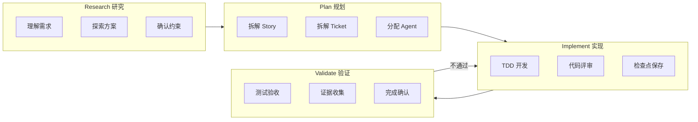
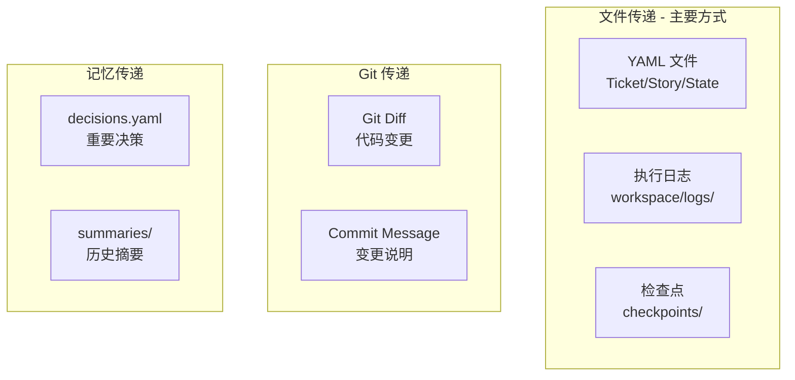
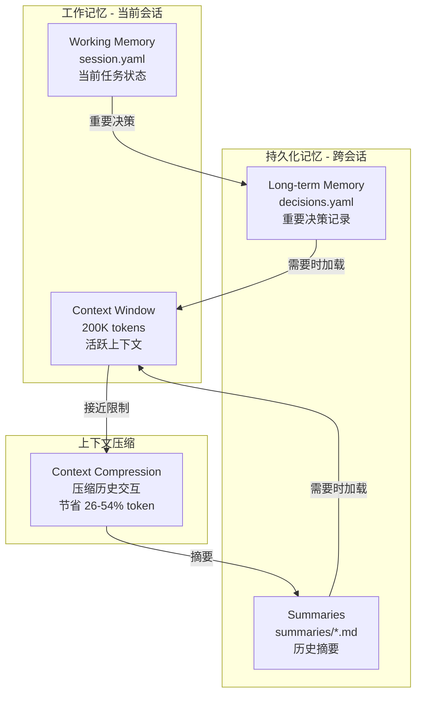
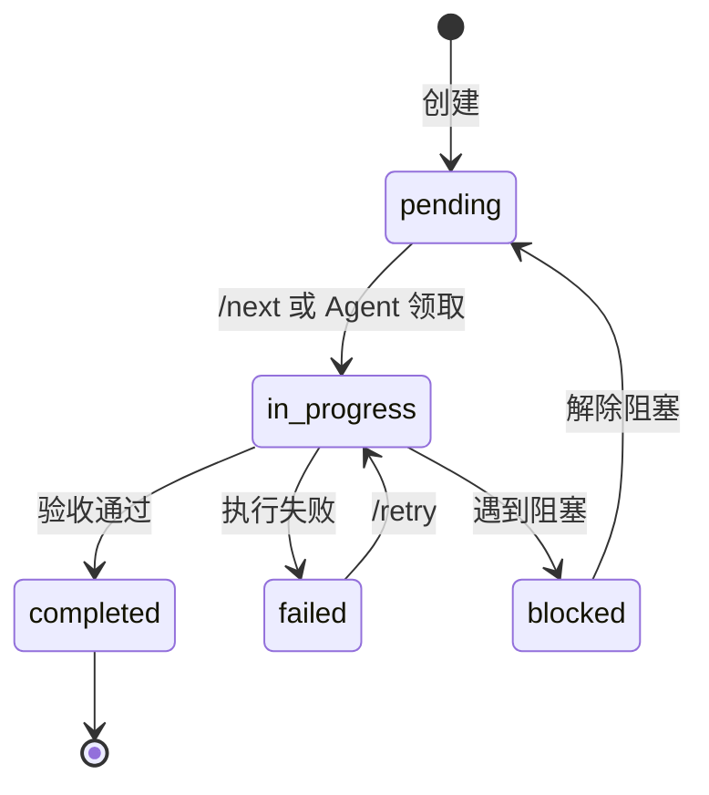
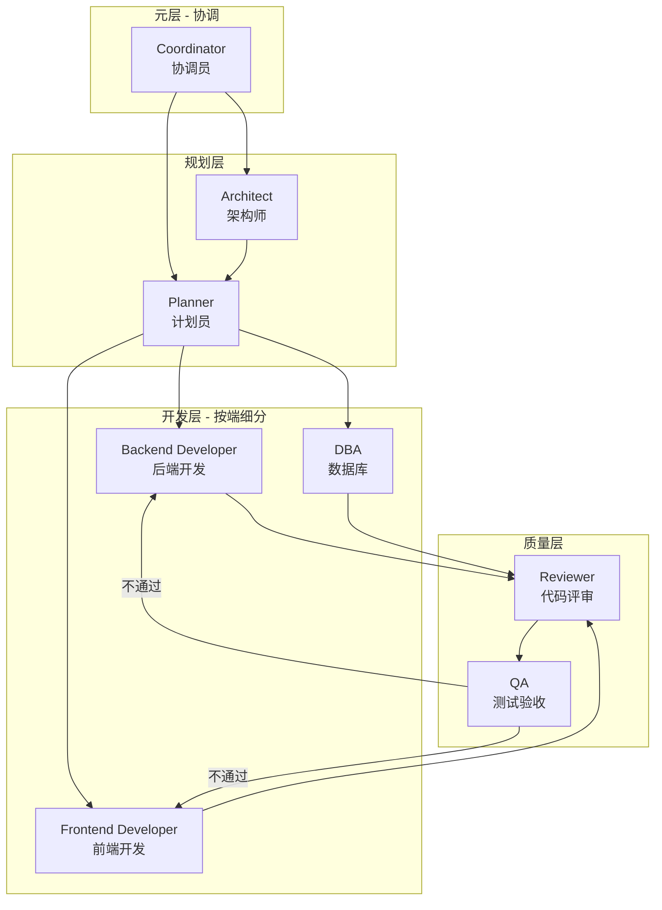
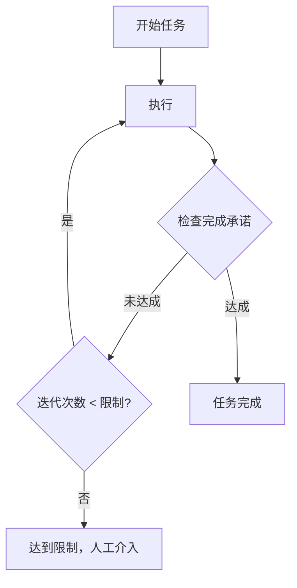
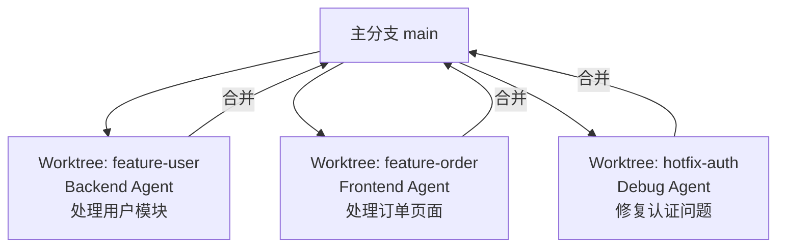
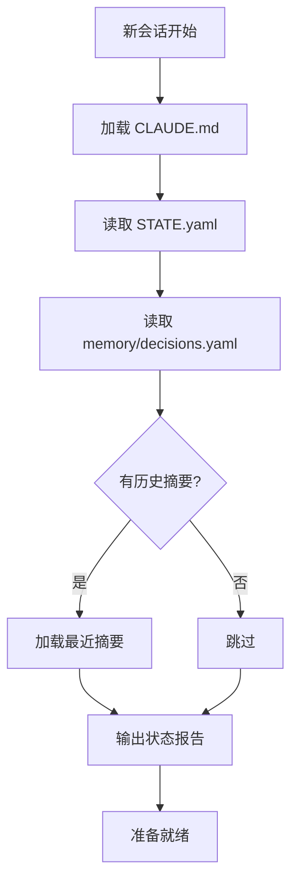

# 一人公司 AI 交付框架

## 参考来源汇总

| 来源 | Stars | 借鉴内容 |

|------|-------|----------|

| [obra/superpowers](https://github.com/obra/superpowers) | 40k+ | 核心工作流、微任务拆解、证据先于断言 |

| [Ralph Loop](https://github.com/thecgaigroup/ralph-cc-loop) | - | 自主循环执行、完成承诺机制 |

| [Catalyst](https://github.com/coalesce-labs/catalyst) | - | RPIV 工作流、持久化记忆 |

| [TÂCHES](https://github.com/glittercowboy/taches-cc-resources) | 1.2k | Meta-skills、39 skills + 11 agents 架构 |

| [Context Engineering Kit](https://github.com/NeoLabHQ/context-engineering-kit) | 302 | 上下文工程优化 |

| [LangGraph](https://github.com/langchain-ai/langgraph) | - | 生产级 6 要素、状态机设计 |

| [claude-memory-bank](https://github.com/russbeye/claude-memory-bank) | - | 工作追踪、跨会话持久化 |

| ACON/ReSum/CaT 论文 | - | 上下文压缩技术（节省 26-54% token） |

---

## 核心设计原则

1. **Skills + Agents 结合**：Skills 定义"怎么做"，Agents 定义"谁来做"
2. **通用层 + 项目层分离**：通用框架可复用，项目配置可定制
3. **RPIV 工作流**：Research → Plan → Implement → Validate
4. **记忆管理**：工作记忆 + 长期记忆 + 上下文压缩
5. **检查点恢复**：支持长时任务的状态保存和恢复
6. **自主循环**：Ralph Loop 模式，持续执行直到完成
7. **多端并行**：Git Worktree 支持多 Agent 并行开发
8. **人工制定 + 机器执行**：拆解阶段人工参与，执行阶段全自动
9. **微任务拆解**：每个 Ticket 2-5 分钟可完成
10. **证据先于断言**：所有完成声明必须有命令输出证明

---

## Skills vs Agents

| 概念 | 类比 | 作用 | 位置 |

|------|------|------|------|

| **Skill** | 岗位职责手册 | 定义"怎么做"：规则、步骤、约束 | `core/skills/` |

| **Agent** | 员工 | 定义"谁来做"：角色、工具、加载哪些 Skills | `core/agents/` + `project/agents/` |

**关系**：Agent 通过 `skills:` 字段加载对应的 Skills，然后执行任务。

**Agent 配置格式**（Claude Code 官方规范）：

```yaml
---
name: agent-name
description: 什么时候调用这个 agent
tools: Read, Grep, Write, Bash    # 可用工具
skills: skill1, skill2            # 预加载的 skills
---
系统提示词...
```

---

## RPIV 工作流（Catalyst 启发）



**每阶段对应的 Skills 和 Agents**：

| 阶段 | Skills | Agent |

|------|--------|-------|

| Research | brainstorming | Architect |

| Plan | story-splitter, ticket-splitter | Planner |

| Implement | deliver-ticket, tdd, checkpoint-manager | Developer |

| Validate | verification, code-review | Reviewer, QA |

---

## Human-in-the-Loop 审批点


### 审批节点定义

| 节点 | 是否必须 | 审批内容 | 命令 |

|------|----------|----------|------|

| Story 拆解后 | **必须** | 确认范围正确、无遗漏 | `/approve stories` |

| Ticket 拆解后 | **必须** | 确认任务合理、粒度合适 | `/approve tickets` |

| 每个 Ticket 完成后 | 可选 | 快速验收单个任务 | `/approve T-xxx` 或自动 |

| Story 全部完成后 | **必须** | 整体功能验收 | `/approve S-xxx` |

### 审批配置

```yaml
# project/config.yaml 中的审批配置
approval:
  story_split: required      # required | optional | auto
  ticket_split: required
  ticket_done: auto          # 单个 Ticket 完成后自动继续
  story_done: required       # Story 完成需要人工确认
  
  # 自动审批条件（当 ticket_done: auto 时）
  auto_approve_if:
    - tests_pass: true
    - lint_pass: true
    - no_new_warnings: true
```

---

## 错误处理与回滚机制

### 错误分类与处理策略

```yaml
error_handling:
  # 1. Ticket 执行失败
  ticket_failed:
    actions:
      - 停止当前 Ticket 执行
      - 记录错误到 workspace/logs/{ticket_id}.yaml
      - 保存当前状态到 checkpoint
      - 通知人工介入（不自动回滚）
    recovery:
      - /retry T-xxx        # 重试当前 Ticket
      - /skip T-xxx         # 跳过（标记为 blocked）
      - /rollback T-xxx     # 回滚到 Ticket 开始前的 checkpoint

  # 2. 测试失败
  test_failed:
    max_retries: 3
    actions:
      - 第 1-2 次：自动触发 debugging skill 分析原因
      - 第 3 次：仍失败则停止，人工介入
    auto_fix:
      enabled: true
      scope: "only_test_file"  # 只允许修改测试文件或实现文件

  # 3. Lint 失败
  lint_failed:
    auto_fix: true             # 自动运行 lint --fix
    max_retries: 2
    fallback: "human_review"

  # 4. 上下文耗尽
  context_exhausted:
    threshold: 85%             # 触发阈值
    actions:
      - 自动触发 context-compression skill
      - 保存当前状态到 checkpoint
      - 压缩后继续执行
    if_compression_fails:
      - 保存完整状态
      - 提示用户开启新会话
      - 提供 /restore 命令

  # 5. 文件冲突（修改了 allowed_paths 之外的文件）
  path_violation:
    actions:
      - 立即停止
      - 回滚该文件的修改
      - 记录违规到日志
      - 人工确认是否扩大 allowed_paths
```

### 回滚命令

```bash
/rollback T-xxx              # 回滚单个 Ticket
/rollback S-xxx              # 回滚整个 Story
/rollback CP-{timestamp}     # 回滚到指定 checkpoint
/rollback --last             # 回滚到上一个 checkpoint
```

---

## Agent 间信息传递

### 传递方式



### 具体传递路径

| 传递路径 | 传递内容 | 传递方式 |

|----------|----------|----------|

| Planner → Developer | 任务定义 | `osg-spec-docs/tasks/tickets/T-xxx.yaml` |

| Developer → Reviewer | 代码变更 | `git diff` + `workspace/logs/T-xxx.yaml` |

| Reviewer → Developer | 评审意见 | `artifacts/reviews/T-xxx.md` |

| Developer → QA | 完成报告 | `workspace/logs/T-xxx.yaml` |

| Any → Any | 重要决策 | `memory/decisions.yaml` |

| Any → Future | 历史上下文 | `memory/summaries/{date}.md` |

### 信息隔离原则

```
⚠️ 关键原则：Agent 之间 **不传递对话历史**

原因：
1. 避免上下文污染
2. 每个 Agent 保持独立视角
3. 节省 token

传递的是：
✓ 结构化数据（YAML）
✓ 执行结果（日志、Git diff）
✓ 关键决策（decisions.yaml）

不传递的是：
✗ 对话历史
✗ 中间思考过程
✗ 探索性尝试
```

---

## 记忆管理架构

### 记忆层次



### 记忆文件结构

```yaml
# memory/session.yaml - 当前会话状态
session_id: "2026-02-01-001"
started_at: "2026-02-01T10:00:00Z"
current_phase: "implement"  # research | plan | implement | validate
current_story: "S-001"
current_ticket: "T-003"
context_usage: 45%
last_checkpoint: "CP-20260201-100500"

# memory/decisions.yaml - 重要决策记录（跨会话持久化）
decisions:
  - id: D-001
    date: "2026-02-01"
    context: "用户管理模块技术选型"
    decision: "使用 MyBatis-Plus 替代原生 MyBatis"
    rationale: "减少样板代码，提升开发效率"
    impact: "S-001, S-002"
    
# memory/summaries/2026-02-01.md - 历史摘要
## 2026-02-01 工作摘要
- 完成 Story S-001 的 Ticket T-001 到 T-003
- 主要改动：用户管理 API + 前端页面
- 遗留问题：T-004 权限校验待处理
```

---

## Ticket 格式规范

### 完整 Ticket 结构

```yaml
# osg-spec-docs/tasks/tickets/T-001.yaml
id: T-001
story_id: S-001
title: 实现用户列表分页查询 API
description: |
  实现 /system/user/list 接口，支持分页、条件筛选。
  参考现有 SysDept 的实现模式。

# 执行配置
type: backend                    # backend | frontend | database | fullstack
agent: backend-java              # 指定执行的 Agent
priority: 1                      # 执行顺序
estimated_minutes: 5             # 预估时间

# 关键：明确的文件边界（强制约束）
allowed_paths:
  modify:                        # 可修改的文件
    - "ruoyi-admin/src/main/java/**/controller/SysUserController.java"
    - "ruoyi-system/src/main/java/**/service/ISysUserService.java"
    - "ruoyi-system/src/main/java/**/service/impl/SysUserServiceImpl.java"
    - "ruoyi-system/src/main/java/**/mapper/SysUserMapper.java"
    - "ruoyi-system/src/resources/mapper/system/SysUserMapper.xml"
  create:                        # 可新建的文件
    - "ruoyi-admin/src/test/java/**/SysUserControllerTest.java"
  read:                          # 可读取参考的文件
    - "ruoyi-admin/src/main/java/**/controller/SysDeptController.java"
    - "ruoyi-system/src/main/java/**/service/impl/SysDeptServiceImpl.java"

# TDD 结构（测试先行）
tdd:
  test_file: "ruoyi-admin/src/test/java/**/controller/SysUserControllerTest.java"
  test_cases:
    - name: "testListUsers_success"
      description: "正常分页查询，返回用户列表"
    - name: "testListUsers_withCondition"
      description: "带条件筛选查询"
    - name: "testListUsers_emptyResult"
      description: "无匹配数据时返回空列表"

# 验收标准（必须可验证）
acceptance:
  - type: command
    run: "mvn test -Dtest=SysUserControllerTest"
    expect: "BUILD SUCCESS"
  - type: command
    run: "mvn checkstyle:check"
    expect: "BUILD SUCCESS"
  - type: api_test               # 可选：API 测试
    method: GET
    url: "/system/user/list?pageNum=1&pageSize=10"
    expect_status: 200

# 依赖关系
dependencies:
  tickets: []                    # 依赖的前置 Ticket
  files:                         # 依赖的已存在文件
    - "ruoyi-common/src/main/java/**/BaseController.java"

# 状态追踪
status: pending                  # pending | in_progress | completed | failed | blocked
created_at: "2026-02-01T09:00:00Z"
started_at: null
completed_at: null
checkpoint_id: null              # 完成后的检查点 ID
```

### Ticket 状态流转



---

## Story 格式规范

```yaml
# osg-spec-docs/tasks/stories/S-001.yaml
id: S-001
requirement_id: REQ-001
title: 用户管理模块
description: |
  实现系统用户的增删改查功能，包括：
  - 用户列表分页查询
  - 新增用户
  - 编辑用户
  - 删除用户
  - 用户状态切换

# INVEST 检查
invest:
  independent: true              # 不依赖其他 Story
  negotiable: true               # 细节可协商
  valuable: true                 # 对用户有价值
  estimable: true                # 可估算工作量
  small: true                    # 足够小（5-10 个 Ticket）
  testable: true                 # 有明确验收标准

# 涉及端
endpoints:
  - backend
  - frontend
  - database

# 关联 Tickets
tickets:
  - T-001  # 用户列表 API
  - T-002  # 新增用户 API
  - T-003  # 编辑用户 API
  - T-004  # 删除用户 API
  - T-005  # 用户列表前端页面
  - T-006  # 用户表单前端组件

# 验收标准（Story 级别）
acceptance:
  - "用户列表正常显示，支持分页"
  - "可以新增用户，必填项校验正常"
  - "可以编辑用户信息"
  - "可以删除用户（软删除）"
  - "所有 API 有单元测试覆盖"

# 状态
status: in_progress              # pending | in_progress | completed | blocked
progress: "3/6"                  # 已完成 Ticket 数
created_at: "2026-02-01T09:00:00Z"
```

---

## 日志格式规范

### Ticket 执行日志

```yaml
# workspace/logs/T-001.yaml
ticket_id: T-001
story_id: S-001
agent: backend-java
session_id: "2026-02-01-001"

# 时间信息
started_at: "2026-02-01T10:00:00Z"
finished_at: "2026-02-01T10:04:32Z"
duration_seconds: 272

# 执行结果
status: success                  # success | failed | blocked
exit_reason: "all_acceptance_passed"

# 执行步骤详情
steps:
  - step: 1
    action: "read_ticket"
    status: success
    timestamp: "2026-02-01T10:00:00Z"
    details: "读取 Ticket T-001 定义"

  - step: 2
    action: "read_reference"
    status: success
    timestamp: "2026-02-01T10:00:15Z"
    files_read:
      - "ruoyi-admin/src/main/java/**/controller/SysDeptController.java"
    details: "读取参考实现"

  - step: 3
    action: "write_test"
    status: success
    timestamp: "2026-02-01T10:00:45Z"
    files_created:
      - "ruoyi-admin/src/test/java/**/SysUserControllerTest.java"
    details: "编写测试用例：testListUsers_success, testListUsers_withCondition, testListUsers_emptyResult"

  - step: 4
    action: "run_test_red"
    status: success
    timestamp: "2026-02-01T10:01:00Z"
    command: "mvn test -Dtest=SysUserControllerTest"
    output: |
      Tests run: 3, Failures: 3, Errors: 0
      BUILD FAILURE
    details: "红灯阶段：测试按预期失败"

  - step: 5
    action: "implement"
    status: success
    timestamp: "2026-02-01T10:01:30Z"
    files_modified:
      - path: "ruoyi-admin/src/main/java/**/controller/SysUserController.java"
        changes: "+45 -2"
      - path: "ruoyi-system/src/main/java/**/service/ISysUserService.java"
        changes: "+12 -0"
      - path: "ruoyi-system/src/main/java/**/service/impl/SysUserServiceImpl.java"
        changes: "+38 -0"
    details: "实现用户列表查询功能"

  - step: 6
    action: "run_test_green"
    status: success
    timestamp: "2026-02-01T10:03:00Z"
    command: "mvn test -Dtest=SysUserControllerTest"
    output: |
      Tests run: 3, Failures: 0, Errors: 0
      BUILD SUCCESS
    details: "绿灯阶段：所有测试通过"

  - step: 7
    action: "run_lint"
    status: success
    timestamp: "2026-02-01T10:03:30Z"
    command: "mvn checkstyle:check"
    output: "BUILD SUCCESS"
    details: "代码规范检查通过"

  - step: 8
    action: "create_checkpoint"
    status: success
    timestamp: "2026-02-01T10:04:00Z"
    checkpoint_id: "CP-20260201-100400"
    details: "创建检查点"

# 验收证据
evidence:
  - type: test_output
    command: "mvn test -Dtest=SysUserControllerTest"
    output: |
      [INFO] Tests run: 3, Failures: 0, Errors: 0, Skipped: 0
      [INFO] BUILD SUCCESS
    timestamp: "2026-02-01T10:03:00Z"

  - type: lint_output
    command: "mvn checkstyle:check"
    output: "[INFO] BUILD SUCCESS"
    timestamp: "2026-02-01T10:03:30Z"

# 文件变更汇总
files_changed:
  created:
    - "ruoyi-admin/src/test/java/**/SysUserControllerTest.java"
  modified:
    - "ruoyi-admin/src/main/java/**/controller/SysUserController.java"
    - "ruoyi-system/src/main/java/**/service/ISysUserService.java"
    - "ruoyi-system/src/main/java/**/service/impl/SysUserServiceImpl.java"
  deleted: []

# 检查点信息
checkpoint:
  id: "CP-20260201-100400"
  git_commit: "abc1234"
  can_rollback: true
```

### 错误日志示例

```yaml
# workspace/logs/T-002.yaml (失败示例)
ticket_id: T-002
status: failed
exit_reason: "test_failed_after_max_retries"

steps:
  # ... 前面步骤省略 ...
  
  - step: 6
    action: "run_test_green"
    status: failed
    attempt: 1
    command: "mvn test -Dtest=SysUserControllerTest"
    output: |
      Tests run: 3, Failures: 1, Errors: 0
      testAddUser_success FAILED
      java.lang.NullPointerException at SysUserServiceImpl.java:42
    
  - step: 7
    action: "debug_analyze"
    status: success
    analysis: |
      根因分析：
      - SysUserServiceImpl.java:42 行 userMapper 未注入
      - 原因：缺少 @Autowired 注解
      修复建议：
      - 添加 @Autowired 到 userMapper 字段

  - step: 8
    action: "auto_fix"
    status: success
    files_modified:
      - "ruoyi-system/src/main/java/**/service/impl/SysUserServiceImpl.java"

  - step: 9
    action: "run_test_green"
    status: failed
    attempt: 2
    # ... 仍然失败 ...

  - step: 12
    action: "run_test_green"
    status: failed
    attempt: 3
    details: "达到最大重试次数，停止执行"

error:
  type: "test_failure"
  message: "测试失败，已重试 3 次"
  last_failure: |
    testAddUser_success FAILED
    Expected: 200
    Actual: 500
  suggested_action: "人工检查 SysUserServiceImpl 的依赖注入配置"
```

---

## Skills Prompt 模板

### deliver-ticket/SKILL.md 完整模板

```yaml
---
name: deliver-ticket
description: 执行 Ticket。严格按 Ticket 实现，遵循 allowed_paths 约束。
invoked_by: user, agent
---
```
```markdown
# Deliver Ticket Skill

## 强制首步：理解确认

读取 Ticket 后，**必须**先输出理解确认，格式如下：

"""
## 📋 任务理解

**Ticket**: {id} - {title}

**目标**: 
{description 的一句话总结}

**允许修改的文件**:
- {allowed_paths.modify 列表}

**可以新建的文件**:
- {allowed_paths.create 列表}

**验收标准**:
1. {acceptance[0]}
2. {acceptance[1]}
...

**参考文件**:
- {allowed_paths.read 列表}

✅ 理解确认，开始执行。
"""

## 执行流程

### Phase 1: TDD 红灯
1. 根据 `tdd.test_cases` 编写测试
2. 运行测试，确认失败（红灯）
3. 输出：
"""
### 🔴 红灯阶段
测试文件: {test_file}
测试用例: {test_cases}
运行结果:
```

{测试输出，显示失败}

```
"""

### Phase 2: 实现代码
1. 阅读参考文件（allowed_paths.read）
2. 实现功能代码
3. **严格限制**在 allowed_paths.modify 范围内

### Phase 3: TDD 绿灯
1. 运行测试，确认通过
2. 输出：
"""
### 🟢 绿灯阶段
运行结果:
```

{测试输出，显示成功}

```
"""

### Phase 4: 代码检查
1. 运行 lint 命令
2. 如有问题，自动修复
3. 输出：
"""
### ✅ 代码检查
```

{lint 输出}

```
"""

## 完成报告格式

"""
## ✅ Ticket {id} 完成报告

### 修改文件
| 文件 | 变更 | 说明 |
|------|------|------|
| {file1} | +{added} -{removed} | {变更说明} |
| {file2} | +{added} -{removed} | {变更说明} |

### 验证证据

**测试结果**:
```

{mvn test 输出}

```

**Lint 结果**:
```

{lint 输出}

```

### 检查点
已保存: **{checkpoint_id}**

### 下一步
- 下一个 Ticket: {next_ticket_id}
- 或运行 `/next` 继续
"""

## 硬性约束（违反则立即停止）

1. **禁止修改 allowed_paths 之外的文件**
   - 违反时：立即停止，输出违规报告

2. **禁止跳过测试**
   - 必须先写测试，测试必须先失败

3. **禁止跳过验证命令**
   - 所有 acceptance 检查必须执行

4. **遇到阻塞立即停止**
   - 不猜测、不假设
   - 输出阻塞原因，等待人工介入

5. **完成后必须创建检查点**
```

### story-splitter/SKILL.md 完整模板

```yaml
---
name: story-splitter
description: Story 拆解。将需求拆解为多个 User Story，遵循 INVEST 原则。
invoked_by: user
---
```
```markdown
# Story Splitter Skill

## 输入要求

需要以下信息：
1. 需求文档路径（docs/requirements/REQ-xxx.md）
2. 或直接的需求描述

## 拆解流程

### Step 1: 需求理解
"""
## 📖 需求理解

**需求来源**: {REQ-xxx}
**核心目标**: {一句话描述}
**涉及模块**: {模块列表}
**涉及端**: {backend/frontend/database}
"""

### Step 2: Story 识别

按以下维度拆解：
- 按用户角色拆分
- 按功能模块拆分
- 按数据实体拆分

### Step 3: INVEST 检验

每个 Story 必须满足：

| 原则 | 检查项 | 通过标准 |
|------|--------|----------|
| **I**ndependent | 是否独立 | 不依赖其他 Story 完成 |
| **N**egotiable | 是否可协商 | 细节可调整 |
| **V**aluable | 是否有价值 | 对用户有明确价值 |
| **E**stimable | 是否可估算 | 能估算 Ticket 数量 |
| **S**mall | 是否够小 | 5-10 个 Ticket 以内 |
| **T**estable | 是否可测试 | 有明确验收标准 |

### Step 4: 输出格式

"""
## 📝 Story 拆解结果

**需求**: {REQ-xxx} - {需求标题}

### Story 列表

| ID | 标题 | 涉及端 | 预估 Tickets | 优先级 |
|----|------|--------|--------------|--------|
| S-001 | {标题} | backend, frontend | 6 | P0 |
| S-002 | {标题} | backend | 4 | P1 |

### Story 详情

#### S-001: {标题}
- **描述**: {用户故事描述}
- **验收标准**:
  1. {标准1}
  2. {标准2}
- **INVEST 检查**: ✅ 全部通过

#### S-002: {标题}
...

### 依赖关系
```

S-001 (独立)

S-002 → S-001 (依赖 S-001 的用户数据)

```

### ⚠️ 需要确认
1. {需要人工确认的问题1}
2. {需要人工确认的问题2}

---
**下一步**: 请确认后运行 `/approve stories`，然后 `/split ticket S-001`
"""

## 输出文件

为每个 Story 创建 YAML 文件：
- `osg-spec-docs/tasks/stories/S-001.yaml`
- `osg-spec-docs/tasks/stories/S-002.yaml`
- ...

同时更新 `osg-spec-docs/tasks/STATE.yaml`
```

---

## 角色体系



| 层级 | 角色 | 加载的 Skills | 说明 |

|------|------|---------------|------|

| **元层** | Coordinator | progress-tracker, memory-bank | 协调多 Agent、追踪进度 |

| **规划层** | Architect | brainstorming, context-compression | 方案设计、架构探索 |

| | Planner | story-splitter, ticket-splitter | 需求拆解、任务规划 |

| **开发层** | Backend Developer | deliver-ticket, tdd, checkpoint-manager | 后端代码实现 |

| | Frontend Developer | deliver-ticket, checkpoint-manager | 前端代码实现 |

| | DBA | deliver-ticket | 数据库变更 |

| **质量层** | Reviewer | code-review | 代码评审 |

| | QA | verification | 测试验收 |

---

## Skills 分类设计

### 类别一：记忆管理 Skills

#### 1. memory-bank/SKILL.md

**来源**：claude-memory-bank、TÂCHES

```yaml
---
name: memory-bank
description: 记忆管理。管理工作记忆和长期记忆的读写。
---
```

**核心功能**：

- 保存重要决策到 `memory/decisions.yaml`
- 读取历史摘要恢复上下文
- 追踪当前会话状态

**触发条件**：

- 做出重要技术决策时
- 会话开始时（加载历史）
- 会话结束时（保存摘要）

---

#### 2. context-compression/SKILL.md

**来源**：ACON、ReSum、CaT 论文

```yaml
---
name: context-compression
description: 上下文压缩。当上下文接近限制时，压缩历史交互。
---
```

**核心流程**：

1. 监控 token 使用率
2. 达到阈值（70%）时触发压缩
3. 提取关键信息，生成摘要
4. 清除旧上下文，保留摘要
5. 保存摘要到 `memory/summaries/`

**压缩策略**：

- 保留：当前任务、未完成 Ticket、重要决策
- 压缩：已完成任务详情、中间探索过程
- 丢弃：重复信息、冗余对话

---

#### 3. checkpoint-manager/SKILL.md

**来源**：LangGraph 生产级特性、Claude 官方 checkpointing

```yaml
---
name: checkpoint-manager
description: 检查点管理。保存/恢复任务状态，支持长时任务。
---
```

**检查点时机**：

- 每个 Ticket 完成后
- 重要决策做出后
- 手动触发 `/checkpoint`

**检查点内容**：

```yaml
# checkpoints/CP-20260201-100500.yaml
id: "CP-20260201-100500"
created_at: "2026-02-01T10:05:00Z"
phase: "implement"
story: "S-001"
ticket: "T-002"
status: "completed"
files_changed:
  - "ruoyi-admin/src/main/java/.../UserController.java"
  - "ruoyi-system/src/main/java/.../UserService.java"
git_commit: "abc1234"
context_summary: |
  完成用户列表 API，下一步是 T-003 用户详情 API
```

**恢复命令**：`/restore CP-20260201-100500`

---

### 类别二：自动化 Skills

#### 4. ralph-loop/SKILL.md

**来源**：Ralph Loop（259 PRs、40k+ 行代码/30天）

```yaml
---
name: ralph-loop
description: 自主循环执行。持续工作直到完成承诺达成或迭代限制。
---
```

**核心机制**：



**配置参数**：

- `completion_promise`: 完成标志（如 "ALL_TESTS_PASS"）
- `max_iterations`: 最大迭代次数（默认 20）
- `verification_command`: 验证命令（如 `mvn test`）

**使用示例**：

```bash
/ralph-loop "完成 S-001 所有 Ticket" \
  --completion-promise "STORY_S001_DONE" \
  --max-iterations 50 \
  --verify "mvn test && npm run lint"
```

**铁律**：

- 必须使用**可验证的二元标准**（测试通过/lint 通过）
- 不使用主观标准（"代码质量好"）

---

#### 5. progress-tracker/SKILL.md

**来源**：TÂCHES meta-skills

```yaml
---
name: progress-tracker
description: 进度追踪。追踪整体进度，生成状态报告。
---
```

**输出格式**：

```
📊 项目进度报告
================
Story S-001: 用户管理模块
  ├── [✓] T-001 用户列表 API
  ├── [✓] T-002 用户新增 API  
  ├── [→] T-003 用户编辑 API (进行中)
  ├── [ ] T-004 用户删除 API
  └── [ ] T-005 前端页面

进度: 40% (2/5 Tickets)
预估剩余: 3 个 Ticket × 5 分钟 ≈ 15 分钟
上下文使用: 45%
最近检查点: CP-20260201-100500
```

---

### 类别三：工作流 Skills

#### 6. brainstorming/SKILL.md

**参考来源**：obra/superpowers brainstorming skill

```yaml
---
name: brainstorming
description: 头脑风暴。当用户说 /brainstorm 或需要细化需求时激活。
---
```

**核心流程**：

1. 理解上下文（读取需求文档）
2. 细化需求（一次一个问题，优先选择题）
3. 探索方案（提出 2-3 个方案及 trade-offs）
4. 确认后记录决策到 memory/decisions.yaml

---

#### 7. story-splitter/SKILL.md

```yaml
---
name: story-splitter
description: Story 拆解。将需求拆解为多个 User Story，遵循 INVEST 原则。
---
```

**（详细 Prompt 模板见上方 "Skills Prompt 模板" 章节）**

---

#### 8. ticket-splitter/SKILL.md

```yaml
---
name: ticket-splitter
description: Ticket 拆解。将 Story 拆解为 2-5 分钟的可执行 Ticket。
---
```

**拆解原则**（借鉴 superpowers）：

- 每个 Ticket 2-5 分钟可完成
- 明确的文件路径（不含模糊描述）
- TDD 结构（测试先行）
- 指定执行 Agent（backend/frontend/dba）

---

#### 9. deliver-ticket/SKILL.md

```yaml
---
name: deliver-ticket
description: 执行 Ticket。严格按 Ticket 实现，遵循 allowed_paths 约束。
---
```

**（详细 Prompt 模板见上方 "Skills Prompt 模板" 章节）**

---

### 类别四：质量 Skills

#### 10. verification/SKILL.md

**参考来源**：obra/superpowers verification-before-completion

```yaml
---
name: verification
description: 完成前验证。证据先于断言。
---
```

**验证清单**：

- [ ] 测试通过（命令输出）
- [ ] Lint 通过（命令输出）
- [ ] 功能可用（如有 UI，截图证明）

---

#### 11. tdd/SKILL.md

**参考来源**：obra/superpowers test-driven-development

```yaml
---
name: tdd
description: TDD 开发。红-绿-重构循环。
---
```

**TDD 流程**：

1. **红**：先写失败的测试
2. **绿**：写最少代码让测试通过
3. **重构**：优化代码，保持测试通过

---

#### 12. code-review/SKILL.md

**参考来源**：obra/superpowers requesting/receiving-code-review

```yaml
---
name: code-review
description: 代码评审。技术评估，非情感表演。
---
```

**评审维度**：

- 功能正确性
- 代码规范
- 性能考量
- 安全问题

---

#### 13. debugging/SKILL.md

**参考来源**：obra/superpowers systematic-debugging

```yaml
---
name: debugging
description: 系统化调试。先找根因再修复。
---
```

**铁律**：没有根因分析，不提出修复方案

---

## 分层架构：通用 vs 项目定制

```
┌─────────────────────────────────────────────────────────┐
│  Core Layer（核心层 - 不变，可复用到任何项目）            │
│  ├── 工作流程（RPIV: Research → Plan → Implement → Validate）│
│  ├── 角色模板（Coordinator, Architect, Planner, Developer...）│
│  ├── 核心 Skills（13 个，分 4 类）                       │
│  ├── 记忆管理机制                                        │
│  ├── 错误处理机制                                        │
│  └── 状态管理、检查点机制                                │
└─────────────────────────────────────────────────────────┘
                            ↓ 继承/配置
┌─────────────────────────────────────────────────────────┐
│  Project Layer（项目层 - 可变，项目特定）                 │
│  ├── 技术栈配置（Java/Python/Go/Vue/React...）          │
│  ├── 开发者角色实例（backend-java, frontend-vue...）    │
│  ├── 代码规范（rules/）- 可引用外部规范                  │
│  └── 命令映射（test → mvn test / pytest...）           │
└─────────────────────────────────────────────────────────┘
```

---

## 目录结构

```
.claude/
├── core/                        # 【不变】核心框架（可复制到任何项目）
│   │
│   ├── skills/                  # 核心技能（13 个）
│   │   │
│   │   ├── # 记忆管理类
│   │   ├── memory-bank/
│   │   │   └── SKILL.md
│   │   ├── context-compression/
│   │   │   └── SKILL.md
│   │   ├── checkpoint-manager/
│   │   │   └── SKILL.md
│   │   │
│   │   ├── # 自动化类
│   │   ├── ralph-loop/
│   │   │   └── SKILL.md
│   │   ├── progress-tracker/
│   │   │   └── SKILL.md
│   │   │
│   │   ├── # 工作流类
│   │   ├── brainstorming/
│   │   │   └── SKILL.md
│   │   ├── story-splitter/
│   │   │   └── SKILL.md
│   │   ├── ticket-splitter/
│   │   │   └── SKILL.md
│   │   ├── deliver-ticket/
│   │   │   └── SKILL.md
│   │   │
│   │   ├── # 质量类
│   │   ├── verification/
│   │   │   └── SKILL.md
│   │   ├── tdd/
│   │   │   └── SKILL.md
│   │   ├── code-review/
│   │   │   └── SKILL.md
│   │   └── debugging/
│   │       └── SKILL.md
│   │
│   ├── agents/                  # 角色模板（7 个）
│   │   ├── coordinator.md       # 协调员
│   │   ├── architect.md         # 架构师
│   │   ├── planner.md           # 计划员
│   │   ├── developer.md         # 开发者通用模板
│   │   ├── reviewer.md          # 评审员
│   │   └── qa.md                # QA
│   │
│   └── templates/               # 文件模板
│       ├── story.yaml
│       ├── ticket.yaml
│       ├── checkpoint.yaml
│       ├── log.yaml
│       └── state.yaml
│
├── project/                     # 【可变】项目配置
│   │
│   ├── config.yaml              # 项目配置（技术栈、命令映射、审批配置）
│   │
│   ├── agents/                  # 项目角色实例（继承通用模板）
│   │   ├── backend-java.md      # Java 后端开发者
│   │   ├── frontend-vue.md      # Vue 前端开发者
│   │   └── dba-mysql.md         # MySQL DBA
│   │
│   └── rules/                   # 项目代码规范（引用外部规范）
│       ├── java.md              # 引用阿里 Java 规范
│       ├── vue.md
│       └── sql.md
│
├── memory/                      # 持久化记忆
│   ├── session.yaml             # 当前会话状态
│   ├── decisions.yaml           # 重要决策记录
│   └── summaries/               # 历史摘要
│       └── {date}.md
│
├── checkpoints/                 # 检查点
│   └── CP-{timestamp}.yaml
│
├── CLAUDE.md                    # 项目入口（引用 core + project）
│
└── commands/                    # 快捷命令
    ├── brainstorm.md
    ├── split.md
    ├── next.md
    ├── status.md
    ├── approve.md               # 审批命令
    ├── checkpoint.md
    ├── restore.md
    ├── rollback.md              # 回滚命令
    └── ralph-loop.md

docs/
└── requirements/                # 需求文档（用户放置）
    └── REQ-001.md

osg-spec-docs/tasks/
├── STATE.yaml                   # 全局状态文件
├── stories/
│   └── S-001.yaml
└── tickets/
    └── T-001.yaml

workspace/
└── logs/                        # 执行日志
    └── T-001.yaml

artifacts/
├── reports/
└── reviews/                     # 代码评审记录
    └── T-001.md
```

---

## 项目配置文件

### project/config.yaml

```yaml
# 项目基本信息
name: ruoyi-vue
type: fullstack  # backend | frontend | fullstack | mobile

# 技术栈
tech_stack:
  backend:
    language: java
    framework: spring-boot
    version: "2.5"
  frontend:
    language: javascript
    framework: vue
    version: "2.6"
  database:
    type: mysql
    version: "8.0"

# 命令映射（逻辑命令 → 实际命令）
commands:
  test: "mvn -q test"
  test-single: "mvn -q test -Dtest={class}"
  build: "mvn -q -DskipTests package"
  lint: "mvn checkstyle:check"
  lint-fix: "mvn checkstyle:check"  # Java 无自动修复
  run: "mvn -pl ruoyi-admin -am spring-boot:run"

# 目录约定
paths:
  backend:
    controllers: "ruoyi-admin/src/main/java/**/controller/"
    services: "ruoyi-system/src/main/java/**/service/"
    mappers: "ruoyi-system/src/main/java/**/mapper/"
    tests: "ruoyi-*/src/test/java/"
  frontend:
    pages: "ruoyi-ui/src/views/"
    api: "ruoyi-ui/src/api/"
    components: "ruoyi-ui/src/components/"

# 启用的开发者角色
developers:
  - backend-java
  - frontend-vue
  - dba-mysql

# 审批配置
approval:
  story_split: required      # required | optional | auto
  ticket_split: required
  ticket_done: auto          # 单个 Ticket 完成后自动继续
  story_done: required       # Story 完成需要人工确认
  
  # 自动审批条件（当 ticket_done: auto 时）
  auto_approve_if:
    tests_pass: true
    lint_pass: true

# 记忆配置
memory:
  compression_threshold: 70%  # 上下文使用率达到此值时触发压缩
  checkpoint_interval: "per_ticket"  # per_ticket | per_story | manual
  
# 错误处理配置
error_handling:
  test_max_retries: 3
  lint_auto_fix: true
  on_path_violation: "stop_and_report"  # stop_and_report | auto_rollback
  
# Ralph Loop 配置
ralph_loop:
  default_max_iterations: 20
  verification_command: "mvn test"

# 代码规范引用
rules_reference:
  java: "https://github.com/alibaba/p3c"  # 阿里 Java 规范
  vue: "https://vuejs.org/style-guide/"
  sql: "internal"
```

---

## Agent 模板设计

### core/agents/coordinator.md

```yaml
---
name: coordinator
description: 协调员。管理多 Agent 协作，追踪整体进度。
tools: Read, Write
skills: progress-tracker, memory-bank
---
# Coordinator（协调员）

## 职责
- 协调多 Agent 工作
- 追踪整体进度
- 管理记忆和上下文
- 决定何时触发上下文压缩
- 分派任务给对应的 Developer Agent

## 触发时机
- 项目启动时
- 每个 Story 开始/结束时
- 上下文接近限制时
- 用户执行 /status 时
```

### core/agents/developer.md

```yaml
---
name: developer
description: 通用开发者模板，需要被具体技术栈继承
skills: deliver-ticket, tdd, checkpoint-manager
---
# Developer（开发者）

## 职责
- 按 Ticket 实现代码
- 遵循 TDD 流程
- 在 allowed_paths 内修改
- 完成后创建检查点

## 通用流程
1. 读取 Ticket，输出理解确认
2. TDD：红 → 绿 → 重构
3. 运行验证命令
4. 创建检查点
5. 产出完成报告

## 错误处理
- 测试失败：最多重试 3 次，触发 debugging skill
- 路径违规：立即停止，报告违规
- 阻塞：停止并输出阻塞原因

## 【由项目配置覆盖】
- 技术栈规范
- 具体命令
- 目录约定
```

### project/agents/backend-java.md

```yaml
---
name: backend-java
extends: developer                    # 继承通用模板
description: Java 后端开发者，处理 Spring Boot 相关的 Ticket
skills: deliver-ticket, tdd, checkpoint-manager
rules: java                           # 加载 java.md 规范
---
# Java 后端开发者

## 继承自
core/agents/developer.md

## 技术栈
- Java 8 + Spring Boot 2.5 + MyBatis

## 代码规范
引用阿里巴巴 Java 开发手册：
- https://github.com/alibaba/p3c

关键规范：
- 类名使用 UpperCamelCase
- 方法名使用 lowerCamelCase
- 常量使用 UPPER_SNAKE_CASE
- 所有 Service 方法需要有 JavaDoc
- 禁止使用魔法数字

## 目录约定
- Controller: ruoyi-admin/src/main/java/**/controller/
- Service Interface: ruoyi-system/src/main/java/**/service/
- Service Impl: ruoyi-system/src/main/java/**/service/impl/
- Mapper: ruoyi-system/src/main/java/**/mapper/
- Test: ruoyi-*/src/test/java/

## 命令
- 测试: mvn test -Dtest={TestClass}
- Lint: mvn checkstyle:check
```

---

## 命令体系

| 命令 | 触发 Agent | 加载 Skills | 作用 |

|------|------------|-------------|------|

| `/brainstorm` | Architect | brainstorming, context-compression | 对话细化需求 |

| `/split story` | Planner | story-splitter | 需求 → Stories |

| `/split ticket S-xxx` | Planner | ticket-splitter | Story → Tickets |

| `/approve stories` | - | - | 审批 Story 拆解结果 |

| `/approve tickets` | - | - | 审批 Ticket 拆解结果 |

| `/next` | Developer (按端分派) | deliver-ticket, tdd, checkpoint-manager | 执行下一个 Ticket |

| `/review T-xxx` | Reviewer | code-review | 代码评审 |

| `/verify S-xxx` | QA | verification | 测试验收 |

| `/status` | Coordinator | progress-tracker | 查看当前状态 |

| `/checkpoint` | - | checkpoint-manager | 手动创建检查点 |

| `/restore {id}` | - | checkpoint-manager | 恢复到指定检查点 |

| `/rollback T-xxx` | - | checkpoint-manager | 回滚指定 Ticket |

| `/ralph-loop` | Coordinator + Developer | ralph-loop | 自主循环执行 |

| `/compress` | Coordinator | context-compression | 手动触发上下文压缩 |

| `/retry T-xxx` | Developer | deliver-ticket | 重试失败的 Ticket |

| `/skip T-xxx` | - | - | 跳过 Ticket（标记为 blocked） |

---

## Git Worktree 并行开发（可选增强）



**使用场景**：

- 多个独立 Story 并行开发
- 不同端的工作互不干扰
- 利用 Claude 等待响应的时间

**命令**：

```bash
/worktree create feature-user    # 创建新 worktree
/worktree list                   # 列出所有 worktree
/worktree switch feature-order   # 切换 worktree
```

---

## 复用方式

当开始一个新项目（如 Python 项目）：

1. **复制 core/ 目录**（不变）

2. **创建新的 project/ 配置**：
```yaml
# project/config.yaml
name: my-python-api
tech_stack:
  backend:
    language: python
    framework: fastapi
commands:
  test: "pytest"
  lint: "ruff check ."
  lint-fix: "ruff check --fix ."
developers:
  - backend-python
memory:
  compression_threshold: 70%
rules_reference:
  python: "https://peps.python.org/pep-0008/"
```

3. **创建项目角色**：`project/agents/backend-python.md`

4. **初始化目录**：`memory/`, `checkpoints/`, `workspace/logs/`

---

## 文档体系

本框架文档拆分为以下部分：

| 文档 | 内容 | 位置 |

|------|------|------|

| **主文档**（本文档） | 架构设计、流程、原则 | 当前文件 |

| **模板文档** | YAML/MD 文件模板 | `一人公司_详细模板.md` |

| **Skills 详细文档** | 每个 Skill 的完整 Prompt | `一人公司_Skills详细.md` |

---

## CLAUDE.md 入口文件

```markdown
# 一人公司 AI 交付框架

## 加载配置
- 核心框架: .claude/core/
- 项目配置: .claude/project/config.yaml
- 当前状态: osg-spec-docs/tasks/STATE.yaml

## 可用命令
| 命令 | 说明 |
|------|------|
| /brainstorm | 头脑风暴，细化需求 |
| /split story | 将需求拆解为 Story |
| /split ticket S-xxx | 将 Story 拆解为 Ticket |
| /approve stories | 审批 Story 拆解 |
| /approve tickets | 审批 Ticket 拆解 |
| /next | 执行下一个 Ticket |
| /status | 查看当前进度 |
| /checkpoint | 手动保存检查点 |
| /restore CP-xxx | 恢复到检查点 |
| /rollback T-xxx | 回滚 Ticket |

## 工作流
Research → Plan → Implement → Validate

## 当前角色
根据 Ticket 类型自动分派：
- backend → backend-java Agent
- frontend → frontend-vue Agent
- database → dba-mysql Agent

## 记忆管理
- 上下文阈值: 70%（超过自动压缩）
- 检查点: 每个 Ticket 完成后自动保存
- 决策记录: memory/decisions.yaml

## 规范引用
- Java: 阿里巴巴 Java 开发手册
- Vue: Vue 官方风格指南
```

---

## STATE.yaml 全局状态文件

```yaml
# osg-spec-docs/tasks/STATE.yaml
version: "1.0"
last_updated: "2026-02-01T10:30:00Z"

# 当前阶段
phase: implement  # research | plan | implement | validate

# 当前工作项
current:
  requirement: REQ-001
  story: S-001
  ticket: T-003
  agent: backend-java

# Stories 状态
stories:
  S-001:
    status: in_progress
    progress: "2/6"
    tickets:
      - id: T-001
        status: completed
        checkpoint: CP-20260201-100100
      - id: T-002
        status: completed
        checkpoint: CP-20260201-100300
      - id: T-003
        status: in_progress
      - id: T-004
        status: pending
      - id: T-005
        status: pending
      - id: T-006
        status: pending

# 统计
stats:
  total_stories: 1
  completed_stories: 0
  total_tickets: 6
  completed_tickets: 2
  failed_tickets: 0
  blocked_tickets: 0

# 最近检查点
last_checkpoint: CP-20260201-100300

# 上下文状态
context:
  usage_percent: 45
  last_compression: null
  
# 会话信息
session:
  id: "2026-02-01-001"
  started_at: "2026-02-01T09:00:00Z"
```

---

## 项目初始化流程

### 方式一：新项目初始化

```bash
# 1. 复制核心框架
cp -r /path/to/core-template/.claude/core .claude/core

# 2. 创建项目目录结构
mkdir -p .claude/project/agents
mkdir -p .claude/project/rules
mkdir -p .claude/memory/summaries
mkdir -p .claude/checkpoints
mkdir -p .claude/commands
mkdir -p docs/requirements
mkdir -p osg-spec-docs/tasks/stories
mkdir -p osg-spec-docs/tasks/tickets
mkdir -p workspace/logs
mkdir -p artifacts/reviews

# 3. 创建项目配置
# 编辑 .claude/project/config.yaml

# 4. 创建 CLAUDE.md
# 编辑 .claude/CLAUDE.md

# 5. 初始化状态
# 创建 osg-spec-docs/tasks/STATE.yaml（空状态）
```

### 方式二：使用初始化命令

```
/init-project ruoyi-vue --stack java,vue,mysql
```

该命令会自动：

1. 检测项目类型
2. 生成 `project/config.yaml`
3. 生成对应的 Agent 实例
4. 初始化 `osg-spec-docs/tasks/STATE.yaml`
5. 创建 `CLAUDE.md`

---

## 会话恢复流程

### 新会话启动时



### 恢复输出格式

```
## 🔄 会话恢复

**上次会话**: 2026-02-01 10:30
**当前阶段**: Implement
**当前任务**: S-001 / T-003

### 进度
- Story S-001: 用户管理模块 (2/6 完成)
- 下一个 Ticket: T-003 用户编辑 API

### 重要决策
- D-001: 使用 MyBatis-Plus 替代原生 MyBatis

### 可用操作
- `/next` - 继续执行 T-003
- `/status` - 查看详细状态
- `/restore CP-xxx` - 恢复到指定检查点

---
继续执行 T-003 吗？输入 `/next` 或其他命令。
```

---

## Subagent 调用语法

### Claude Code 官方语法

```markdown
# 在主 Agent 中调用 Subagent

Task(agent="backend-java", prompt="执行 Ticket T-003")
```

### 自动分派逻辑

```python
# 伪代码：根据 Ticket 类型分派 Agent
def dispatch_agent(ticket):
    type_to_agent = {
        "backend": "backend-java",
        "frontend": "frontend-vue", 
        "database": "dba-mysql",
        "fullstack": "backend-java"  # 默认后端
    }
    return type_to_agent.get(ticket.type, "developer")
```

### /next 命令的分派流程

```mermaid
flowchart TD
    Next[/next 命令] --> GetTicket[获取下一个 pending Ticket]
    GetTicket --> CheckType{Ticket 类型?}
    CheckType -->|backend| BE[调用 backend-java Agent]
    CheckType -->|frontend| FE[调用 frontend-vue Agent]
    CheckType -->|database| DBA[调用 dba-mysql Agent]
    BE --> Execute[执行 deliver-ticket Skill]
    FE --> Execute
    DBA --> Execute
```

---

## 需求文档格式

### docs/requirements/REQ-001.md

```markdown
# REQ-001: 用户管理模块

## 背景
系统需要完善的用户管理功能，支持管理员对系统用户进行增删改查操作。

## 目标用户
- 系统管理员

## 功能需求

### 1. 用户列表
- 分页展示用户列表
- 支持按用户名、手机号、状态筛选
- 支持按创建时间排序

### 2. 新增用户
- 必填：用户名、密码、手机号
- 选填：邮箱、部门、角色
- 校验：用户名唯一、手机号格式

### 3. 编辑用户
- 可修改：基本信息、部门、角色
- 不可修改：用户名
- 支持重置密码

### 4. 删除用户
- 软删除（逻辑删除）
- 支持批量删除
- 删除前确认

### 5. 状态管理
- 启用/禁用用户
- 禁用用户无法登录

## 非功能需求
- 列表加载时间 < 1s
- 所有操作需要记录日志

## 验收标准
- [ ] 用户列表正常显示
- [ ] 可新增用户，校验正常
- [ ] 可编辑用户信息
- [ ] 可删除用户（软删除）
- [ ] 状态切换正常
- [ ] 所有接口有单元测试

## 优先级
P0 - 核心功能

## 预估
- Stories: 1-2 个
- Tickets: 8-12 个
- 工作量: 约 1 小时
```

---

## 实现路径

### Phase 1: Core 结构

- 创建 `.claude/core/` 目录结构
- 创建 `memory/`, `checkpoints/`, `workspace/logs/` 目录
- 创建 `core/templates/*.yaml` 模板文件

### Phase 2: 记忆管理 Skills

- 编写 `memory-bank/SKILL.md`
- 编写 `context-compression/SKILL.md`
- 编写 `checkpoint-manager/SKILL.md`

### Phase 3: 工作流 Skills

- 编写 `brainstorming/SKILL.md`
- 编写 `story-splitter/SKILL.md`（含完整 Prompt 模板）
- 编写 `ticket-splitter/SKILL.md`（含完整 Prompt 模板）
- 编写 `deliver-ticket/SKILL.md`（含完整 Prompt 模板）

### Phase 4: 质量 Skills

- 编写 `verification/SKILL.md`
- 编写 `tdd/SKILL.md`
- 编写 `debugging/SKILL.md`
- 编写 `code-review/SKILL.md`

### Phase 5: 自动化 Skills

- 编写 `ralph-loop/SKILL.md`
- 编写 `progress-tracker/SKILL.md`

### Phase 6: Agent 模板

- 编写 `coordinator.md`
- 编写 `architect.md`
- 编写 `planner.md`
- 编写 `developer.md`
- 编写 `reviewer.md`
- 编写 `qa.md`

### Phase 7: Project 配置（若依）

- 创建 `project/config.yaml`（含审批、错误处理、规范引用配置）
- 创建 `project/agents/`（backend-java, frontend-vue, dba-mysql）
- 创建 `project/rules/`（引用阿里规范）

### Phase 8: Commands

- 编写 `commands/*.md` 快捷命令（含 approve、rollback、retry）

### Phase 9: 端到端测试

- 放需求到 `docs/requirements/`
- 运行完整流程：`/brainstorm` → `/split` → `/approve` → `/next` → `/verify`
- 测试错误处理和回滚
- 测试记忆管理和检查点恢复